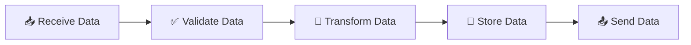
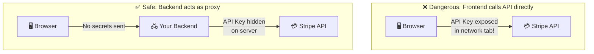
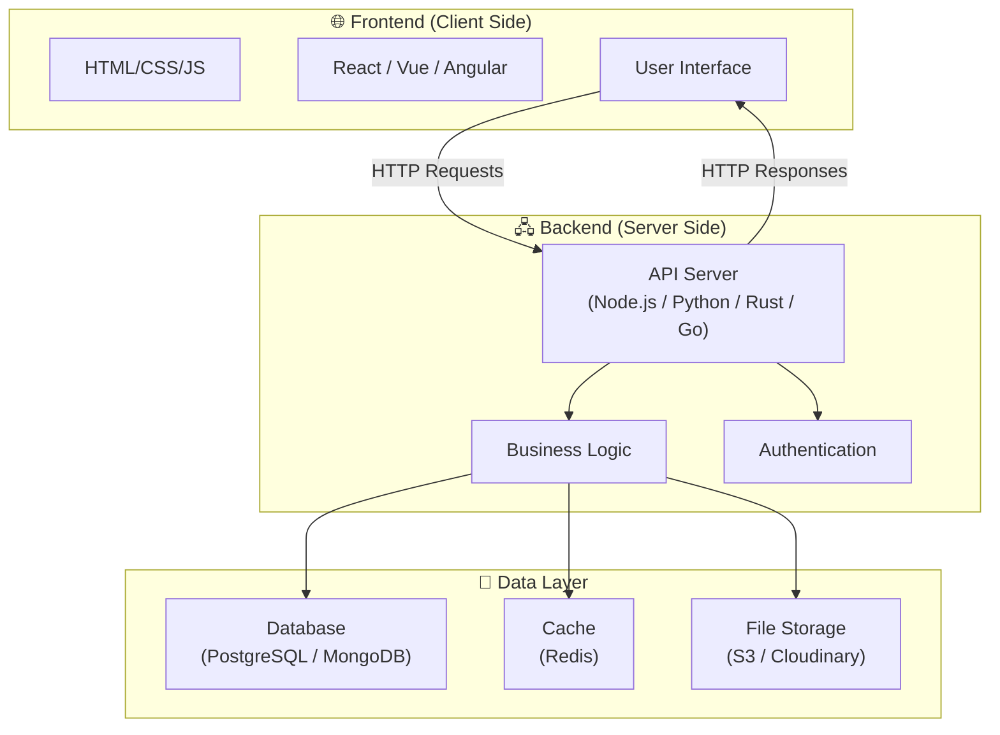

# 🧠 Chapter 2: What is Backend & Why Do We Need It?

> *"Backend can be compressed into one sentence — **the process we use to deal with data**."*

---

## 📌 Defining Backend

At its core, backend development is about **data**. Every single operation a backend performs — whether it's processing a payment, authenticating a user, generating a recommendation feed, or sending a notification — ultimately boils down to receiving data from somewhere, validating that it's correct, transforming it into a useful shape, storing it durably, and sending results back. This might sound reductive, but it's genuinely the unifying thread that connects every backend system ever built, from a simple blog's comment form to the distributed infrastructure behind Google Search.



Consider a user registering on your website. The backend **receives** the registration form data (name, email, password). It **validates** the data — is the email formatted correctly? Is the password strong enough? Does an account with this email already exist? It **transforms** the data — hashing the password so it's never stored in plain text, generating a unique user ID, creating a session token. It **stores** the user record in a database. And finally, it **sends** a response back — "Account created successfully!" along with a redirect to the dashboard. Whether you're building Instagram, a banking app, or a weather service, this five-step cycle is always happening on the backend.

---

## 🏛️ A Brief History: How Backends Evolved

The concept of a "backend" as we know it today didn't always exist. Understanding how it evolved helps explain why modern backend architecture looks the way it does.

In the earliest days of the web (early 1990s), there was no real separation between "frontend" and "backend." Web servers like **NCSA HTTPd** simply served static HTML files from a directory. When you visited a URL, the server looked up the corresponding file on disk and sent it back. There was no dynamic content, no databases, no user accounts — just static pages linked together with hyperlinks. This worked fine for Tim Berners-Lee's original vision of a document-sharing system, but it couldn't support anything interactive.

The first major breakthrough came with **CGI (Common Gateway Interface)** in 1993. CGI allowed a web server to execute an external program — a Perl script, a C program, a shell script — and return its output as the HTTP response. For the first time, web pages could be generated dynamically based on user input. But CGI was painfully slow: every single request spawned a new operating system process, which involved significant overhead. A busy website would quickly exhaust its server's resources.

The late 1990s and early 2000s brought a wave of server-side scripting languages that solved CGI's performance problems by embedding the language runtime directly into the web server. **PHP** (1995) became enormously popular because it could be mixed directly into HTML files — you could write `<?php echo "Hello, " . $name; ?>` right inside your webpage, and the server would execute it before sending the HTML to the browser. **ASP** (Active Server Pages) from Microsoft offered a similar approach for Windows servers. These languages made dynamic web development accessible to a much broader audience, but the code was often messy — business logic, database queries, and HTML markup were all tangled together in the same files.

The mid-2000s saw the rise of **MVC (Model-View-Controller) frameworks** that imposed structure on backend code. **Ruby on Rails** (2004) and **Django** (2005, Python) popularized the idea that backend code should be organized into distinct layers: models for data, views for presentation, and controllers for business logic. These frameworks also introduced powerful abstractions like ORMs (Object-Relational Mappers), which let developers interact with databases using their programming language instead of writing raw SQL. The "convention over configuration" philosophy of Rails, in particular, dramatically accelerated web development and influenced virtually every framework that followed.

Then came **Node.js** in 2009, created by **Ryan Dahl**, which did something radical: it brought JavaScript — previously a browser-only language — to the server side. Node.js used an event-driven, non-blocking I/O model that made it exceptionally efficient at handling many concurrent connections, which was ideal for real-time applications like chat servers and streaming platforms. For the first time, developers could use the same language on both the frontend and the backend, and the JavaScript ecosystem exploded with server-side tools, frameworks (Express.js, Koa, Fastify), and libraries.

Most recently, the **serverless** movement (starting with AWS Lambda in 2014) has further abstracted away the infrastructure. Instead of managing servers, developers write individual functions that are triggered by events — an HTTP request, a database change, a file upload — and the cloud provider handles everything else: scaling, load balancing, server provisioning, and even billing down to the millisecond. This evolution continues today, but the fundamental job of the backend remains unchanged: receive, validate, transform, store, and send data.

---

## 🤔 Why Can't We Just Put Backend Logic in the Frontend?

This is a question every new developer asks, and it's a genuinely smart one. If the browser can run JavaScript, and JavaScript is a full-featured programming language, why not write all our logic in the frontend and skip the backend entirely? The answer comes down to four fundamental problems that frontend-only architectures cannot solve.

---

### Reason 1: 🔐 Security — The Frontend is an Open Book

This is the single most important reason backends exist, and it's worth understanding deeply. **Everything in the frontend is visible to the user.** This isn't a theoretical concern — it's a practical reality. Anyone can open their browser's DevTools (press F12 right now), navigate to the Sources tab, and see every line of JavaScript code the website is running. They can inspect every variable, every API key, every conditional statement. They can set breakpoints, modify variables in real time, and execute arbitrary code in the console.

```
❌ Frontend (Visible to Everyone)
────────────────────────────────────
const DB_PASSWORD = "super_secret_123"    // Anyone can see this!
const API_KEY = "sk-abc123xyz"             // Exposed in DevTools!

// User can modify this in console:
if (user.role === "admin") {               // User changes this to true!
    deleteAllUsers();
}
```

This means that any logic placed in the frontend is **untrusted by definition**. If you put your database credentials in frontend code, anyone who visits your site can extract them and gain direct access to your database. If you implement payment processing in the frontend, users can modify the price to zero before the request is sent. If you implement admin privilege checks in the frontend, users can simply flip the boolean in DevTools and grant themselves admin access. These aren't hypothetical attack scenarios — they are the most basic, entry-level techniques that any curious teenager with a browser can exploit.

> [!CAUTION]
> **Everything in the frontend is visible to the user.** Open DevTools (F12) on any website and you can see all JavaScript code, all variables, all API keys. There is **ZERO security** in frontend code.

The backend keeps secrets safe because its code runs on **your server** — a machine that the user has no access to. The user can't see the code, can't inspect variables, can't set breakpoints, and can't modify behavior. When the backend says "this user is an admin," that determination is made in a secure environment based on data in a protected database, not based on a JavaScript variable that anyone can tamper with.

---

### Reason 2: 🔌 Secure Communication with External APIs

Modern applications don't exist in isolation. They integrate with dozens of third-party services: **Stripe** and **Razorpay** for payments, **SendGrid** and **Mailgun** for emails, **Twilio** for SMS, **OpenAI** for AI capabilities, **Cloudinary** for image processing, and many more. All of these services authenticate your requests using **secret API keys** — long, random strings that prove you are an authorized user of the service.

If you called these APIs directly from the frontend, your secret API keys would be visible in the browser's Network tab for anyone to copy. An attacker could steal your Stripe key and charge thousands of dollars to your account. They could steal your SendGrid key and send millions of spam emails under your name. They could steal your OpenAI key and run up your API bill with their own requests.



The backend acts as a **secure middleman**. The frontend sends a request to your backend saying "process this payment," and your backend — which holds the Stripe secret key safely in an environment variable — makes the actual API call to Stripe. The user never sees the key, never has access to it, and can't abuse it. This proxy pattern is so fundamental that virtually every web application in existence uses it.

---

### Reason 3: 💾 Efficient and Secure Database Communication

Databases — whether relational systems like PostgreSQL and MySQL, or document stores like MongoDB — are designed to communicate with **server-side applications**, not browsers. There are several reasons for this, and they go beyond just security.

First, the security concern is critical: if the frontend connected directly to your database, every user would effectively have a database client running in their browser. They could execute arbitrary queries, read other users' private data, modify records they shouldn't have access to, or run `DROP TABLE users;` and wipe out your entire user base. A backend enforces access control by carefully validating every request and constructing queries that only access data the requesting user is authorized to see.

But even if security weren't a concern, there are important performance and reliability reasons to keep database communication on the backend. **Connection pooling** allows a backend server to maintain a small set of persistent database connections and share them across thousands of incoming requests, rather than each user's browser opening its own connection (which would exhaust the database's connection limit almost immediately). **Query optimization** is another factor: a well-designed backend constructs efficient queries with proper indexes, joins, and filters, sending only the specific data the client needs rather than dumping entire tables to the browser for client-side filtering. And **transactions** — the ability to group multiple database operations into an atomic unit that either fully succeeds or fully rolls back — require server-side coordination that simply isn't possible from a browser.

> [!IMPORTANT]
> If the frontend directly connected to a database, **every user would have full access** to your database. They could `DROP TABLE users;` and wipe out your entire user base.

---

### Reason 4: 💻 Computing Power is Limited on the User's Device

Your backend runs on powerful servers — or cloud infrastructure — with virtually unlimited resources. Your user might be on a budget phone with 2GB of RAM and a struggling mobile processor. The disparity between server resources and client resources is enormous, and it has significant implications for where you place computationally intensive work.

```
🖧 Backend Server                    📱 User's Phone
──────────────────                    ────────────────
• 64 GB RAM                           • 2 GB RAM
• 32 CPU cores                        • 4 CPU cores
• SSD storage                         • Limited storage
• 10 Gbps network                     • 4G/Wi-Fi
• Always online                       • Battery limited
• Process millions of records         • Struggles with 10K records
```

Tasks like generating AI-powered recommendation feeds, processing and transcoding video uploads, running analytics queries over millions of database rows, compressing and resizing images, and building search indexes all require significant CPU time, memory, and sometimes specialized hardware like GPUs. Running these operations on the user's device would be agonizingly slow, drain their battery, and potentially crash their browser. The backend provides a centralized, powerful environment where these heavy computations can happen quickly and efficiently, with only the final results being sent to the client.

---

## 🏗️ The Architecture: How Frontend & Backend Fit Together

Now that we understand *why* the backend exists, let's look at *how* it fits into the broader architecture of a web application. The modern web follows a layered architecture where each layer has a distinct responsibility, and communication between layers happens through well-defined interfaces.

The **frontend** (client side) encompasses everything that runs in the user's browser or on their device. This includes the HTML that structures the page, the CSS that styles it, and the JavaScript that makes it interactive. Modern frontend frameworks like React, Vue, and Angular provide sophisticated tools for building complex user interfaces, managing client-side state, and handling user interactions. But no matter how advanced the frontend becomes, its ultimate boundary is the user's device — it can't access databases, it can't keep secrets, and it can't perform heavy computation efficiently.

The **backend** (server side) runs on servers that you control. It exposes an **API** (Application Programming Interface) — a set of HTTP endpoints that the frontend can call to request data or trigger actions. The backend handles all the security-critical work: authenticating users, authorizing actions, validating input, executing business logic, and communicating with databases and external services. It's written in whatever language best suits the job — Node.js, Python, Rust, Go, Java, C# — and it can be deployed on physical servers, virtual machines, containers (Docker/Kubernetes), or serverless platforms.

The **data layer** sits behind the backend and provides persistent storage. This includes relational databases for structured data (PostgreSQL, MySQL), caches for frequently accessed data (Redis, Memcached), file storage services for media (AWS S3, Cloudinary), and sometimes message queues for asynchronous processing (RabbitMQ, Kafka). The frontend never talks to the data layer directly — all access is mediated through the backend.



---

## 🔑 Key Takeaway

The frontend is the **face** of your application — it's what users see, touch, and interact with. It's responsible for presenting data beautifully, responding to user actions, and creating an engaging experience. The backend is the **brain** — it processes data, enforces business rules, guards secrets, communicates with databases and external services, and ensures that the application behaves correctly even when users try to do things they shouldn't. Neither can function without the other, and the boundary between them is defined by HTTP — the protocol that lets them communicate. Understanding HTTP deeply is what we'll tackle next.

---

[← Previous: How Requests Travel](./01_How_Requests_Travel.md) | [Next: HTTP Deep Dive →](./03_HTTP_Deep_Dive.md)
