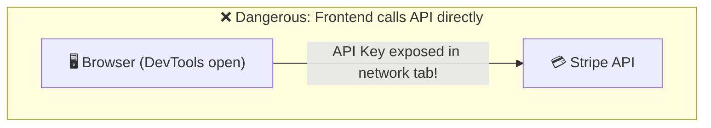
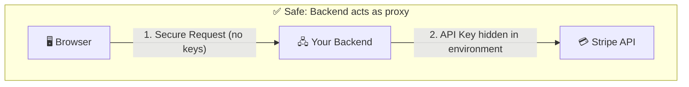
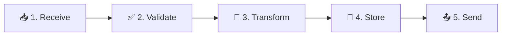
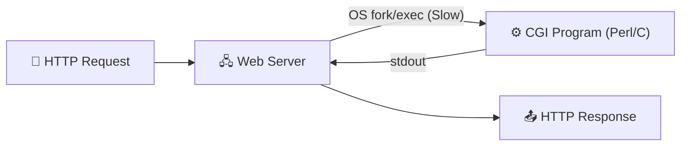
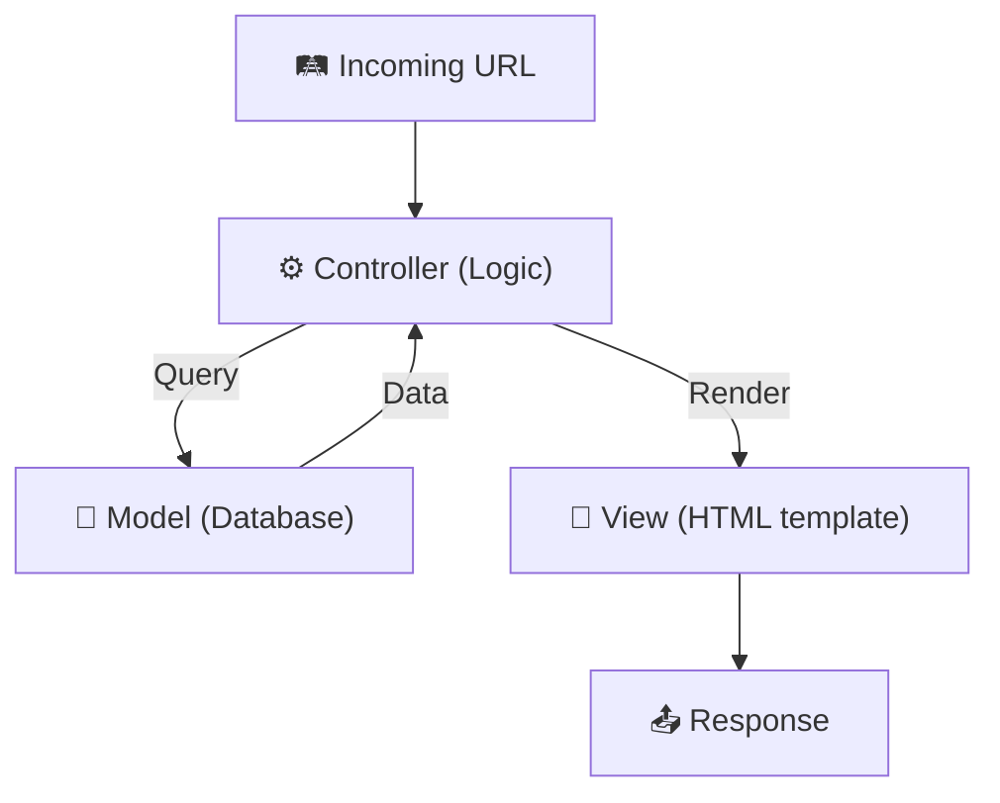
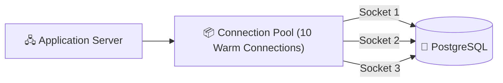
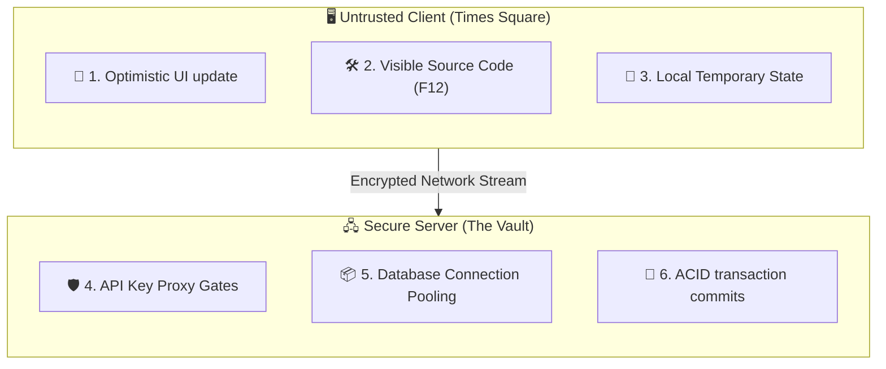

# Chapter II: The Unseen Machinery and the Vault of Trust

> "Backend can be compressed into a single, somewhat reductionist sentence: it is the systematic process we use to deal with data in an environment where we cannot trust the person holding the screen."

---

## I. The Blueberries of Vermont and the Assignats of Paris

If you drive through the rural, winding backroads of Vermont in late July, you will eventually encounter a peculiar economic institution: the roadside farm stand. 

Usually, it is nothing more than a wooden cart decorated with a hand-painted sign: "Blueberries — $4.00 a Pint." There is a stack of cardboard baskets filled with dark, dusty fruit, and next to them, a heavy wooden box with a padlock and a narrow slot cut in the top, labeled "Honesty Box. Please leave money here." 

There is no cashier. There are no security cameras. There is no biometric scanner. The farmer is half a mile away, driving a tractor or eating lunch. The entire transaction—the transfer of property, the calculation of value, the settlement of debt—is delegated entirely to the customer.

If you are a sociologist or a game theorist, the Vermont honesty box is a minor miracle. It is a system that operates with near-zero overhead. 

It has no transaction fees, no administrative costs, and no security personnel. 

And, for the most part, it works. 

In small, tight-knit communities where everyone knows the farmer, where the social density is high, and where the reputational cost of being caught stealing four dollars' worth of fruit is social death, the honesty box is a stable equilibrium. 

The transaction is completed honestly because the cost of dishonesty is internalized by the customer's own nervous system.

Now, imagine taking that exact same wooden cart, with the exact same padlocked box and the exact same blueberries, and placing it in the middle of Times Square at midnight on a Saturday.

It would last roughly four minutes.

The baskets would be taken, the wooden box would be smashed open for the cash inside, and the cart itself would probably be spray-painted or used as a barricade. 

The system collapses not because the blueberries have changed, or because the padlock is weaker, but because the **boundary of trust** has shifted. 

In Times Square, the social density is zero. The reputational cost of theft is non-existent. 

The customer is an anonymous, transient agent with a high immediate incentive to cheat and a zero probability of social sanction. 

To run a business in Times Square, you cannot rely on an honesty box. 

You need a storefront. You need heavy glass windows. You need a cash register operated by an employee who stands *behind* a counter, and you need a vault in the back where the cash is locked away at the end of the night.

Let us look at a second, more catastrophic example: the *Assignats* of the French Revolutionary government in 1789.

Faced with a mounting national debt, the National Assembly issued paper bonds called Assignats, backed by the value of confiscated church lands. 

Initially, these bonds were intended to act as high-value government certificates. 

But because the revolutionary government was weak, disorganized, and lacked a secure, centralized administrative apparatus, they made a critical engineering error: they printed the Assignats on cheap paper with easily replicable ink, and they distributed them without keeping a centralized ledger of who owned what.

Almost immediately, the system was flooded with counterfeits. 

Royalist sympathizers in London printed massive shipments of fake Assignats and shipped them across the English Channel to sabotage the revolutionary economy. 

Local printers in Paris set up their own presses in cellars, churning out millions of livres. 

Because the verification of the bill's validity was left entirely to the local transaction point—the baker, the butcher, or the landlord looking at a piece of paper in a dimly lit shop—there was no secure, authoritative environment to validate the transaction.

By 1796, the Assignats had experienced a hyperinflationary collapse so absolute that they were virtually worthless. The government had to gather all the printing plates and burn them in the Place Vendôme. 

The lesson of the Assignats is identical to the lesson of the Times Square blueberry cart: **If you leave the rules of your transaction, the validation of your tokens, and the administration of your ledger in an open, untrusted environment, your system will be hijacked, corrupted, and driven to ruin.**

In the digital world, the browser is Times Square. 

The user's mobile device is the open, dimly lit Parisian shop. 

And the "backend" is the secure vault, the heavy glass storefront, and the centralized, authoritative ledger that stands behind the counter.

[^1]: There is a fascinating study by economists at the University of Zurich who analyzed honesty boxes in Switzerland. They found that people actually pay more than the suggested price if the box is decorated with an image of human eyes—a psychological hack that triggers our evolutionary fear of social exclusion. But even the "eye hack" collapses if the physical environment is completely anonymous, proving that security is ultimately a function of structural boundaries, not paint.

---

## II. The Great Bifurcation: Client and Server

When we talk about the "frontend" and the "backend," we are not just describing two different directories in a workspace or two different programming languages. 

We are describing a fundamental, architectural **Bifurcation of Trust**.

The frontend—the client—is everything that runs on the user's device. 

This includes the HTML structure, the CSS styles, the React or Vue components, the compiled Swift or Kotlin native binary, and the JavaScript logic running in the browser's V8 engine.

The backend—the server—is everything that runs on machines you own, rent, or control inside a secure cloud data center. 

This includes the Node.js, Go, or Python application runtimes, the API gateways, the load balancers, the Redis cache clusters, and the persistent PostgreSQL or MongoDB databases.

This division is not arbitrary. It is defined by a single, unyielding rule: **The client is an open book; the server is a secure vault.**

### 1. The DevTools Revelation

To understand why the client can never be trusted, we must look at what actually happens when a user opens a web page.

Your server sends a bundle of HTML, CSS, and JavaScript down the wire. 

The user's browser receives this bundle, parses it, and executes it. 

But once those files leave your server, **you lose all control over them.** 

They are loaded into the RAM of a device owned by the user. 

And because the user owns the device, they have complete administrative authority over its operating system, its memory, and its browser runtime.

If you are using Chrome, Safari, or Firefox, you can press `F12` (or right-click and select "Inspect") to open the **Developer Tools**. 

DevTools is not a hacker's toolkit; it is a standard, built-in feature of every modern browser. 

Through DevTools, any user can:
*   View every single line of JavaScript code your application is running.
*   Inspect the values of all active variables, state states, and memory arrays.
*   Set breakpoints to pause the execution of code mid-sentence, letting them modify variables in memory before the code resumes.
*   Inject arbitrary JavaScript directly into the console to invoke internal application functions.
*   Intercept, modify, and replay any network request sent by the browser.

This means that any check, any validation, any cryptographic key, or any business rule you write in the frontend is **purely advisory**. 

If you write a conditional check in your React component:

```javascript
if (user.isAdmin) {
  renderAdminPanel();
}
```

An attacker does not need to compromise your database to access the admin panel. 

They simply open DevTools, go to the console, type `window.user.isAdmin = true`, and watch the interface render the administrative panel instantly. 

If you put your database password inside a frontend configuration variable:

```javascript
const DB_PASSWORD = "my_vault_password_123";
```

Anyone who visits your site can open the "Sources" tab, search for the variable, and extract your raw database keys in three seconds. 

They can then download a database client, connect directly to your database, and run `DROP TABLE users;`, destroying your entire business.

### 2. The API Key Exposure

Modern web applications integrate with a vast ecosystem of third-party services. 

We use Stripe or Razorpay for payments, SendGrid for transactional emails, Twilio for SMS verification, and OpenAI for running AI models. 

Each of these services requires your application to authenticate itself by shipping a secret **API Key** along with every request.

Imagine if you tried to run your application entirely from the browser, making direct requests to Stripe's servers:



To charge a customer's card, your frontend code must send a request to Stripe carrying your secret API key: `sk_live_51Hz...`. 

The moment that request leaves the browser, it is logged in the DevTools "Network" tab. 

Anyone visiting your site can open that tab, copy your secret key, and use it to charge thousands of dollars of fake transactions to your account, or download your entire customer database, or lock you out of your Stripe account.

To prevent this, the backend must act as a **Secure Proxy**:



The browser sends a request to *your* backend: "I would like to purchase this blueberry basket." 

Your backend receives the request, verifies that the user is authenticated and has the funds, and then makes a private, secure call to Stripe using the secret API key stored in a protected server-side environment variable. 

The key never leaves your server. The user never sees it, never handles it, and cannot exploit it.

---

## III. The Five Acts of the Backend Engine Room

If the backend's primary duty is to act as a secure, authoritative gateway for data, what does it actually *do* when a request arrives?

Regardless of the framework you choose—whether it is Node.js with Express, Python with Django, Go with Fiber, or Rust with Actix—the core lifecycle of a backend transaction can be compressed into **Five Sequential Acts**:



### 1. Act I: Receive

The backend receives the raw TCP segments, decrypts the TLS layer, and parses the raw HTTP text stream into a structured object in memory. 

The server reads the HTTP verb (`POST`), the target path (`/v1/registration`), the headers (such as `Content-Type: application/json`), and the raw body payload.

### 2. Act II: Validate

This is the gatekeeper stage. Before the server executes any logic, it must assume the incoming payload is **actively hostile**. 

It runs the data through a series of strict sanitization and validation checks:
*   **Schema Validation**: Does the payload contain all required fields? Are the data types correct? (e.g., is the email actually a string, and is the age actually an integer?)
*   **Sanitization**: Does the input contain malicious scripts? If the user typed `<script>alert('hacked')</script>` in their username field, the server must escape or strip those characters to prevent **Cross-Site Scripting (XSS)** attacks.
*   **Access Control**: Is this user allowed to write to this endpoint? Does their session token match the resource they are trying to modify?

### 3. Act III: Transform

Once the data is verified to be safe and complete, the server must transform it into a useful format. 

For a registration request:
*   The raw password string (`"password123"`) must never be stored in plain text. The server passes it through a high-computation cryptographic hashing algorithm (like **bcrypt** or **Argon2**)[^2] with a random salt value.
*   It generates metadata: a unique UUID for the user, a creation timestamp (`created_at: NOW()`), and default permission scopes.

[^2]: We will inspect the mathematics of password hashing in Chapter VIII. For now, understand that bcrypt is deliberately slow—taking about 100 milliseconds to compute a single hash. This slowness is a feature, not a bug; it makes it computationally impossible for an attacker who steals your database to brute-force user passwords, as testing a billion combinations would take hundreds of years.

### 4. Act IV: Store

The server commits the transformed data to permanent, durable storage. 

It initiates a database connection, compiles a safe SQL query (using parameterized queries to prevent SQL Injection), and writes the row to PostgreSQL or MySQL. 

It may also write a copy of the active session token to Redis for rapid lookups on subsequent requests.

### 5. Act V: Send

The server compiles the result, packages it inside an HTTP response envelope (e.g., `201 Created` with a JSON payload confirming success), and hands it back to the operating system's network stack to be shipped back down the wire to the client.

---

## IV. Chronological Tapestry: From Static Files to Serverless Functions

To appreciate why modern backend systems look the way they do, we must understand how we arrived here. 

The history of backend development is a continuous journey to solve three competing engineering challenges: **Performance, Maintainability, and Scale.**

### Era I: The Static Web (1991–1993)

In the earliest days of the World Wide Web, there was no dynamic logic on the server. 

Web servers like **NCSA HTTPd** or early versions of Apache were simple file-delivery systems. 

When you typed a URL like `http://info.cern.ch/index.html`, the server simply mapped that path to a directory on its local hard drive, read the static HTML file from the disk, and sent it over the TCP socket.

There were no user accounts, no database queries, and no dynamic comments. 

If you wanted to update a webpage, you had to physically log in to the server via FTP, open the HTML file in a text editor, write the changes, and save the file back to disk. 

The web was a read-only library.

### Era II: CGI and the Process-Spawn Storm (1993)

As companies realized the commercial potential of the web, they demanded interactivity. They wanted search engines, online forms, and early shopping carts.

To solve this, web architects formalized the **Common Gateway Interface (CGI)** in 1993. 

CGI allowed the web server to execute an external program on the operating system (written in Perl, C, or a shell script) whenever a specific URL was hit.

The web server would capture the HTTP request data, set it as environment variables on the OS, launch the CGI program, and capture the program's console output (stdout) to send back as the HTTP response.



This was a massive architectural leap. 

Suddenly, web pages could be dynamic, reading and writing to databases via Perl scripts. 

But CGI had a fatal performance flaw: **It spawned a brand new operating system process for every single incoming request.**

In Linux or Unix, spawning a process (`fork()` and `exec()`) is a heavy operation. 

The OS kernel must allocate a new virtual memory address space, set up file descriptors, and load the program binary from disk into RAM.

If your site received a sudden rush of a thousand simultaneous visitors, the server would try to spawn a thousand processes at the same time. 

The CPU would lock up under the sheer overhead of **context switching**, the server's RAM would saturate, and the machine would crash under a "process-spawn storm."

### Era III: Embedded Runtimes and PHP (1995)

To solve the process-spawn storm, developers realized they needed to keep the programming runtime permanently loaded in memory inside the web server itself, rather than spawning it externally.

This led to the creation of embedded module runtimes, the most famous of which was **PHP (Hypertext Preprocessor)**, created by Rasmus Lerdorf in 1995. 

PHP integrated directly with the Apache web server via `mod_php`. 

Instead of launching a separate process, Apache loaded the PHP interpreter once into its own memory space when starting up.

PHP introduced a radical new paradigm: **HTML Templating.** 

Instead of writing a complex C program that outputted HTML strings line-by-line, developers could write standard HTML and embed PHP tags directly inside the file:

```html
<html>
  <body>
    <h1>Welcome, <?php echo $_GET['name']; ?>!</h1>
  </body>
</html>
```

The web server would read this file, execute any code inside the `<?php ?>` tags on the fly, strip the tags, and send the pure HTML output to the browser.

This was incredibly fast and easy to write. 

It democratized web development, powering the rise of massive platforms like WordPress, Yahoo, and Facebook. 

But as applications grew larger, PHP's biggest strength became its biggest structural weakness. 

Because code could be written anywhere in the file, developers began building massive, unmaintainable codebases where database queries, security validations, and HTML presentation logic were all tangled together in a single file—popularly known as **Spaghetti Code**.

### Era IV: MVC and the Separation of Concerns (2004–2005)

To rescue developers from spaghetti code, the industry turned to the **Model-View-Controller (MVC)** design pattern. 

MVC was popularized in the mid-2000s by two highly influential frameworks: **Ruby on Rails** (created by David Heinemeier Hansson in 2004) and **Django** (Python, 2005).

MVC enforced a strict separation of concerns:
*   **Model**: The data structure and database communication layer (typically using an **Object-Relational Mapper (ORM)** like ActiveRecord to represent database tables as native language classes).
*   **View**: The presentation layer (HTML templates with variables).
*   **Controller**: The traffic cop. It maps the URL to a specific function, reads inputs, queries the model, and hands the resulting data to the view.



Rails also popularized the philosophy of **Convention over Configuration**. 

Instead of spending days writing complex configuration files to decide where database tables should map, the framework assumed sensible defaults: a model class named `User` would automatically map to a database table named `users`. 

This dramatically accelerated development velocity.

### Era V: Node.js and the Non-Blocking Revolution (2009)

While MVC frameworks solved maintainability, they ran into a new performance bottleneck as the web transitioned to real-time interactions (like chat, notifications, and continuous streaming).

Traditional servers (like Ruby, Python, or Apache) used a **Thread-per-Request** model. 

When a request arrived, the server allocated a dedicated OS thread to handle it. 

If the application needed to execute a slow database query or read a file from disk, the thread would block, sitting idle in memory while waiting for the I/O operation to complete.

```text
Thread 1: [--- Read from DB (Blocking CPU) ---] --> Return Response
Thread 2: [--- Read from Disk (Blocking CPU) -] --> Return Response
```

If you had ten thousand users waiting on database queries at the same time, you needed ten thousand active threads. 

Each thread consumes about one megabyte of memory stack space, meaning a server would quickly exhaust its RAM and grind to a halt under high concurrency.

In 2009, **Ryan Dahl** created **Node.js**. 

Node.js brought JavaScript to the server, but its real breakthrough was its **Single-Threaded, Event Loop, Non-Blocking I/O** architecture.

Instead of dedicating a thread to each request, Node runs on one single thread. 

When your code initiates an I/O operation (like a database query), Node does not block the thread. 

Instead, it delegates the I/O task to the operating system's kernel or a background worker pool, registers a **Callback Function**, and immediately moves on to handle the next request.

```text
Single Thread: [Req 1 DB Read initiated] -> [Req 2 Disk Read initiated] -> [Req 3 process] -> [DB Read Done -> Callback executed]
```

When the database operation is complete, the kernel triggers an interrupt, placing the callback task in Node's event queue, and the event loop executes it when the thread is free.

Through this event-driven design, a single Node.js server running on modest hardware can manage tens of thousands of concurrent connections with minuscule memory usage, transforming how we build high-concurrency web applications.

### Era VI: Serverless Functions (2014–Present)

Today, we are living in the era of **Serverless Computing**, pioneered by AWS Lambda in 2014.

In all previous eras, developers had to manage servers—virtual machines running on the cloud. 

You had to provision operating systems, configure NGINX, install runtime versions, monitor CPU metrics, and pay for the virtual machine 24/7, even if no one was visiting your site at 3:00 AM.

Serverless abstracts the infrastructure away entirely. 

Developers write simple, isolated functions that perform a single task (e.g., processing a registration or uploading a file). 

These functions are completely stateless.

They do not run on a persistent virtual machine. 

Instead, when an HTTP request arrives, the cloud provider spins up an isolated, micro-container in milliseconds, executes your function, returns the response, and terminates the container.

You only pay for the exact milliseconds your code is physically running. 

If your site receives zero traffic, you pay zero dollars. 

If a million visitors arrive at once, the cloud provider spins up a million micro-containers automatically, handling the scale without you ever configuring a single load balancer.

---

## V. The Three Architectural Pillars of the Backend

Now that we understand why the backend exists and how it evolved, we must look at the three critical systems that make database and server-side computation efficient.

### 1. Connection Pooling: Avoiding the Socket-Creation Tax

Imagine a web application with ten thousand active users. 

If the backend acted naively, every time a user clicked a button, the server would open a brand new TCP connection to the PostgreSQL database, execute the query, and close the connection.

This is exceptionally expensive. 

Opening a connection to a database requires a TCP three-way handshake, a security handshake, allocation of memory buffers on the database server, and authentication checks. 

This process can consume twenty to fifty milliseconds. 

If you do this for every single query, your application will feel incredibly sluggish, and the database will crash under the CPU overhead of establishing thousands of connections per second.

To solve this, modern backends use **Connection Pooling**.



When the application server starts up, it creates a "pool" of warm, persistent database connections (let us say ten active sockets) and keeps them open permanently.

When a request arrives and needs to query the database, it does not open a new socket. 

Instead, it "checks out" an existing, warm connection from the pool in microseconds, executes its query, and immediately returns the connection back to the pool.

The socket is never closed. 

This simple architecture slashes network overhead to near-zero, letting a small number of persistent connections handle thousands of queries per second.

### 2. Query Optimization and the Danger of the Table Scan

A database is not a magic black box that retrieves data instantly. 

If you run a query:

```sql
SELECT * FROM users WHERE email = 'harshit_87@gmail.com';
```

and your database has a million rows, how does it find Harshit?

If you have not configured your database correctly, it must execute a **Full Table Scan**. 

It reads row #1 from disk into RAM, checks if the email matches, then reads row #2, then row #3, all the way to row #1,000,000.

This is a physical catastrophe. 

It saturates disk I/O, consumes 100% of the database CPU, and takes several seconds to complete. 

If ten users run this query at the same time, the database will lock up completely.

To prevent this, the backend must design proper **Database Indexes**.

An index is a separate, highly optimized data structure—typically a **B-Tree (Balanced Tree)**—that keeps a sorted list of your keys (like emails) along with pointers to their physical positions on the disk.

```text
B-Tree Root: [H]
             / \
     [A - G]    [I - Z]
```

When you query with an index, the database does not read the million rows. 

Instead, it walks the B-Tree in logarithmic time—taking at most three or four node comparisons—and jumps directly to the physical disk coordinate of the matching user. 

The query completes in less than one millisecond.

### 3. ACID Transactions: The Safe Deposit Box of Distributed State

Imagine you are building a banking application. 

User A wants to transfer $100 to User B. 

This transaction requires two distinct operations:
1.  Deduct $100 from User A's balance.
2.  Add $100 to User B's balance.

What happens if the first operation succeeds, but immediately after, a sudden power failure strikes the data center, and the server crashes before executing the second operation?

User A has lost $100, but User B never received it. 

The money has vanished into the digital void. 

This is a catastrophic failure of consistency.

To prevent this, the database must process the operations inside an **ACID Transaction**:

```sql
BEGIN TRANSACTION;

UPDATE accounts SET balance = balance - 100 WHERE id = 'user_a';
UPDATE accounts SET balance = balance + 100 WHERE id = 'user_b';

COMMIT;
```

With an ACID transaction, the database guarantees **Atomicity**: the two update commands are treated as a single, indivisible unit of work. 

They must either both succeed together, or if even a single line fails (or if the server crashes mid-way), the entire transaction is **rolled back**, restoring both balances as if the transaction never started.

Your state remains perfectly consistent.

---

## VI. Symmetrical Compendium Summary

We have now explored the deep, unseen machinery that governs the backend. Let us trace the complete, symmetrical division of labor between the client and the server:



Remember: the browser on your screen is not the application. 

It is merely a mirror—a beautiful, dynamic reflection of a state that is safely stored, verified, and managed inside the silent, non-blocking engine rooms of your server fleet.

In the next chapter, we will examine the formal grammar of the web: the HTTP protocol, and trace the history of the treaties that govern how these two worlds speak to each other across the canyon.

---

[Next Chapter → HTTP: The Language of the Web →](./03_HTTP_Deep_Dive.md)
