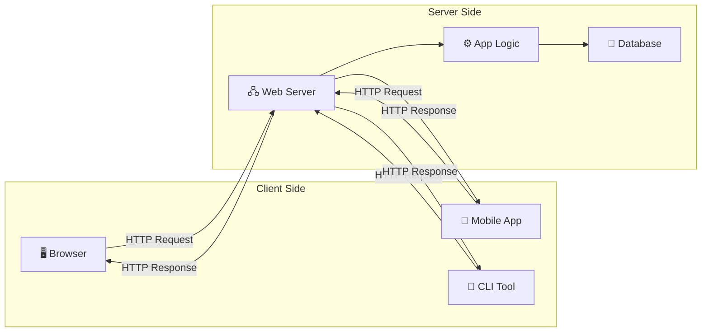
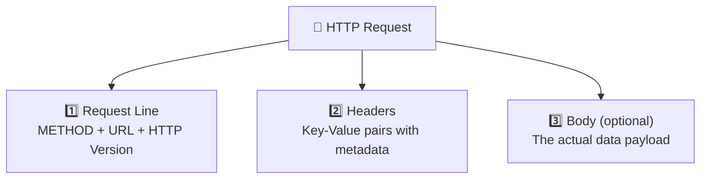

# 🌐 Chapter 3: HTTP — The Language of the Web

> *"HTTP is the medium through which browsers talk with servers."*

---

## 📌 What is HTTP?

**HTTP (HyperText Transfer Protocol)** is the protocol — the agreed-upon set of rules — that governs how messages are formatted, transmitted, and interpreted between clients (browsers, mobile apps, CLI tools) and servers. If the internet is the postal system that physically delivers letters, then HTTP is the language those letters are written in. Both the sender and the receiver need to understand the same language for communication to work, and HTTP is the language that the entire web has standardized on.

But HTTP didn't spring into existence fully formed. It has a rich history that spans over three decades of evolution, and understanding that evolution helps explain why the protocol works the way it does today.

---

## 🏛️ The History of HTTP: From One-Liner to Modern Protocol

HTTP was invented by **Tim Berners-Lee** at CERN in 1989 as part of his proposal for the World Wide Web. The original version, retroactively called **HTTP/0.9**, was almost comically simple. It supported exactly one method — `GET` — and the entire protocol consisted of sending a single line: `GET /page.html`. The server would respond with the raw HTML content and immediately close the connection. There were no headers, no status codes, no content types, no metadata of any kind. It worked, but it was barely more sophisticated than asking someone to read a file aloud.

**HTTP/1.0**, formalized in RFC 1945 in 1996, was the first real version of the protocol. It introduced headers (key-value pairs carrying metadata about the request and response), status codes (like `200 OK` and `404 Not Found`), the `Content-Type` header (so the server could tell the client whether it was sending HTML, an image, or plain text), and support for methods beyond GET (most notably POST, which allowed clients to send data to the server). However, HTTP/1.0 had a crippling performance limitation: every single request required opening a brand-new TCP connection. If a webpage contained 20 images, the browser had to perform 20 separate TCP handshakes — each adding 30+ milliseconds of latency.

**HTTP/1.1**, published in RFC 2068 in 1997 (and updated in RFC 2616 in 1999), fixed this and became the workhorse of the web for nearly two decades. Its most important innovation was **persistent connections** (keep-alive): by default, the TCP connection stayed open after a response was sent, allowing multiple requests to flow over the same connection. HTTP/1.1 also introduced chunked transfer encoding (allowing the server to start sending a response before knowing its total size), the `Host` header (enabling multiple websites to be served from a single IP address — critical for the explosion of shared hosting), content negotiation, caching directives, and the full suite of methods (PUT, DELETE, PATCH, OPTIONS) that form the foundation of RESTful APIs. HTTP/1.1 was so successful that it remained the dominant version of the protocol from 1997 until well into the 2010s.

**HTTP/2**, standardized in 2015 based on Google's experimental SPDY protocol, tackled HTTP/1.1's biggest remaining bottleneck: **head-of-line blocking**. In HTTP/1.1, requests on a single connection had to be processed sequentially — the server couldn't send response #2 until response #1 was completely finished. HTTP/2 solved this with **multiplexing**, allowing multiple requests and responses to be interleaved on a single connection simultaneously. It also introduced header compression (using an algorithm called HPACK), server push (allowing the server to proactively send resources the client would likely need), and binary framing (replacing HTTP/1.1's text-based format with a more efficient binary encoding). All of this happened transparently — the semantics of HTTP (methods, headers, status codes) remained unchanged, only the wire format became more efficient.

**HTTP/3**, published as RFC 9114 in 2022, is the latest major evolution. It replaces TCP with **QUIC** (originally developed by Google), a transport protocol built on top of UDP. QUIC eliminates TCP's head-of-line blocking at the transport layer (where losing a single packet could stall all streams), provides built-in encryption (TLS 1.3 is integrated into the protocol rather than being a separate handshake), and supports connection migration (so your connection survives switching from Wi-Fi to cellular). HTTP/3 adoption is growing rapidly, with major services like Google, Facebook, and Cloudflare already supporting it.

---

## 💡 Two Models for Running Backend Code

When we talk about how HTTP requests are handled, there are two dominant architectural models: the traditional client-server model and the newer serverless model. Both use HTTP as the communication protocol — the difference lies in who manages the server infrastructure and how the backend code is executed.

### 1. Client-Server Model

The client-server model is the traditional architecture that has powered the web since its inception. There's a clear separation between the **client** (the browser, mobile app, or any software making requests) and the **server** (the machine running the backend code that processes those requests and returns responses). In this model, you as the developer are responsible for provisioning, configuring, deploying, and maintaining the server. You choose the hardware (or cloud VM), install the operating system, set up the runtime environment, deploy your application code, configure networking and firewalls, and monitor the server's health.



The client-server model has several defining characteristics that are worth understanding deeply. First, the **client always initiates** communication — the server never randomly pushes data to the client unless the client has asked for it (WebSocket connections being a notable exception that we'll cover later). This request-response pattern is fundamental to HTTP. Second, HTTP is **stateless**, meaning each request is completely independent — the server doesn't inherently remember anything about previous requests from the same client. If the server needs to track a user's session, it has to use explicit mechanisms like cookies or tokens, because the protocol itself treats every request as a fresh interaction with a stranger. Third, there's a clear **separation of concerns**: the client handles the user interface and user interactions, while the server handles data processing, business logic, and storage. This separation allows frontend and backend teams to work independently, evolving their respective codebases at different paces.

The client-server model gives you maximum control over your infrastructure. You can fine-tune server configurations, install specialized software, optimize database access patterns, and handle real-time connections (WebSockets, Server-Sent Events). The tradeoff is operational complexity — you're responsible for scaling, security patching, uptime monitoring, and capacity planning.

---

### 2. Serverless Model

The serverless model, despite its misleading name, absolutely still uses servers — you just don't manage them. A cloud provider like AWS (Lambda), Google Cloud (Cloud Functions), Azure (Functions), Vercel, or Cloudflare Workers runs your code on-demand in response to events, and handles all the infrastructure concerns (provisioning, scaling, patching, monitoring) automatically.

The serverless concept emerged from a broader trend in cloud computing toward higher levels of abstraction. In the early 2000s, developers managed physical servers. Then IaaS (Infrastructure as a Service) providers like AWS EC2 (launched 2006) let you rent virtual machines instead. Then PaaS (Platform as a Service) providers like Heroku (2007) managed the operating system and runtime for you. Serverless (pioneered by AWS Lambda in **2014**) took this one step further: you write individual functions, upload them, and the cloud provider executes them whenever a trigger fires — an HTTP request, a database change, a file upload, a scheduled timer. Your function runs, returns a result, and shuts down. You pay only for the actual compute time consumed, often measured in milliseconds.


The serverless model offers automatic scaling (from zero requests to millions, the provider handles it), zero server maintenance, and a pay-per-use pricing model that can be dramatically cheaper for sporadic workloads. The main tradeoffs are **cold starts** (when a function hasn't been invoked recently, the provider needs to spin up a new instance, which can add 100–500ms of latency on the first request), limited execution duration (most providers cap function runtime at 5–15 minutes), and less control over the execution environment.

> [!NOTE]
> Both models use HTTP as the communication protocol. The difference is in **who manages the server infrastructure**, not in how clients communicate. Whether your backend runs on a VM you provisioned manually or on a Lambda function that scales automatically, the client still sends the same HTTP request and receives the same HTTP response.

---

## 🔗 HTTP Uses TCP: Understanding the Protocol Stack

HTTP is an **application-layer** protocol, which means it sits at the top of the networking stack and relies on lower-level protocols to handle the mechanics of actually delivering data across the internet. Specifically, HTTP runs on top of **TCP** (Transmission Control Protocol) at the transport layer, which in turn runs on top of **IP** (Internet Protocol) at the network layer.

```
┌─────────────────────────────┐
│     Application Layer       │ ← HTTP lives here
├─────────────────────────────┤
│     Transport Layer         │ ← TCP lives here
├─────────────────────────────┤
│     Network Layer           │ ← IP lives here
├─────────────────────────────┤
│     Link Layer              │ ← Ethernet/Wi-Fi
└─────────────────────────────┘
```

This layered architecture (formalized in both the OSI model from the 1980s and the simpler TCP/IP model) is one of the most elegant design decisions in all of computing. Each layer handles one concern and exposes a clean interface to the layer above it. IP handles addressing and routing — getting packets from point A to point B across the internet. TCP handles reliability — ensuring packets arrive completely, correctly, and in order. And HTTP handles semantics — defining what a "request" and "response" look like, what methods and headers mean, and how clients and servers should behave.

The reason HTTP chose TCP over UDP comes down to reliability. HTTP delivers structured data — HTML documents, JSON payloads, images, scripts — where every single byte matters. A missing packet in a webpage would cause garbled HTML. A missing packet in a JSON response would produce invalid JSON that crashes the client's parser. TCP guarantees that none of this happens by detecting lost packets and retransmitting them, and by reassembling packets that arrive out of order. UDP, by contrast, is a "fire and forget" protocol — it sends packets without any guarantee of delivery, ordering, or integrity. UDP is perfect for use cases where speed matters more than completeness (live video streaming, online gaming, DNS lookups), but it's entirely unsuitable for the structured, complete data that HTTP needs to deliver.

> [!NOTE]
> HTTP/3 is an interesting exception: it uses **QUIC**, which is built on top of UDP rather than TCP. But QUIC itself implements reliability, ordering, and congestion control — it essentially reimplements TCP's guarantees on top of UDP, with the added benefit of avoiding TCP's head-of-line blocking. So even in HTTP/3, the data is delivered reliably; it's just the mechanism that changed, not the guarantee.

---

## 📦 How Does an HTTP Message Look?

HTTP messages come in two types: **Requests** (sent by the client to the server) and **Responses** (sent by the server back to the client). Both follow a similar structure with three components: a start line, headers, and an optional body. Understanding this structure is essential because every single interaction between a frontend and a backend — every API call, every page load, every form submission — is an HTTP message.

### HTTP Request Structure

An HTTP request is how the client tells the server what it wants. Every request consists of three parts: the **request line** (which specifies the HTTP method, the URL path, and the protocol version), the **headers** (key-value pairs carrying metadata about the request), and optionally a **body** (containing data the client is sending to the server, such as a JSON payload for a POST request).

```http
POST /api/users/login HTTP/1.1        ← Request Line (Method + Path + Version)
Host: api.example.com                  ← Headers start here
Content-Type: application/json         ← 
Authorization: Bearer abc123           ← 
Accept: application/json               ← 
User-Agent: Mozilla/5.0                ← Headers end here
                                       ← Empty line (separator)
{                                      ← Body starts here
  "email": "harshit@gmail.com",        ← 
  "password": "mypassword123"          ← 
}                                      ← Body ends here
```

The request line is a single line that carries the three most essential pieces of information: the **method** (what action the client wants to perform — GET, POST, PUT, DELETE, etc.), the **path** (which resource the client is targeting — `/api/users/login` in this case), and the **HTTP version** (almost always `HTTP/1.1` or `HTTP/2`). The headers that follow provide rich context about the request without requiring the server to parse the body. And the body, when present, carries the actual data payload — typically a JSON object for modern APIs.



> [!TIP]
> **GET and DELETE** requests typically have **no body** — they're just asking the server to retrieve or remove a resource, so the URL and headers carry all the necessary information. **POST, PUT, and PATCH** requests typically include a body because they're sending data to the server (creating, replacing, or updating a resource).

---

## 📋 HTTP Headers — Why Do We Even Need Them?

Headers are key-value pairs that carry **metadata** about the request or response. They might seem like bureaucratic overhead at first glance, but they serve a critical purpose: they allow the server (or client) to make informed decisions about how to process the message **without needing to read the entire body**.

Think of headers like the **label on a shipping package**. When a package arrives at a warehouse, the workers don't need to open the box to know where it came from, where it's going, how fragile it is, or what's inside — all of that information is printed on the label. Similarly, HTTP headers tell the server what format the body is in (`Content-Type: application/json`), who sent the request (`Authorization: Bearer abc123`), what language the client prefers (`Accept-Language: en-US`), and how large the body is (`Content-Length: 256`) — all before the server reads a single byte of the body itself.

This ability to inspect metadata before processing the body is crucial for efficiency and correctness. A server can reject a request with an unsupported content type (returning `415 Unsupported Media Type`) without wasting resources parsing the body. It can check authentication credentials in the `Authorization` header before processing an expensive database query. It can route the request to the correct handler based on the `Host` header when multiple websites share the same server. Headers make all of this possible.

---

## 📂 Categories of HTTP Headers

HTTP headers are organized into several categories based on their purpose. Understanding these categories helps you know which headers to set and when, both as a client making requests and as a server sending responses.

### 1. 🔍 Request Headers

Request headers are sent by the client to provide context about the request itself — who is making the request, what kind of response they can handle, and what authentication credentials they're presenting. The `Host` header specifies which domain the request is targeting (essential for virtual hosting, where multiple websites share a single server). The `User-Agent` header identifies the client software (browser name and version, operating system, device type), which servers can use for analytics or to serve different content to different clients. The `Accept` header tells the server what response formats the client can handle (JSON, HTML, XML), while `Accept-Language` and `Accept-Encoding` specify language and compression preferences respectively. The `Authorization` header carries authentication credentials — most commonly a Bearer token (JWT) for API authentication. And the `Cookie` header sends any previously stored cookies back to the server with every request.

| Header | Purpose | Example |
|---|---|---|
| `Host` | Which server/domain to reach | `Host: api.example.com` |
| `User-Agent` | Info about the client (browser, OS) | `User-Agent: Mozilla/5.0 (Windows NT 10.0)` |
| `Accept` | What response formats the client can handle | `Accept: application/json, text/html` |
| `Accept-Language` | Preferred language | `Accept-Language: en-US, hi-IN` |
| `Accept-Encoding` | Supported compression formats | `Accept-Encoding: gzip, br` |
| `Authorization` | Authentication credentials | `Authorization: Bearer eyJhbG...` |
| `Cookie` | Previously stored cookies | `Cookie: session=abc123` |
| `Referer` | Previous page URL | `Referer: https://google.com` |

---

### 2. 📤 Response Headers

Response headers are sent by the server to provide context about the response. The `Content-Type` header is arguably the most important — it tells the client what format the response body is in so the client knows how to parse it. A `Content-Type: application/json` means the body is a JSON string that should be parsed with `JSON.parse()`, while `Content-Type: text/html` means the body is an HTML document that should be rendered by the browser's layout engine. The `Set-Cookie` header instructs the client's browser to store a cookie that will be automatically sent back with future requests (this is how sessions work). The `Cache-Control` header tells the client (and any intermediate proxies or CDNs) how long the response can be cached before it needs to be re-fetched. And the `Access-Control-Allow-Origin` header is the key CORS header that tells the browser whether a cross-origin request is permitted — a topic we'll cover in depth in Chapter 4.

| Header | Purpose | Example |
|---|---|---|
| `Content-Type` | Format of the response body | `Content-Type: application/json` |
| `Content-Length` | Size of the response body in bytes | `Content-Length: 348` |
| `Set-Cookie` | Instructs client to store a cookie | `Set-Cookie: session=xyz; HttpOnly` |
| `Cache-Control` | Caching instructions | `Cache-Control: max-age=3600` |
| `Location` | Redirect URL (used with 3xx status) | `Location: /dashboard` |
| `Server` | Server software info | `Server: nginx/1.25` |
| `Access-Control-Allow-Origin` | CORS — which origins can access | `Access-Control-Allow-Origin: *` |

---

### 3. 🔄 Representation Headers

Representation headers describe the body of the resource being transferred. While there's overlap with response headers, representation headers specifically characterize the content itself — its MIME type, its encoding, its language, and its length. These headers are important because the same resource (say, a user's profile data) could be represented in different formats (JSON, XML, HTML), different languages (English, Hindi), or different compression encodings (gzip, Brotli). The representation headers tell the recipient exactly which variant they're receiving.

| Header | Purpose | Example |
|---|---|---|
| `Content-Type` | MIME type of the body | `Content-Type: text/html; charset=UTF-8` |
| `Content-Encoding` | Compression applied to body | `Content-Encoding: gzip` |
| `Content-Language` | Language of the content | `Content-Language: en-US` |
| `Content-Length` | Size in bytes | `Content-Length: 1024` |

---

### 4. 📦 Payload Headers

Payload headers describe the payload data itself, which may differ from the representation after encoding or compression has been applied. For example, if a 10KB JSON response is compressed with gzip to 3KB, the `Content-Length` in the payload context refers to the 3KB compressed size that's actually being transmitted over the wire. The `Transfer-Encoding: chunked` header indicates that the response body is being sent in chunks rather than all at once — useful when the server doesn't know the total response size in advance (for example, when streaming data from a database query).

| Header | Purpose | Example |
|---|---|---|
| `Content-Length` | Length of the payload | `Content-Length: 512` |
| `Content-Range` | Which part of a resource is being sent | `Content-Range: bytes 200-999/8000` |
| `Transfer-Encoding` | How the payload is encoded for transfer | `Transfer-Encoding: chunked` |

---

## 🧩 Two Special Properties of HTTP Headers

### Property 1: Extensibility

One of HTTP's most powerful design decisions is that its headers are **extensible** — you can create your own custom headers without needing to modify the protocol specification or get approval from any standards body. This extensibility is what has allowed HTTP to remain relevant for three decades despite the web's radical evolution.

```http
X-Request-ID: abc-123-def-456
X-Rate-Limit-Remaining: 47
X-Custom-Feature-Flag: dark-mode-enabled
```

Historically, custom headers used the `X-` prefix to distinguish them from standardized headers. This convention was officially deprecated by RFC 6648 in 2012 because it created problems when custom headers later became standards (the `X-` prefix would be stuck in the name forever). Despite this, many APIs still use the `X-` prefix by convention, and you'll see it frequently in the wild. The important principle is that you can name custom headers anything you want, as long as they don't conflict with standard headers. This extensibility means HTTP can evolve organically — new capabilities can be added by individual services via custom headers, and if they prove broadly useful, they can eventually be standardized without breaking backward compatibility.

---

### Property 2: Remote Control

Headers give the server a remarkable ability to **remotely control client behavior** without the client needing any special application code. The browser is built to automatically obey certain headers, which means the server can dictate caching policy, set cookies, trigger redirects, enforce HTTPS, and control file download behavior — all through headers alone.

| Header | Remote Control Action |
|---|---|
| `Cache-Control: no-store` | "Don't cache this response at all!" |
| `Cache-Control: max-age=86400` | "Cache this for 24 hours" |
| `Set-Cookie: theme=dark` | "Store this preference on the client" |
| `Location: /new-page` | "Redirect to this URL" |
| `Retry-After: 60` | "You're rate-limited; try again in 60 seconds" |
| `Content-Disposition: attachment` | "Download this file instead of displaying it" |
| `Strict-Transport-Security` | "Always use HTTPS from now on" |

This is a form of **declarative programming** applied to network communication. Instead of the server sending instructions that the client must interpret and execute (which would require client-side code), the server simply sets headers that the browser has been pre-programmed to obey. The `Strict-Transport-Security` header is a particularly powerful example: once a server sends it, the browser will refuse to connect to that domain over plain HTTP for the specified duration, automatically upgrading all future requests to HTTPS. A single header, sent once, provides security protection for potentially years — no client-side JavaScript required.

---

[← Previous: What is Backend?](./02_What_Is_Backend.md) | [Next: HTTP Methods →](./04_HTTP_Methods.md)
