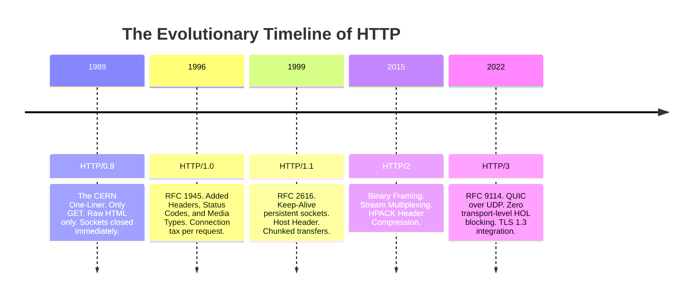
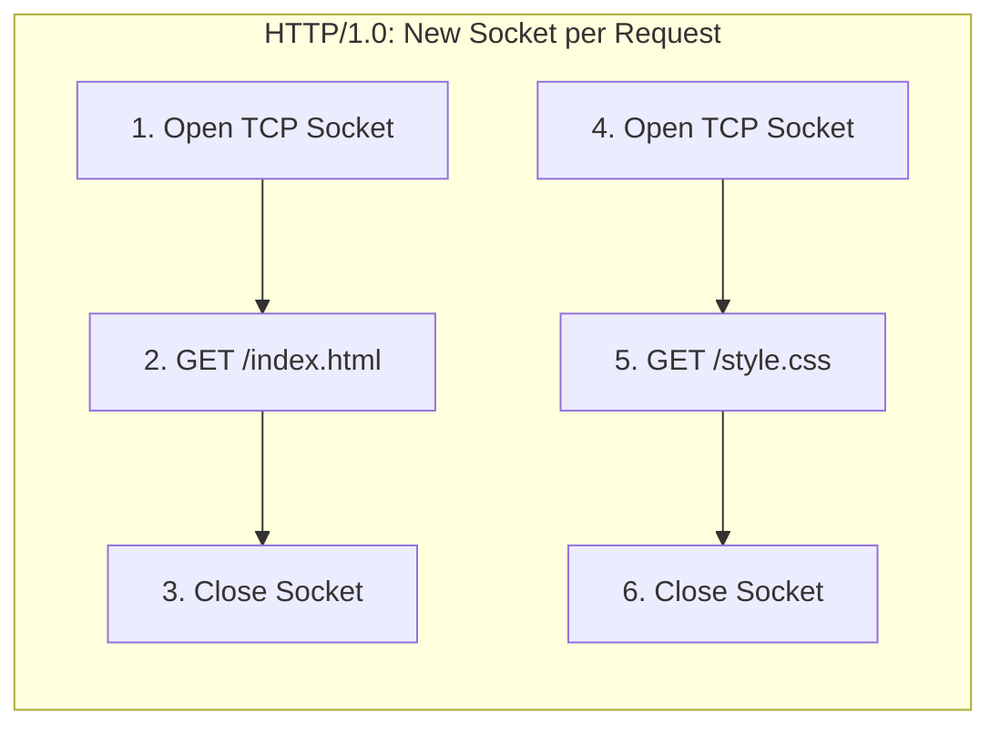
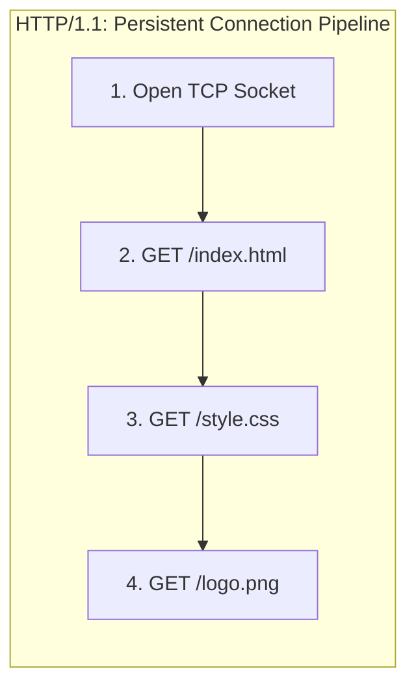
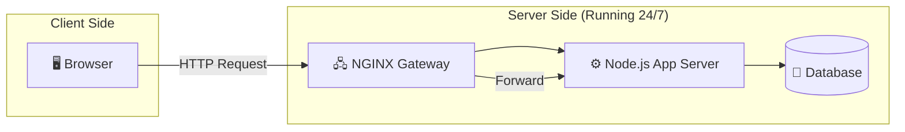
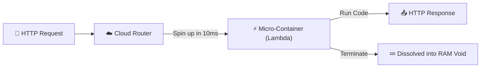

# Chapter III: The Digital Grammar and the Treaties of CERN

> "HTTP is the formal treaty of international trade for the web—the strict, agreed-upon grammar that prevents a transaction from collapsing into a semantic Tower of Babel."

---

## I. The Kowtow of Macartney and the Charge of the Light Brigade

In September of 1793, the <strong>Earl of Macartney</strong> arrived at the summer palace of the <strong>Qianlong Emperor</strong> in Rehe, bearing hot-air balloons, pocket watches, and a letter from King George III. 

His mission was simple: open trade between the British Empire and the Qing Dynasty. 

But before he could even present his balloons, the negotiation ground to a screeching halt over a single, highly contested question of physical grammar: the <strong>Kowtow</strong>.

In the diplomatic grammar of the Qing court, the kowtow—kneeling three times and touching one's forehead to the floor nine times—was an absolute prerequisite. 

It was the physical serialization format of respect, proving that the visitor acknowledged the Emperor as the Son of Heaven. 

But to Macartney, kneeling was a sign of religious worship reserved strictly for God. 

In British diplomatic grammar, one bowed, and perhaps kissed the hand of the sovereign. 

Macartney offered to kowtow only if a Chinese official of equal rank did the same before a portrait of King George III. 

The Qing court refused, viewing this as an absurd, syntax-breaking demand. 

Macartney eventually performed a modified British bow; the Emperor, insulted by what he saw as incomplete, corrupted syntax, rejected the trade treaty. 

The two empires, unable to agree on a shared protocol for bowing, drifted toward seventy years of war and economic devastation.

Let us look at a second, more immediate tragedy of corrupted grammar: the <strong>Charge of the Light Brigade</strong> in 1854.

During the Battle of Balaclava, Lord Raglan saw Russian soldiers preparing to carry off captured Turkish guns on the heights. 

He scribbled a brief, urgent order to Lord Lucan: *"Lord Raglan wishes the cavalry to advance rapidly to the front, and try to prevent the enemy carrying away the guns."*

When the messenger, Captain Nolan, delivered the note to Lucan, they were standing in a valley. 

Lucan could not see the heights; the only guns visible to him were a battery of Russian artillery at the far end of the valley, flanked by cavalry and infantry. 

Lucan, confused by the note, asked Nolan which guns Raglan meant. 

Nolan, impatient and arrogant, gestured vaguely toward the end of the valley and snapped: *"There, my Lord, is your enemy! There are your guns!"*

Lucan interpreted Raglan's verb "advance" through Nolan's physical gesture. 

He ordered the Light Brigade to charge straight down the throat of the Russian valley. 

Of the six hundred and seven cavalrymen who rode out, only half returned. 

The disaster occurred not because the horses were slow, or because the soldiers were cowards, but because the <strong>grammatical envelope of the message</strong> lacked a shared, deterministic dictionary. 

The word "guns" mapped to one coordinate in Raglan's mind and a completely different coordinate in Lucan's mind, and the protocol had no header fields to resolve the ambiguity.

These are not isolated historical curiosities. They are examples of the <strong>Grammatical Coordination Problem</strong>—a mathematical truth that applies to all communicating agents: <strong>If two independent systems try to exchange state without a rigid, deterministic, and universally agreed-upon protocol, their interactions will inevitably slide into corruption, misunderstanding, and systemic failure.</strong>

When a web browser in Mumbai tries to communicate with a server in San Francisco, it is facing the exact same problem that broke Macartney at Rehe. 

The browser and the server are separated by miles of noisy wire, different operating systems, and different programming languages. 

If the browser sends a raw stream of characters: `give_me_my_dashboard_now_please_harshit`, the server will look at it with the same blank incomprehension that Lucan showed Captain Nolan. 

Is `give_me` a verb? Is `dashboard` a resource? Where do the headers end and the metadata begin?

To solve this, we rely on the <strong>HyperText Transfer Protocol (HTTP)</strong>. 

Formalized by <strong>Tim Berners-Lee</strong> at CERN in 1989, HTTP is the diplomatic grammar of the web. 

It defines exactly how a request must kowtow to a server, exactly how the envelopes must be labeled, and exactly how the status of the transaction must be serialized down the physical wire.

[^1]: There is a beautiful, highly technical essay by the late network theorist Jonathan Postel (author of RFC 793) where he states: *"Be conservative in what you send, and liberal in what you accept."* This is popularly known as <strong>Postel's Law</strong>, and it has guided the implementation of virtually every HTTP client and server for thirty years. It is the reason your browser does not crash when a server returns a slightly misspelled header.

---

## II. The Archaeology of HTTP: From One-Liner to Multiplexed Silicon

HTTP did not spring into existence fully formed. 

It was carved out over three decades of continuous optimization, as the web grew from a quiet index of research papers to a high-speed engine of global commerce. 

Let us trace this evolutionary archaeology:



### 1. HTTP/0.9: The CERN One-Liner (1989–1991)

The original version of the protocol was almost comically minimal. 

It had exactly one method: `GET`. 

It did not support headers, status codes, content-type negotiations, or metadata of any kind. 

A client opened a raw TCP socket to the server and sent a single line:

```text
GET /index.html
```

The server read the line, mapped it to a file, loaded the HTML from disk, shipped the raw HTML characters back over the socket, and <strong>immediately closed the connection.</strong>

It was simple, it was fast, and it was entirely text-based. 

But it was barely more sophisticated than asking a neighbor to read a document aloud over a fence. 

If the page had an image, HTTP/0.9 could not serve it, because there was no way to tell the browser: "I am sending you binary JPEG bytes, not HTML text."

### 2. HTTP/1.0: The Metadata Revolution (1996)

As the web expanded, developers demanded the ability to serve images, style sheets, and binary files. 

This led to the formalization of <strong>HTTP/1.0</strong> in RFC 1945.

HTTP/1.0 introduced the structural layout we still use today:
*   <strong>Request/Response Headers</strong>: Key-value pairs carrying metadata about the transaction (e.g., `Content-Type`, `User-Agent`).
*   <strong>Status Codes</strong>: Numeric indicators of success or failure (e.g., `200 OK`, `404 Not Found`).
*   <strong>Content-Type (MIME Types)</strong>: Allowing servers to declare exactly what type of asset was being returned.

But HTTP/1.0 carried a crippling performance limitation: <strong>Every single request paid a heavy "TCP Connection Tax."</strong>



If a webpage contained an HTML file, a CSS stylesheet, and ten images, the browser had to open and close <strong>twelve separate TCP connections</strong> sequentially. 

Each connection required a full TCP three-way handshake, costing valuable round-trip latency. 

On a slow 1996 telephone line, the page felt incredibly sluggish, as the browser spent more time negotiating TCP handshakes than actually downloading the bytes.

### 3. HTTP/1.1: Persistent Sockets (1997–1999)

Formalized in RFC 2616, <strong>HTTP/1.1</strong> saved the web by introducing <strong>Persistent Connections (Keep-Alive)</strong>.

Under HTTP/1.1, the TCP connection does not close after the response is sent. 

Instead, the browser keeps the socket open and uses it to stream subsequent requests sequentially down the same warm pipeline.



HTTP/1.1 also introduced:
*   <strong>The `Host` Header</strong>: Enabling multiple websites (e.g., `site-a.com` and `site-b.com`) to be served from a single physical IP address—the foundation of shared web hosting.
*   <strong>Chunked Transfer Encoding</strong>: Letting the server stream long, dynamic responses before knowing their final size.
*   <strong>PUT, DELETE, and OPTIONS</strong>: Formalizing the verbs necessary for modern RESTful APIs.

But HTTP/1.1 carried its own architectural bottleneck: <strong>Head-of-Line (HOL) Blocking</strong>.

Although the TCP connection remained open, the requests were strictly sequential. 

The server had to process and return response #1 before it could start sending response #2. 

If response #1 was a slow database query, and response #2 was a fast static image, the image was blocked behind the database write, sitting idle in the server's buffer. 

To bypass this, browsers started opening up to <strong>six parallel TCP connections</strong> to the same host, which worked but consumed massive operating system resources on both ends.

### 4. HTTP/2: Binary Framing and Multiplexing (2015)

Standardized in 2015 based on Google's experimental SPDY protocol, <strong>HTTP/2</strong> broke the head-of-line blocking bottleneck at the application layer.

Instead of writing text streams, HTTP/2 splits all requests and responses into small, binary <strong>Frames</strong>. 

These frames are labeled with a <strong>Stream ID</strong> and slung down a single TCP connection simultaneously.

```text
HTTP/2 Stream: [Frame 1 (Stream 1)] -> [Frame 1 (Stream 2)] -> [Frame 2 (Stream 1)] -> [Frame 2 (Stream 2)]
```

The server can process these frames in any order, interleaving them on the fly. 

If the database write (Stream 1) is slow, the server simply shoots the static image frames (Stream 2) down the wire in the middle of the Stream 1 frames. 

The browser receives the frames, reads their Stream IDs, and reconstructs the files in memory. 

The head-of-line blocking is completely eliminated.

HTTP/2 also introduced:
*   <strong>HPACK Header Compression</strong>: Compressing the massive, repetitive HTTP headers using a shared dictionary, saving precious bytes on mobile networks.
*   <strong>Server Push</strong>: Allowing the server to proactively send critical assets (like CSS files) to the browser before the browser even asks for them.

### 5. HTTP/3: QUIC over UDP (2022)

While HTTP/2 solved head-of-line blocking at the *application* layer, it remained vulnerable to head-of-line blocking at the *transport* layer.

Because HTTP/2 still runs on top of TCP, the OS kernel views the connection as a single, sequential stream of packets. 

If a single packet of Stream 1 is lost in transit, TCP halts all processing, refusing to let the application read *any* of the subsequent packets (even the healthy packets belonging to Stream 2) until the lost packet is retransmitted. 

A flaky Wi-Fi connection with 1% packet loss would choke the entire multiplexed pipeline.

To solve this final bottleneck, <strong>HTTP/3</strong> replaces TCP entirely with <strong>QUIC (Quick UDP Internet Connections)</strong>, running on top of <strong>UDP</strong>.

UDP is a stateless, packet-switched protocol with zero reliability built-in. 

QUIC implements its own, highly optimized reliability layers directly in user space. 

Under QUIC, each stream is treated as an independent logical entity at the transport layer. 

If a packet belonging to Stream 1 is lost, the operating system continues to feed Stream 2 packets to the application without a microsecond of delay. 

Only Stream 1 is paused while the lost packet is fetched.

QUIC also integrates <strong>TLS 1.3</strong> directly into its connection handshake, cutting connection time to exactly one round trip, and supports <strong>Connection Migration</strong>, letting your active video call survive as your phone switches from your home Wi-Fi to a cellular network.

---

## III. The Battle of Paradigms: Dedicated Servants vs. On-Demand Phantoms

When we construct web applications, how does our code physically handle these incoming HTTP streams? 

Today, the industry is divided between two dominant architectural models: <strong>The Traditional Client-Server Model</strong> and <strong>The Serverless Event Model</strong>.

### 1. The Client-Server Model: The Dedicated Servant

The traditional client-server model is the architecture that has run the web since Tim Berners-Lee's first server at CERN.

In this model, you rent or provision a permanent virtual machine (such as an AWS EC2 instance). 

You install the operating system, configure a web server (like NGINX), start your application runtime (like Node.js), and keep it running 24 hours a day, 7 days a week.



This model is defined by three immutable traits:
*   <strong>The Client Initiates</strong>: The server stands as a silent, passive sentinel. It cannot initiate a request; it only speaks when spoken to.
*   <strong>Statelessness</strong>: Every HTTP request is treated as a completely isolated transaction. The server does not inherently remember previous requests from the same user. If your user is logged in, they must explicitly present their identity token with *every single click*, because the protocol has no memory.
*   <strong>Dedicated Resources</strong>: Your application thread pool stands warm and ready in memory. When a request arrives, the CPU can process it immediately without startup delays.

The client-server model gives you total, fine-grained control over your server environment, allowing you to establish low-latency, persistent TCP connections (like WebSockets) for real-time messaging. 

The tradeoff is operational friction: you are responsible for monitoring CPU thresholds, deploying patches, and paying for the virtual machine even if no one visits your site for days.

### 2. The Serverless Model: The On-Demand Phantom

Pioneered by AWS Lambda in 2014, the serverless event model operates on a completely different philosophy: <strong>Compute on-demand, charge by the millisecond.</strong>

In a serverless model, you do not manage a persistent virtual machine. 

Instead, you write isolated, stateless functions and upload them to a cloud provider. 

The function sits dormant inside the cloud provider's storage systems. 

When an HTTP request arrives, the cloud provider's router captures it, spins up an isolated, lightweight container in milliseconds, loads your code into RAM, executes the function, returns the HTTP response, and <strong>immediately destroys the container.</strong>



This model offers incredible advantages:
*   <strong>Infinite Elastic Scaling</strong>: If one hundred thousand requests land on your site simultaneously, the router spins up one hundred thousand parallel containers on the fly, handling the traffic without a single configuration tweak.
*   <strong>Perfect Cost Optimization</strong>: You only pay for the exact milliseconds your code is running. If your site receives no traffic at night, your bill is exactly zero dollars.

But the serverless model carries major trade-offs:
*   <strong>Cold Starts</strong>: If a function has not been invoked recently, the initial request must wait for the cloud provider to provision the container and load the code, adding up to 500 milliseconds of latency to the first interaction.
*   <strong>Stateless Execution</strong>: Because the container is destroyed after each run, you cannot store variables in local server memory or maintain persistent database socket pools between calls, forcing you to rely on external caching layers (like Upstash Redis) or database proxies.

---

## IV. The Anatomy of the HTTP Telegram

Regardless of the model you use, the raw text of the HTTP request that travels down the wire remains a highly structured, readable telegram. 

Let us break down the exact anatomy of an outgoing `POST` request and the returning `200 OK` response:

```carousel
```text
POST /v1/users HTTP/1.1
Host: api.sriniously.com
Content-Type: application/json
User-Agent: Mozilla/5.0
Content-Length: 43

{
  "name": "Harshit",
  "role": "Curator"
}
```
<!-- slide -->
```text
HTTP/1.1 200 OK
Date: Tue, 19 May 2026 12:00:00 GMT
Content-Type: application/json
Content-Length: 31

{
  "status": "success",
  "id": 101
}
```
````

Let us analyze the three distinct segments of this transaction:

### 1. The Request Line

The very first line of the request: `POST /v1/users HTTP/1.1` carries the three core parameters of the request:
*   <strong>The Verb</strong>: `POST`, indicating that the client wishes to write new data to the server.
*   <strong>The Path</strong>: `/v1/users`, identifying the specific target resource in our routing tree.
*   <strong>The Version</strong>: `HTTP/1.1`, declaring which treaty version the client is using to format its grammar.

### 2. The Headers Block

Following the request line is a block of key-value headers:
*   `Host: api.sriniously.com`: Crucial for shared server routing, telling the proxy which virtual host should process the request.
*   `Content-Type: application/json`: Defining the serialization grammar of the payload, telling the server's parser to interpret the body bytes as a structured JSON object.
*   `Content-Length: 43`: Declaring the exact byte boundary of the payload, telling the server exactly when the body ends and the next request on the socket begins.

### 3. The Body Payload

Separated from the headers block by a <strong>mandatory blank line (CRLF)</strong>, the body contains the raw, serialized payload payload. 

In this case, it is a clean JSON object containing the user's name and role.

---

## V. Key Takeaways

We have now mapped the complete, elegant grammar of the web. Let us review the key parameters of the protocol layers:

| Layer / Model | Transport Protocol | Latency Profile | Core Benefit | The Bottleneck |
| :--- | :--- | :--- | :--- | :--- |
| <strong>HTTP/1.1</strong> | TCP (RFC 793) | ~50 - 150ms | Keep-Alive persistent connection recycling | Head-of-Line Blocking at application layer |
| <strong>HTTP/2</strong> | TCP (RFC 793) | ~30 - 80ms | Frame Multiplexing on a single socket | Head-of-Line Blocking at transport layer |
| <strong>HTTP/3</strong> | QUIC over UDP | ~10 - 50ms | Stream Independence and integrated TLS 1.3 | High CPU packet validation overhead |
| <strong>Serverless</strong> | On-Demand Routing | ~100 - 600ms | Automatic, infinite scaling with zero idle cost | Cold Starts and Stateless connection pool limits |

HTTP is not merely a tool for loading web pages; it is the ultimate administrative framework of global distributed systems. 

In the next chapter, we will inspect the seven primary verbs of this language—the HTTP methods—and trace the precise boundaries that separate safe, idempotent, and mutable operations.

---

[Next Chapter → HTTP Methods: The Seven Verbs →](./04_HTTP_Methods.md)
