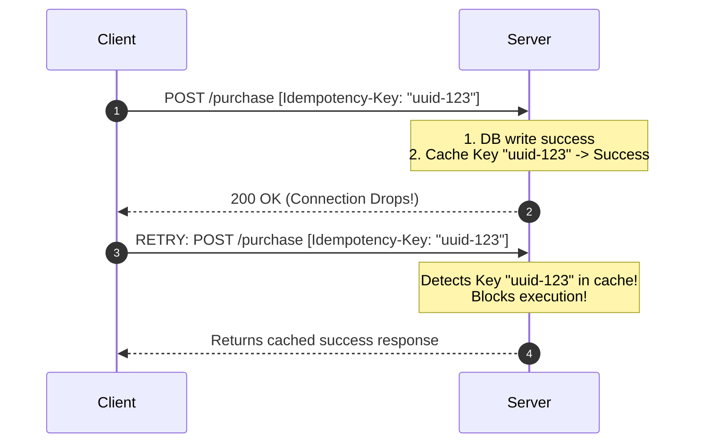
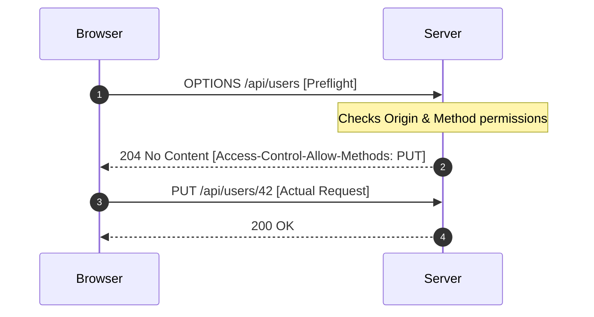

# Chapter IV: The Seven Verbs and the Same-Origin Borders

> "HTTP methods define the semantic shape of human will—they map the physical act of transport onto a strict, legally binding grammar of state mutation."

---

## I. The Graphite on Cellulose and the Button of the Fifth Floor

Consider the physical act of holding a pen and dragging its graphite tip across a piece of paper to write your signature. 

On a purely mechanical level, the action is identical. 

It is the application of friction to wood pulp, guided by the neural circuits of your hand. 

But the <strong>semantic verb</strong> attached to this act determines the legal and material structure of the universe:
*   If you drag the pen across a guest book at a wedding, you are performing a passive, non-binding record of attendance. It has no side effects. It alters no rights. (This is a <strong>GET</strong>).
*   If you drag the pen across a bank check for ten thousand dollars, you are creating a brand-new financial instrument, generating a debit token that will cascade through the clearing houses. (This is a <strong>POST</strong>).
*   If you drag the pen across your previous last will and testament to replace it with a brand-new document containing entirely new beneficiaries, you are executing a complete, destructive overwrite of state. (This is a <strong>PUT</strong>).
*   If you drag the pen through a single clause of an existing contract to scratch out a spelling error while leaving the other thirty pages intact, you are performing a localized, partial mutation of state. (This is a <strong>PATCH</strong>).
*   If you drag the pen across a deed of release, declaring that a debt is cancelled and the record is formally expunged from the archives, you are executing a deletion. (This is a <strong>DELETE</strong>).

The physical universe is indifferent to these differences. 

To the paper, it is all just ink and friction. 

But to the human coordination systems that stand behind the paper, the verb is everything. 

If you treat a bank check as a guest book—signing it twenty times because you like the feeling—you will bankrupt yourself. 

If you treat a will as a minor scratch-out, you will trigger decades of litigation.

Let us look at a second, more everyday analogy: the <strong>Elevator Button</strong> vs. the <strong>Slot Machine Lever</strong>.

When you enter an elevator and press the button for the fifth floor, you are executing an <strong>idempotent operation</strong>. 

You press the "5" button once, and the elevator moves to the fifth floor. 

If you get impatient and hammer the "5" button ten more times, the elevator does not take you to the fiftieth floor. 

It does not double its speed. It does not charge you ten times. 

It simply registers that you wish to be on the fifth floor, a destination it has already committed to. 

Pressing the button one time or one hundred times produces the <strong>exact same final state</strong>.

Now, contrast this with the lever of a slot machine at a casino in Las Vegas.

Each pull of the lever is a <strong>non-idempotent operation</strong>. 

Pull it once, and you spend one coin and roll the gears. 

Pull it three times, and you spend three coins and roll the gears three times. 

The state of your wallet, the state of the machine's memory, and the state of the casino's revenue matches the exact number of times you pulled the lever. 

If a network glitch pauses the universe and replay-attacks your lever pulls, you will be ruined.

These two concepts—<strong>Semantic Verbs</strong> and <strong>Idempotency</strong>—are the twin pillars of <strong>HTTP Methods</strong>.

When we build backends, we are not merely receiving bytes; we are executing human intentions. 

If a client sends an HTTP request, the URL (`/v1/posts/928374`) acts as the noun—identifying the target resource. 

But the HTTP method acts as the verb, declaring the semantic rules, the caching boundaries, and the mathematical safety profiles of the transaction.

[^1]: Idempotency is a term coined by the American mathematician Benjamin Peirce in 1870 in his book *Linear Associative Algebra*. He used it to describe elements of algebraic systems that remain unchanged when multiplied by themselves ($x^2 = x$). In computer science, we have adopted this mathematical calculus to manage the chaotic, flaky nature of networks.

---

## II. The Vocabulary of State: The Seven Verbs of Tim's Dictionary

Tim Berners-Lee’s original 1991 protocol had exactly one verb: `GET`. 

The early web did not need any other words, because it was a read-only library. 

But as the web grew into an engine of global commerce, we expanded our vocabulary. 

Today, the HTTP method vocabulary is defined by <strong>Seven Primary Verbs</strong>, each carrying a unique semantic and behavioral profile:

| Method | Core Purpose | Request Body? | Safe? | Idempotent? | Analogy |
| :--- | :--- | :--- | :--- | :--- | :--- |
| <strong>GET</strong> | Retrieve/read data | ❌ No | ✅ Yes | ✅ Yes | 📖 Reading a book from the shelf |
| <strong>POST</strong> | Create a new resource | ✅ Yes | ❌ No | ❌ No | 📝 Writing a new book and placing it on the shelf |
| <strong>PUT</strong> | Replace an entire resource | ✅ Yes | ❌ No | ✅ Yes | 📕 Replacing an entire book with a new edition |
| <strong>PATCH</strong> | Partially update a resource | ✅ Yes | ❌ No | ❌ No (Usually) | ✏️ Editing a single chapter of the book |
| <strong>DELETE</strong> | Remove a resource | ❌ No | ❌ No | ✅ Yes | 🗑️ Removing a book from the shelf |
| <strong>HEAD</strong> | Retrieve headers only | ❌ No | ✅ Yes | ✅ Yes | 👀 Looking at a book's cover without opening it |
| <strong>OPTIONS</strong> | Probe server capabilities | ❌ No | ✅ Yes | ✅ Yes | ❓ Asking "what can I do with this shelf?" |

Let us inspect the deep, logical architecture of these verbs:

### 1. GET: The Passive Reader

`GET` is the workhorse of the web. 

It is designed strictly to read data. 

Under the HTTP specification, a `GET` request <strong>must be Safe</strong>. 

Safety is a formal technical term meaning that the operation <strong>must not modify the resource state on the server</strong>.

When a browser executes `GET /v1/posts/928374`, the server might log the request, update analytics counters, or rotate server logs. 

But these are secondary side effects. 

The post itself—the resource—must remain completely unmodified.

Because `GET` is safe and idempotent, the network infrastructure of the internet is allowed to <strong>cache it aggressively</strong>. 

CDNs, proxies, and home routers can capture the server's response to a `GET` request and save it in memory. 

When the next visitor asks for the same URL, the proxy returns the cached copy without ever contacting your backend, keeping your database cool and your servers fast.

### 2. POST: The Creator of State

`POST` is the opposite of GET. 

It is designed to create new resources or execute complex, state-mutating actions (like processing a payment).

A `POST` request is <strong>neither Safe nor Idempotent</strong>. 

Every time you execute a `POST` request, the server is expected to write new data to the database, generate a new UUID, or deduct money from a ledger.

Because `POST` is non-idempotent, it is <strong>never cached</strong>. 

If a browser tries to cache a `POST` payment request, the user would only be charged once, but the merchant would never receive the subsequent orders. 

Furthermore, if a user submits a form and hits the browser's "Back" button, the browser will display a warning dialog: "Confirm Form Resubmission." 

This is the browser's way of saying: "The page you are returning to was generated by a non-idempotent `POST` request. If I reload it, I might submit your credit card details a second time. Are you sure you want to risk it?"

### 3. PUT vs. PATCH: The Complete Overwrite and the Surgical Strike

One of the most common coordination failures in API design is the confusion between `PUT` and `PATCH`. 

Both are used to update existing resources, but they do so under completely different mathematical guarantees.

*   `PUT` is designed for <strong>Complete Replacement</strong>. 
    When you send a `PUT` request to `/v1/users/42`, the payload must contain the <strong>entire representation of the resource</strong>. 
    If the user has twenty fields (name, age, email, address, avatar, etc.) and you only want to update the age, a `PUT` request must still carry all twenty fields. 
    The server reads the payload and completely overwrites the existing row in the database. 
    If you omit the email field, the server will assume you wish to erase it, setting the database column to `NULL`.
    Because `PUT` completely overwrites the resource, it is <strong>Idempotent</strong>. 
    Replacing a resource with the same data ten times leaves the resource in the exact same state as replacing it once.

*   `PATCH` was added late to the HTTP dictionary in 2010 (RFC 5789) to allow <strong>Partial Updates</strong>. 
    With `PATCH`, you only transmit the fields you wish to change: `{ "age": 22 }`. 
    The server reads the payload, loads the existing user row, surgeries the new values into the specific columns, and saves the record back to disk.
    Because `PATCH` is evaluated dynamically based on the current state of the resource, it is <strong>not inherently idempotent</strong>. 
    If you send a `PATCH` request containing an increment instruction: `{ "op": "increment", "path": "/views" }`, executing it three times will add three to the view count, not one.

### 4. OPTIONS: The Diplomatic Border Patrol

`OPTIONS` does not read or write data. 

It is a meta-verb. 

It asks the server: "What verbs, headers, and credentials are permitted on this resource?" 

The server replies with metadata headers (like `Allow: GET, POST, OPTIONS`), telling the client how to behave. 

As we shall see, `OPTIONS` is the foundational gateway for <strong>CORS preflight checks</strong>, acting as the border patrol of cross-origin web safety.

---

## III. The Calculus of Idempotency: Shifting the Risk of Network Failure

Why do we care so much about mathematical properties like idempotency? 

Is it just academic pedantry? 

No. It is a vital shield against the fundamental unreliability of physical networks.

Imagine a user in a rural area with a flaky cellular connection trying to buy a $100 ticket. 

The phone constructs the request, opens a TCP socket, and launches the packet. 

The server receives the packet, executes the database transaction, deducts $100 from the user's card, and compiles a success response.

But just as the server launches the response packet back down the wire, the cellular tower drops the connection. 

The response is lost in the air.

```text
Client:   [POST /purchase] ───────────────> Server (Executes charge)
Client:   [Drops connection] <××××× [Response Lost] Server (Success returned)
Client:   "Did it work? I have no idea. I will retry."
```

From the client's perspective, the request timed out. 

The phone has no idea whether the server processed the transaction and the response was lost, or whether the server crashed before processing the transaction.

If the operation is <strong>GET, PUT, or DELETE</strong>, the client can safely retry the request automatically. 

If the server already deleted the user or updated the field, running it a second time does no harm.

But if the operation is <strong>POST</strong>, retrying the request is incredibly dangerous. 

If the client automatically retries the `POST /purchase` request, the server will receive it as a fresh transaction, charge the card a second time, and issue two tickets.

To make non-idempotent `POST` requests safe in distributed networks, we must implement <strong>Idempotency Keys</strong>:



1.  The client generates a unique, single-use UUID: `"uuid-123"` and attaches it as an HTTP header: `Idempotency-Key: uuid-123`.
2.  The server receives the request, checks its Redis cache for the key, registers a cache miss, and proceeds to charge the card.
3.  The server writes the transaction success payload to Redis with the key `"uuid-123"` and a 24-hour expiration.
4.  If the connection drops and the client retries the identical request carrying the same key, the server detects the key in Redis, blocks the database write, and returns the cached success response instantly. 

Through this proxy system, we project an idempotent interface onto a non-idempotent verb, protecting our systems against double-payment disasters.

---

## IV. The Border Control: SOP and the CORS Preflight Check

If HTTP methods are the grammar of communication, <strong>CORS (Cross-Origin Resource Sharing)</strong> is the border control system that enforces territorial boundaries between different domains.

### 1. The Same-Origin Policy (SOP)

To understand CORS, we must first understand the <strong>Same-Origin Policy (SOP)</strong>, designed by Netscape in 1995.

SOP is the most critical security boundary in browser architectures. 

It dictates that a script running on Website A (`https://my-blog.com`) is strictly forbidden from reading or writing data on Website B (`https://your-bank.com`).

Without SOP, the web would collapse. 

Imagine if you logged into your bank account. The bank saves your session credentials inside a cookie in your browser. 

If you then navigate to a malicious blog site, the blog could run a background script that calls `fetch('https://your-bank.com/api/balance')`.

Because the browser holds the cookie, the request would automatically carry your credentials. 

The bank would see the cookie, assume it was you, and return your balance. 

The blog script would read your balance, send it to a hacker server, and proceed to transfer your funds.

SOP blocks this. 

Under SOP, the browser allows Website A to *send* a request to Website B, but it <strong>strictly blocks the script on Website A from reading the returned response</strong> unless Website B explicitly gives permission.

### 2. Cross-Origin Resource Sharing (CORS)

But what if you *want* to share resources? 

What if your frontend lives on `https://sriniously.com` and your backend API lives on `https://api.sriniously.com`? 

These are different origins (subdomains are treated as different origins by the browser).

To allow this, we use <strong>CORS</strong>—a protocol that uses HTTP headers to negotiate permissions across origins.

When `https://sriniously.com` makes an API call to `https://api.sriniously.com`, the browser automatically appends the `Origin` header to the request:

```http
GET /v1/posts/101 HTTP/1.1
Host: api.sriniously.com
Origin: https://sriniously.com
```

The backend server receives the request. 

If it wants to allow the request, it must return a specific access header in its response:

```http
HTTP/1.1 200 OK
Access-Control-Allow-Origin: https://sriniously.com
```

When the browser receives the response, it checks the headers. 

If the `Access-Control-Allow-Origin` matches the origin of the script, the browser lets the script read the data. 

If the header is missing, or if it says `Access-Control-Allow-Origin: https://other-site.com`, the browser triggers a security error in the console, blocking the script from reading the JSON.

> [!CAUTION]
> <strong>CORS is a browser security enforcement, not a server shield.</strong> The backend server *does* execute the database query and process the request. It is the *browser* that intercepts the response and blocks the JavaScript code from reading it. An attacker using a command-line tool like `curl` can bypass CORS entirely because `curl` is not a browser and does not enforce SOP.

### 3. The Preflight OPTIONS Check

If CORS only blocked the script from *reading* the response, we would still have a catastrophic problem for state-mutating requests.

Imagine a script on a malicious site running `fetch('https://your-bank.com/api/delete-account', { method: 'DELETE' })`.

Under raw SOP, the browser would launch the `DELETE` request, the bank server would receive it, delete the account, and return success. 

The browser would then block the malicious site from reading the success response. 

But the damage is already done—the account is deleted!

To prevent this, the browser executes a <strong>Preflight Request</strong> before launching any "non-simple" requests (which includes `PUT`, `PATCH`, `DELETE`, or any request with custom headers or JSON payloads).



1.  Before sending the actual `PUT /v1/users/42` request, the browser automatically launches a silent <strong>preflight check</strong> using the `OPTIONS` verb.
2.  The preflight request carries headers asking for permission:
    *   `Access-Control-Request-Method: PUT`
    *   `Access-Control-Request-Headers: Content-Type`
3.  The server receives the `OPTIONS` request. It does *not* execute the database logic. It merely checks its permissions and returns a `204 No Content` response carrying:
    *   `Access-Control-Allow-Methods: GET, POST, PUT`
    *   `Access-Control-Allow-Headers: Content-Type`
4.  The browser reads the preflight response. If the server allows the `PUT` verb, the browser immediately fires the actual `PUT` request carrying your data.
5.  If the preflight check fails, the browser blocks the actual request from ever hitting the wire, protecting the server against unauthorized mutations.

---

## V. Key Takeaways

We have now mapped the complete, elegant grammar of the web. Let us review the key parameters of the protocol layers:

| Layer / Model | Transport Protocol | Latency Profile | Core Benefit | The Bottleneck |
| :--- | :--- | :--- | :--- | :--- |
| <strong>GET</strong> | TCP (RFC 793) | ~50 - 150ms | Keep-Alive persistent connection recycling | Head-of-Line Blocking at application layer |
| <strong>HTTP/2</strong> | TCP (RFC 793) | ~30 - 80ms | Frame Multiplexing on a single socket | Head-of-Line Blocking at transport layer |
| <strong>HTTP/3</strong> | QUIC over UDP | ~10 - 50ms | Stream Independence and integrated TLS 1.3 | High CPU packet validation overhead |
| <strong>Serverless</strong> | On-Demand Routing | ~100 - 600ms | Automatic, infinite scaling with zero idle cost | Cold Starts and Stateless connection pool limits |

Understanding HTTP methods and CORS boundaries is not merely a tool for loading web pages; it is the ultimate administrative framework of global distributed systems. In the next chapter, we will inspect the seven primary verbs of this language—the HTTP methods—and trace the precise boundaries that separate safe, idempotent, and mutable operations.

---

[Next Chapter → HTTP Responses: The Royal Decrees →](./05_HTTP_Responses.md)
