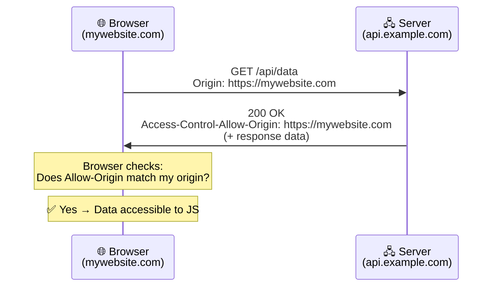
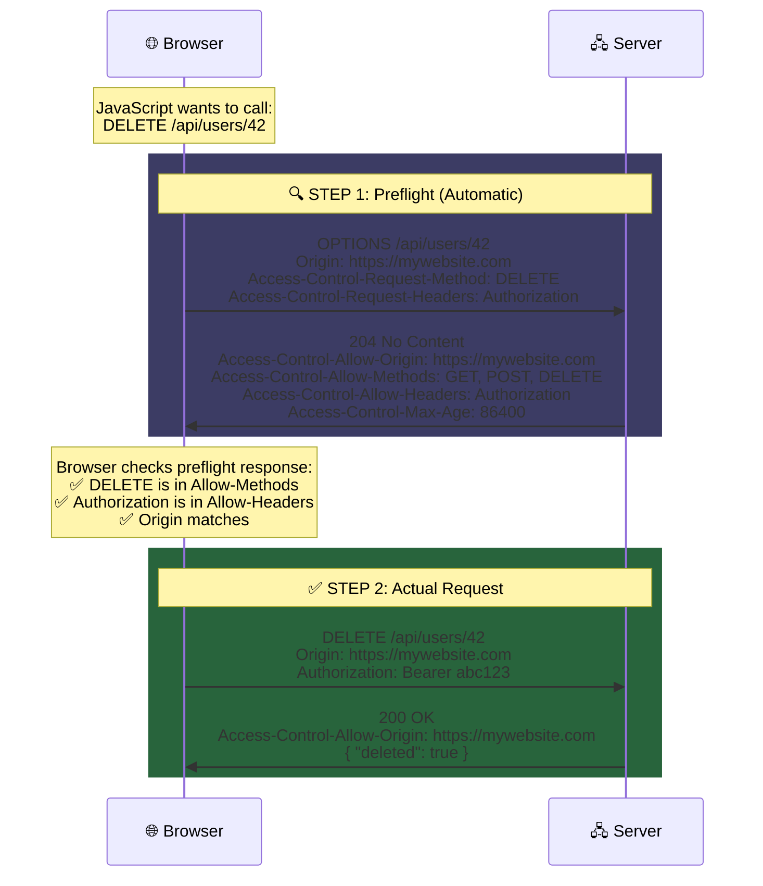

# ⚡ Chapter 4: HTTP Methods & CORS

> *"HTTP methods define the METHOD of interaction — what you want to DO with the data."*

---

## 📌 What Are HTTP Methods?

HTTP methods, sometimes called **HTTP verbs**, tell the server what action the client wants to perform on a resource. If the URL is a noun (identifying *which* resource), the method is a verb (specifying *what to do* with it). When you send `GET /api/users/42`, you're saying "read user 42." When you send `DELETE /api/users/42`, you're saying "remove user 42." Same resource, different intent — and that intent is encoded in the HTTP method.

### The Historical Evolution of HTTP Methods

The set of HTTP methods we use today didn't arrive all at once. In **HTTP/0.9** (1991), Tim Berners-Lee's original protocol, there was exactly one method: **GET**. The early web was purely a document retrieval system — you could ask a server for a document, and it would send it back. That was the entire protocol. There was no way to send data *to* the server, no way to update or delete resources, and no concept of a request body.

**HTTP/1.0** (1996) expanded the method vocabulary significantly. It formalized GET and introduced **POST**, which allowed clients to send data to the server in the request body — enabling form submissions, file uploads, and the first interactive web applications. HTTP/1.0 also introduced **HEAD** (identical to GET but returning only headers, not the body — useful for checking if a resource exists without downloading it).

**HTTP/1.1** (1997) brought the full suite of methods that RESTful APIs depend on today. It formalized **PUT** (replace an entire resource), **DELETE** (remove a resource), **OPTIONS** (ask the server what methods are allowed), **TRACE** (echo the request back for debugging), and **CONNECT** (establish a tunnel, primarily used for HTTPS proxying). But one important method was still missing.

**PATCH** was added much later, in **RFC 5789** (2010), to address a real-world gap that developers had been working around for years. PUT was designed to replace an entire resource — if you had a user with 20 fields and wanted to update just one, you technically had to send all 20 fields in your PUT request. PATCH was introduced specifically for **partial updates**, allowing you to send only the fields that changed. Its late addition to the standard explains why it has different idempotency guarantees than PUT, as we'll discuss shortly.

### Overview of Methods

| Method | Purpose | Has Body? | Analogy |
|---|---|---|---|
| **GET** | Retrieve/read data | ❌ No | 📖 Reading a book from the shelf |
| **POST** | Create new data | ✅ Yes | 📝 Writing a new book and placing it on the shelf |
| **PUT** | Replace entire resource | ✅ Yes | 📕 Replacing an entire book with a new edition |
| **PATCH** | Partially update resource | ✅ Yes | ✏️ Editing a single chapter of the book |
| **DELETE** | Remove a resource | ❌ No | 🗑️ Removing a book from the shelf |
| **OPTIONS** | Ask what methods are allowed | ❌ No | ❓ Asking "what can I do with this shelf?" |
| **HEAD** | Same as GET but without the body | ❌ No | 👀 Looking at a book's cover without opening it |

### Real-World API Examples:

```http
GET    /api/users/42         → Get user with ID 42
POST   /api/users            → Create a new user
PUT    /api/users/42         → Replace ALL data for user 42
PATCH  /api/users/42         → Update SOME fields of user 42
DELETE /api/users/42         → Delete user 42
HEAD   /api/users/42         → Check if user 42 exists (headers only)
OPTIONS /api/users           → What methods does /api/users support?
```

---

## 🔄 Idempotent vs Non-Idempotent Methods

### What Does "Idempotent" Mean?

Idempotency is a property borrowed from mathematics that has profound practical implications in distributed systems. A method is **idempotent** if making the same request multiple times produces the **exact same server-side state** as making it once. The key word here is "state" — it's not about getting the same response (though that usually follows), it's about the server ending up in the same state regardless of whether the request was executed once or a hundred times.

Think of it like an elevator button for a specific floor. Pressing the "5" button once takes you to floor 5. Pressing it ten more times doesn't take you to floor 50 — you're still going to floor 5. That's idempotent. Now contrast that with a vending machine button. Press it once and you get one snack. Press it three times and you get three snacks (and a lighter wallet). That's non-idempotent — each execution has an additional effect.

### The Breakdown

**GET** is idempotent because reading data never changes anything on the server. You can fetch `GET /api/users/42` a thousand times and the server's state is unchanged — the user record is unmodified, no new records are created, no data is deleted. The server might log each request or update analytics counters, but those are side effects that don't affect the resource itself.

**PUT** is idempotent because it replaces the entire resource with the data you provide. If you send `PUT /api/users/42 { "name": "Harshit", "age": 21 }`, the user record will be exactly `{ "name": "Harshit", "age": 21 }` after the first request. Sending the same PUT ten more times produces the same final state — the user record is still `{ "name": "Harshit", "age": 21 }`. The resource was replaced with the same data each time, so the result is identical.

**DELETE** is idempotent because deleting something that's already deleted doesn't change the state further. The first `DELETE /api/users/42` removes the user. The second `DELETE /api/users/42` might return a 404 (because the user no longer exists), but the server's state is the same — user 42 is gone, and sending more DELETEs doesn't make it "more gone."

**POST** is **not idempotent** because each request typically creates a new resource. `POST /api/orders { "item": "pizza" }` creates Order #1. The same POST again creates Order #2. Again, Order #3. Three requests, three distinct orders — each execution changed the server's state in a new way.

**PATCH** is **not idempotent** in general because it depends on the current state of the resource. A PATCH operation like `{ "op": "increment", "path": "/views", "value": 1 }` adds 1 to the view count each time it's called — three PATCH requests would increment the count by 3, not 1. However, some PATCH operations *can* be idempotent (like `{ "name": "Harshit" }`, which sets the name regardless of its current value), which is why PATCH's idempotency is technically "it depends."

| Method | Idempotent? | Why? |
|---|---|---|
| **GET** | ✅ Yes | Reading data 100 times doesn't change anything |
| **PUT** | ✅ Yes | Replacing a resource with the same data = same result every time |
| **DELETE** | ✅ Yes | Deleting something that's already deleted = still deleted |
| **PATCH** | ❌ No | *Can be* non-idempotent (e.g., `increment counter by 1`) |
| **POST** | ❌ No | Creating a new resource each time = different result every time |
| **HEAD** | ✅ Yes | Same as GET — just reading, no side effects |
| **OPTIONS** | ✅ Yes | Just asking about capabilities, no changes |

> [!IMPORTANT]
> **Why does idempotency matter?** Because networks are unreliable. If your HTTP request times out, you don't know whether the server received and processed it or whether it was lost in transit. If the operation was idempotent (GET, PUT, DELETE), you can safely retry it — the worst that happens is the same operation executes twice, producing the same result. But if the operation was non-idempotent (POST), retrying it could create duplicates — which is why payment systems use **idempotency keys** (a unique ID attached to each POST request so the server can detect and reject duplicate submissions).

---

## 🌍 The OPTIONS Method & CORS

### What is the OPTIONS Method?

The `OPTIONS` method asks the server a simple question: **"What am I allowed to do with this resource?"** The server responds with headers that list the permitted HTTP methods, allowed headers, and other access policies. Unlike GET or POST, OPTIONS isn't about fetching or modifying data — it's a metadata request about the server's capabilities and permissions.

```http
OPTIONS /api/users HTTP/1.1
Host: api.example.com
Origin: https://mywebsite.com
```

Server responds:
```http
HTTP/1.1 204 No Content
Allow: GET, POST, PUT, DELETE, OPTIONS
Access-Control-Allow-Origin: https://mywebsite.com
Access-Control-Allow-Methods: GET, POST, PUT, DELETE
Access-Control-Allow-Headers: Content-Type, Authorization
Access-Control-Max-Age: 86400
```

While OPTIONS can be called manually, its most important role is in the **CORS preflight flow**, where the browser sends it automatically before certain cross-origin requests. To understand why, we need to understand CORS itself.

---

### What is CORS?

**CORS (Cross-Origin Resource Sharing)** is a security mechanism built into every modern web browser that controls which websites can make HTTP requests to which servers. By default, browsers enforce the **Same-Origin Policy**, which blocks JavaScript on one origin from making requests to a different origin. CORS is the mechanism that allows servers to relax this restriction for trusted origins.

#### What is an "Origin"?

An origin is defined by three components: **protocol + domain + port**. Two URLs share the same origin only if all three components match exactly. Even minor differences — like HTTP vs HTTPS, or port 443 vs port 3000 — make them different origins.

```
https://mywebsite.com:443    → One origin
https://api.example.com:443  → Different origin (different domain)
http://mywebsite.com:80      → Different origin (different protocol)
https://mywebsite.com:3000   → Different origin (different port)
```

#### The Historical Context: Why Same-Origin Policy Exists

The Same-Origin Policy was introduced by **Netscape Navigator 2.0 in 1995**, making it one of the oldest security features in web browsers. To understand why it was needed, imagine a web without it. You visit `evil-site.com`, which runs JavaScript that silently sends a request to `your-bank.com/api/transfer?to=attacker&amount=10000`. Because you're logged into your bank in another tab, your browser would automatically attach your bank's session cookies to the request. The transfer would succeed, and you'd lose your money — all because you visited a malicious website in a different tab. This attack is called **Cross-Site Request Forgery (CSRF)**, and the Same-Origin Policy was designed to prevent it.

The problem was that the Same-Origin Policy was *too* restrictive. Legitimate use cases required cross-origin requests: a frontend hosted on `myapp.com` needed to call an API at `api.myapp.com`. A web application needed to load fonts from Google Fonts or fetch data from a third-party weather API. For years, developers resorted to hacky workarounds, the most notorious being **JSONP (JSON with Padding)**. JSONP exploited the fact that `<script>` tags were exempt from the Same-Origin Policy — so instead of making a normal API request, you'd create a `<script>` tag whose `src` pointed to the API, and the server would wrap its JSON response in a function call that your page could catch. It worked, but it was ugly, insecure (it could only do GET requests and was vulnerable to injection attacks), and never intended to be a real solution.

**CORS** was the proper solution. Developed through the W3C and standardized around 2014, CORS provides a structured mechanism for servers to declare which origins are allowed to access their resources. Instead of blocking all cross-origin requests outright, the browser asks the server "is this origin allowed?" and the server responds with explicit permission headers. If the server says yes, the browser lets the request through. If the server says no (or doesn't include CORS headers at all), the browser blocks the response from reaching JavaScript.

---

### The Two CORS Flows

CORS behaves differently depending on the complexity of the request. Simple requests go through a streamlined flow, while complex requests require a two-step process called **preflight**.

#### Flow 1: Simple Requests (No Preflight)

A "simple" request is one that meets all of the following criteria: the method is GET, HEAD, or POST; the Content-Type (if set) is `text/plain`, `multipart/form-data`, or `application/x-www-form-urlencoded`; and there are no custom headers. These criteria roughly correspond to the types of requests that HTML forms and basic browser features could already make before JavaScript's `fetch()` API existed — so they're considered "safe" and don't require preflight.

For simple requests, the browser sends the request directly to the server, but includes an `Origin` header identifying where the request came from. The server processes the request normally and includes `Access-Control-Allow-Origin` in its response. The browser then checks whether the allowed origin matches the request's origin. If it matches, the response data is made available to JavaScript. If it doesn't match, the browser silently blocks JavaScript from accessing the response (even though the server actually processed the request — the blocking happens on the client side).



---

#### Flow 2: Preflighted Requests (Complex Requests)

A "preflighted" request is any request that doesn't qualify as "simple." In practice, this means most real-world API calls are preflighted because they use `Content-Type: application/json` (which isn't in the "simple" list), include custom headers like `Authorization`, or use methods like PUT, PATCH, or DELETE. The browser detects that the request is complex and automatically sends a **preflight OPTIONS request** before the actual request, asking the server for permission.

> [!WARNING]
> Most real-world API calls are "complex" because they use `Content-Type: application/json` and include `Authorization` headers. This means **most requests are preflighted**, adding an extra round trip. Understanding and optimizing for this is important for API performance.

The preflight flow works in two steps. First, the browser sends an `OPTIONS` request to the target URL with special headers: `Origin` (identifying the requesting website), `Access-Control-Request-Method` (the HTTP method the actual request will use), and `Access-Control-Request-Headers` (any custom headers the actual request will include). The server responds with its access policy: `Access-Control-Allow-Origin`, `Access-Control-Allow-Methods`, `Access-Control-Allow-Headers`, and `Access-Control-Max-Age` (how long the browser should cache this preflight result). Only if the preflight response confirms that the actual request is permitted does the browser proceed to send the real request.



The `Access-Control-Max-Age` header is an important optimization. When set to `86400` (24 hours), it tells the browser to cache the preflight result — meaning subsequent requests to the same endpoint within that window won't trigger another preflight, saving a full round trip of latency. Without this caching, every single API call from a cross-origin frontend would require two HTTP round trips instead of one, effectively doubling the latency for every interaction.

> [!TIP]
> `Access-Control-Max-Age: 86400` means the browser will cache the preflight result for **24 hours**. During that time, subsequent requests to the same endpoint won't trigger another preflight, significantly improving performance.

---

## 🔑 Key Takeaways

HTTP methods evolved alongside the web itself — from GET-only in HTTP/0.9 to the full RESTful vocabulary of GET, POST, PUT, PATCH, DELETE, OPTIONS, and HEAD that we use today. Each method carries semantic meaning about the client's intent, and understanding the distinction between **idempotent** methods (safe to retry: GET, PUT, DELETE) and **non-idempotent** methods (may create duplicates: POST) is critical for building reliable systems on unreliable networks. CORS, meanwhile, is the browser's defense against cross-origin attacks — a security mechanism that evolved from the blunt Same-Origin Policy of 1995 through the hacky JSONP era into today's structured permission system with preflight requests and explicit server-side allow headers.

---

[← Previous: HTTP Deep Dive](./03_HTTP_Deep_Dive.md) | [Next: HTTP Responses & Status Codes →](./05_HTTP_Responses.md)
