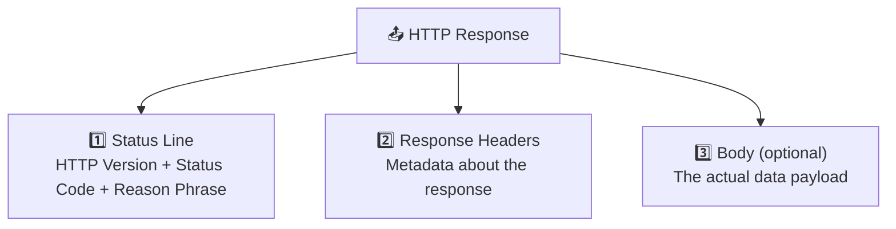
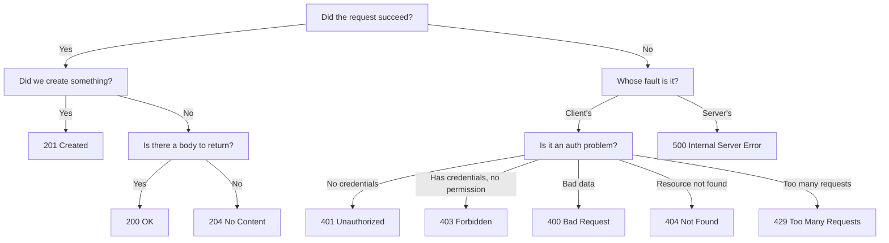
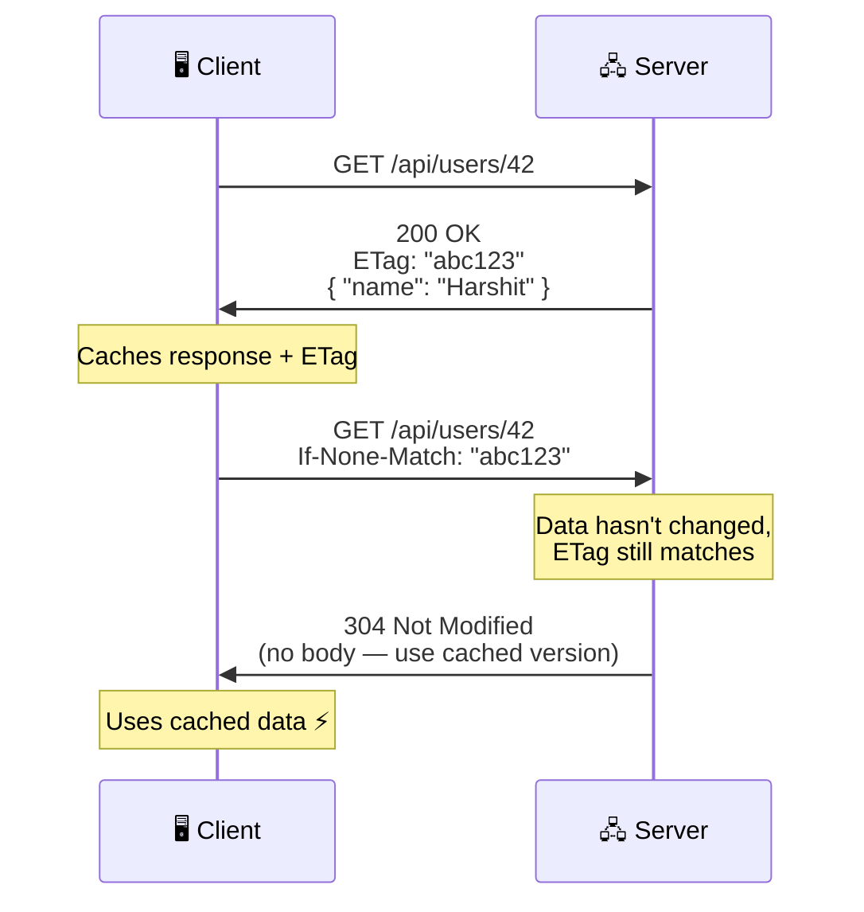
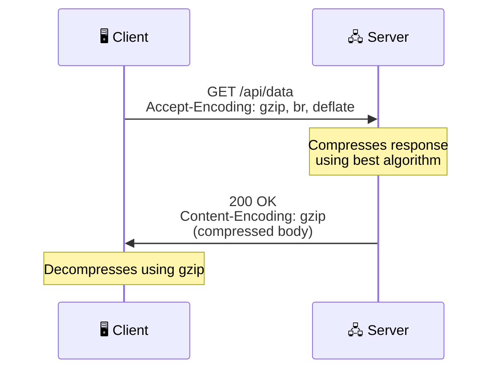
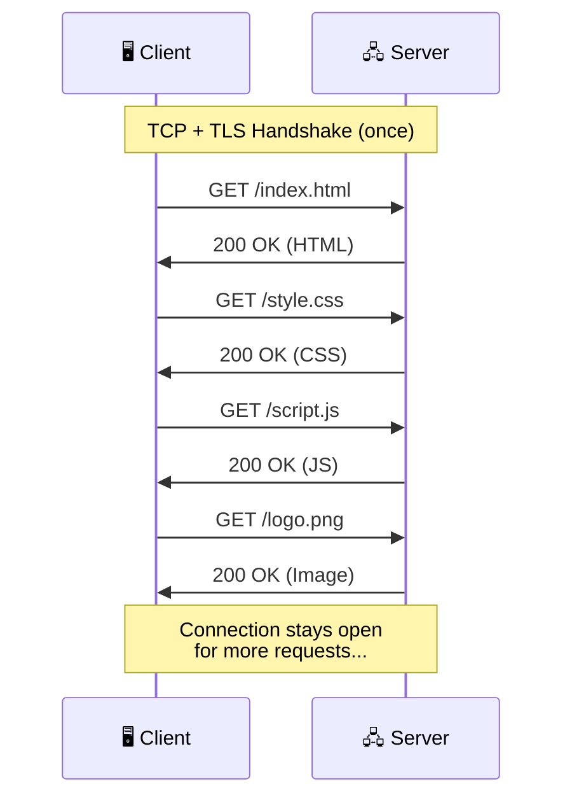
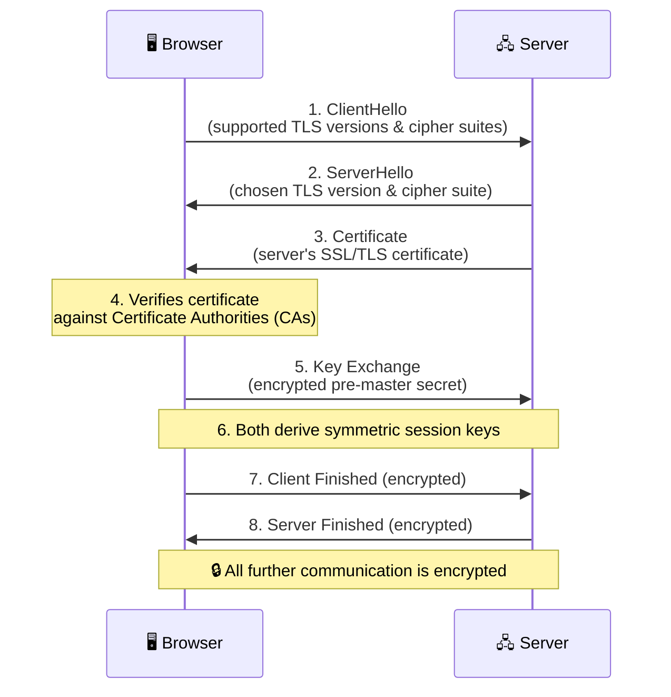

# 📤 Chapter 5: HTTP Responses, Status Codes, Caching & More

> *"The server's response is its way of saying — here's what happened with your request."*

---

## 📨 HTTP Response Structure

Every HTTP request that a client sends receives exactly one HTTP response from the server. This response is the server's complete answer — it tells the client whether the request succeeded or failed, provides metadata about the result, and optionally includes a body containing the actual data. Just like requests, responses follow a well-defined three-part structure that has remained consistent since HTTP/1.0 was formalized in 1996.

The first part is the **status line**, which is the response's equivalent of the request line. It contains the HTTP version, a three-digit status code, and a human-readable reason phrase. The status code is the most important piece of information in the entire response — it's a standardized number that tells the client, in a machine-parseable way, exactly what happened. The second part is the **response headers**, which carry metadata about the response: its content type, its size, caching instructions, cookies to set, and much more. The third part is the **body**, which contains the actual data payload — the JSON object, the HTML document, the image bytes, or whatever the client requested. Not all responses have bodies; a `204 No Content` or a `301 Redirect` typically has no body at all.

```http
HTTP/1.1 200 OK                        ← Status Line (Version + Status Code + Reason)
Content-Type: application/json          ← Response Headers
Content-Length: 85                      ←
Cache-Control: max-age=3600            ←
Set-Cookie: session=abc; HttpOnly      ←
X-Request-Id: req-789                  ←
                                       ← Empty line (separator)
{                                      ← Response Body
  "id": 42,                            ←
  "name": "Harshit",                   ←
  "email": "harshit@example.com"       ←
}                                      ←
```



---

## 📊 HTTP Status Codes — The Complete Guide

Status codes are three-digit numbers that communicate the outcome of an HTTP request in a standardized, machine-parseable way. They were first formally defined in **HTTP/1.0 (RFC 1945, 1996)** and significantly expanded in **HTTP/1.1 (RFC 2616, 1999)**. The system was designed with elegant simplicity: the first digit of the status code categorizes the response into one of five groups, so any client can understand the general meaning of any status code — even codes it has never encountered before — just by looking at the first digit.

```
1xx → ℹ️  Informational  (Hold on...)
2xx → ✅ Success         (Here you go!)
3xx → 🔀 Redirection     (Go somewhere else)
4xx → ❌ Client Error    (You messed up)
5xx → 💥 Server Error    (We messed up)
```

This five-category design was influenced by earlier protocol standards and has proven remarkably durable — the same categories defined in 1996 are still the foundation of every API and every web server today. Let's examine each category in depth.

---

### 1️⃣ `1xx` — Informational Responses

The 1xx status codes are the least commonly encountered in day-to-day development, but they serve important roles in specific scenarios. These codes indicate that the server has received the request and is continuing to process it — they're essentially progress updates, not final answers.

The most practically relevant 1xx code is **101 Switching Protocols**, which you'll encounter whenever a client upgrades an HTTP connection to a **WebSocket** connection. WebSockets enable real-time, bidirectional communication between client and server (essential for chat applications, live notifications, collaborative editing tools), but they start life as a regular HTTP request. The client sends a GET request with an `Upgrade: websocket` header, and the server responds with `101 Switching Protocols` to confirm the switch. From that point on, the connection operates under the WebSocket protocol rather than HTTP.

**100 Continue** is another interesting code that solves a practical efficiency problem. Imagine a client wants to upload a 500MB file, but first needs to check if the server will accept it (maybe the file type is wrong, or the client isn't authenticated). The client can send the request headers with an `Expect: 100-continue` header and wait. If the server responds with `100 Continue`, the client proceeds to send the large body. If the server responds with an error (like `413 Payload Too Large`), the client avoids wasting bandwidth uploading a file that would be rejected anyway.

| Code | Name | Meaning |
|---|---|---|
| `100` | Continue | "I got your headers. Go ahead and send the body." |
| `101` | Switching Protocols | "Let's switch to a different protocol (e.g., WebSocket)." |
| `102` | Processing | "I'm working on it, please wait." |

> [!NOTE]
> You'll encounter `101 Switching Protocols` when upgrading from HTTP to WebSocket connections — the server is saying "OK, let's switch to WebSocket protocol now." This is common in real-time apps like chat, gaming, and collaborative tools.

---

### 2️⃣ `2xx` — Success ✅

The 2xx codes indicate that the request was successfully received, understood, and processed. However, "success" doesn't always mean "here's the data you asked for" — different 2xx codes communicate different nuances of success.

**200 OK** is the most common status code on the entire internet. It means the request succeeded and the server is returning the requested data in the response body. This is the standard response for successful GET requests (returning the requested resource), successful PUT requests (returning the updated resource), and sometimes successful POST requests (returning the created resource).

**201 Created** is used specifically when a POST request successfully creates a new resource. The distinction from 200 matters because it tells the client that something new now exists on the server that didn't exist before. A well-designed API will also include a `Location` header pointing to the URL of the newly created resource, so the client knows where to find it.

**202 Accepted** is the "async acknowledgment" code. It means the server has received and validated the request, but the actual processing hasn't completed yet. This is common for long-running operations like generating a report, processing a video upload, or sending a batch of emails. The server typically returns a job ID that the client can use to poll for the result later.

**204 No Content** means the request succeeded but there's nothing to return in the body. This is the typical response for successful DELETE requests — the resource has been removed, so there's nothing to send back. It's also used for PUT/PATCH updates where the client doesn't need a copy of the updated resource.

```http
# Successful GET → 200
GET /api/users/42 → 200 OK { "name": "Harshit" }

# Successful POST → 201
POST /api/users   → 201 Created { "id": 43, "name": "New User" }

# Successful DELETE → 204
DELETE /api/users/42 → 204 No Content (empty body)

# Async job submitted → 202
POST /api/reports/generate → 202 Accepted { "job_id": "j-123", "status": "processing" }
```

---

### 3️⃣ `3xx` — Redirection 🔀

The 3xx codes tell the client that the resource has moved and the client needs to take additional action — usually following a redirect to a new URL. The subtle differences between the various 3xx codes reflect hard-learned lessons about how redirects interact with HTTP methods and browser caching.

**301 Moved Permanently** tells the client that the resource has permanently moved to a new URL (specified in the `Location` header). Browsers and search engines will update their bookmarks and indexes to point to the new URL. However, 301 has a historical quirk: some browsers changed POST requests to GET requests when following a 301 redirect. This was technically a violation of the HTTP specification, but it became so widespread that it was effectively standardized behavior.

**308 Permanent Redirect** was introduced in RFC 7538 (2015) specifically to fix this quirk. It has the same meaning as 301 (permanent move), but with the guarantee that the HTTP method will **not** be changed when following the redirect. If the original request was a POST, the redirected request will also be a POST. Use 308 for API redirects where method preservation matters.

**302 Found** (originally called "Moved Temporarily") indicates a temporary redirect. The resource is temporarily at a different URL, but the client should continue using the original URL for future requests. Like 301, some browsers historically changed POST to GET on 302 redirects. **307 Temporary Redirect** was introduced as the method-preserving equivalent of 302.

**304 Not Modified** is a special redirect that doesn't redirect to a different URL — instead, it tells the client that the cached version of the resource is still valid and can be used without downloading the full response again. This is a key part of HTTP caching, which we'll discuss in detail shortly.

```http
# 301 — Permanent redirect
HTTP/1.1 301 Moved Permanently
Location: https://new-domain.com/page

# 304 — Cached content is still fresh
HTTP/1.1 304 Not Modified
(no body — browser uses cached version)
```

> [!IMPORTANT]
> **301 vs 308**: With 301, the browser might change a POST to a GET when following the redirect. With 308, the method is **guaranteed to stay the same**. Use 308 for API redirects where method preservation is critical.

---

### 4️⃣ `4xx` — Client Errors ❌

The 4xx codes indicate that something is wrong with the request — it's the client's fault. The server understood the request well enough to determine it can't be fulfilled, and the specific 4xx code tells the client *why*.

**400 Bad Request** is the catch-all for malformed requests. The request body contains invalid JSON, a required field is missing, a date is in the wrong format, or the request otherwise doesn't conform to what the server expects. It's the server's way of saying "I can't understand what you're asking for."

**401 Unauthorized** and **403 Forbidden** are the two authentication/authorization codes, and they're frequently confused. **401** means "I don't know who you are" — the request lacks valid authentication credentials (no token provided, or the token is expired/invalid). The server is asking the client to authenticate itself. **403** means "I know exactly who you are, but you don't have permission to do this" — the client is authenticated, but the authenticated user doesn't have the necessary privileges. A regular user trying to access an admin-only endpoint gets 403, not 401.

Think of it like a nightclub: **401** is the bouncer saying "Show me your ID" (no authentication). **403** is the bouncer saying "I see your ID, but you're not on the VIP list" (no authorization).

**404 Not Found** means the requested resource doesn't exist. This is probably the most well-known status code among general internet users, thanks to the "404 Page Not Found" error pages that websites display. For APIs, 404 means the endpoint exists but the specific resource (identified by an ID or path parameter) wasn't found in the database.

**409 Conflict** indicates that the request conflicts with the current state of the server. A classic example is trying to create a user with an email address that already exists — the server can't fulfill the request because doing so would violate a uniqueness constraint.

**429 Too Many Requests** is the rate-limiting status code. When a client sends too many requests in a short period, the server responds with 429 and typically includes a `Retry-After` header indicating how long the client should wait before trying again. Rate limiting is essential for protecting servers from abuse, whether it's a malicious DDoS attack or simply a misbehaving script that's accidentally hammering the API.

| Code | Name | When It's Used |
|---|---|---|
| `400` | Bad Request | Request is malformed (invalid JSON, missing required fields) |
| `401` | Unauthorized | Authentication required — "Who are you?" |
| `403` | Forbidden | Authenticated but not authorized — "You can't do this" |
| `404` | Not Found | The resource doesn't exist |
| `405` | Method Not Allowed | Endpoint exists but doesn't support that method |
| `409` | Conflict | Conflicts with current state (e.g., duplicate email) |
| `413` | Payload Too Large | Request body is too big |
| `422` | Unprocessable Entity | Well-formed but semantically incorrect (validation errors) |
| `429` | Too Many Requests | Rate limited — "Slow down!" |

> [!TIP]
> **401 vs 403 — The Nightclub Analogy:**
> - **401** = "Show me your ID" (no authentication)
> - **403** = "I see your ID, but you're not on the VIP list" (no authorization)

---

### 5️⃣ `5xx` — Server Errors 💥

The 5xx codes indicate that the server failed to fulfill a valid request — it's the server's fault, not the client's. The client's request was properly formed and valid, but something went wrong on the server side during processing.

**500 Internal Server Error** is the generic catch-all for server-side failures. An unhandled exception in the application code, a division by zero, a null pointer dereference, a failed database connection — any unexpected error that the server didn't anticipate and doesn't have specific handling for results in a 500. In a well-designed system, 500 errors are logged with full stack traces and context for debugging, while the response body returned to the client is kept deliberately vague (to avoid leaking internal implementation details that could help an attacker).

**502 Bad Gateway** and **504 Gateway Timeout** are related codes that occur in systems with reverse proxies or API gateways. A **502** means the proxy (like NGINX or an API gateway) received an invalid response from the upstream application server — perhaps the application crashed or returned malformed data. A **504** means the proxy didn't receive a response from the upstream server within its configured timeout period — the upstream server might be overloaded, stuck in a long computation, or simply unreachable.

**503 Service Unavailable** indicates that the server is temporarily unable to handle requests, usually because it's overloaded or undergoing maintenance. Unlike 500 (which suggests a bug), 503 is a *planned* or *expected* temporary condition. Servers often include a `Retry-After` header with 503 responses to tell clients when to try again.

| Code | Name | When It's Used |
|---|---|---|
| `500` | Internal Server Error | Generic "something broke on our end" |
| `502` | Bad Gateway | Proxy got an invalid response from upstream |
| `503` | Service Unavailable | Server overloaded or in maintenance |
| `504` | Gateway Timeout | Proxy didn't get a response in time |

---

## 📊 Status Code Decision Tree



---

## 📦 HTTP Caching

Caching is one of the most impactful performance optimizations in web architecture. The idea is simple: store a copy of a server's response so that future identical requests can be served from the cache instead of hitting the server again. The performance improvement can be dramatic — a cached response might be served in 5 milliseconds compared to 200 milliseconds for a fresh server round trip.

### A Brief History of Web Caching

Web caching has evolved through several generations. In the earliest days of HTTP/1.0, the only caching mechanism was the **`Expires` header** — the server would include a specific date and time after which the cached response should be considered stale. This was crude and fragile: if the server's clock and the client's clock were out of sync, caching behavior would be unpredictable.

**HTTP/1.1** (1997) introduced the **`Cache-Control` header**, which replaced `Expires` with a more flexible, relative system. Instead of specifying an absolute expiration date, `Cache-Control` uses directives like `max-age=3600` (fresh for 3600 seconds from the time of the response), `no-cache` (always revalidate with the server before using), and `no-store` (never cache at all). HTTP/1.1 also introduced **ETags** (entity tags) — unique identifiers for specific versions of a resource that allow efficient cache validation (checking if the cached version is still current without downloading the full response).

As the web matured, caching expanded beyond the browser. **CDNs (Content Delivery Networks)** like Cloudflare, Akamai, and AWS CloudFront emerged to cache content at **edge servers** located geographically close to users, reducing latency by serving responses from a server in the user's own city rather than from a data center across the world. The `Cache-Control` header's `public` and `private` directives became critical for controlling whether CDNs and proxies should cache a response or whether caching should be limited to the end user's browser.

### Cache-Control Header

```http
# Cache for 1 hour
Cache-Control: max-age=3600

# Don't cache at all (sensitive data like bank balance)
Cache-Control: no-store

# Cache but always revalidate with server before using
Cache-Control: no-cache

# Only the browser can cache (not CDNs/proxies)
Cache-Control: private, max-age=600

# Anyone can cache (CDNs, proxies, browsers)
Cache-Control: public, max-age=86400
```

| Directive | Meaning |
|---|---|
| `max-age=N` | Cache is fresh for N seconds |
| `no-cache` | Must revalidate with server before using cached version |
| `no-store` | Don't cache at all (use for sensitive data) |
| `private` | Only browser can cache (not CDNs) |
| `public` | Anyone can cache |
| `must-revalidate` | Once stale, must revalidate before reuse |

### Cache Validation with ETag

ETags provide an efficient mechanism for the client to ask the server "has this resource changed since I last fetched it?" without downloading the entire response body. When the server sends a response, it includes an `ETag` header containing a hash or version identifier for that specific version of the resource. When the client makes a subsequent request for the same resource, it includes the cached ETag in an `If-None-Match` header. If the resource hasn't changed (the server's current ETag matches), the server responds with **304 Not Modified** and an empty body — the client uses its cached copy, saving bandwidth and server processing time. If the resource has changed, the server sends the full response with a new ETag.



---

## 🤝 Content Negotiation

Content negotiation is the process by which a client and server agree on the best format for the response. The web serves many types of clients — desktop browsers, mobile apps, command-line tools, IoT devices — and they may have different capabilities and preferences for how data should be represented.

The client communicates its preferences using `Accept` headers, and each format can be assigned a **quality factor** (`q` value) between 0 and 1 indicating preference priority. A `q` value of 1.0 (the default if omitted) means "most preferred," while lower values indicate decreasing preference.

```http
# Client says: "I prefer JSON, but I can also handle XML or HTML"
Accept: application/json, application/xml;q=0.9, text/html;q=0.8
```

The server examines these preferences and picks the best format it can produce. If it supports JSON (the client's top preference), it returns JSON. If it only supports XML, it returns XML (the client's second preference). This negotiation happens transparently on every request, and it extends beyond just data formats — clients can also negotiate language (`Accept-Language: en-US, hi;q=0.9` means "I prefer English, but Hindi is acceptable"), compression algorithm (`Accept-Encoding: gzip, br` means "I support gzip and Brotli compression"), and character encoding (`Accept-Charset: UTF-8`).

| Header | Negotiates | Example |
|---|---|---|
| `Accept` | Response format (MIME type) | `Accept: application/json` |
| `Accept-Language` | Response language | `Accept-Language: en-US, hi;q=0.9` |
| `Accept-Encoding` | Compression algorithm | `Accept-Encoding: gzip, br` |
| `Accept-Charset` | Character encoding | `Accept-Charset: UTF-8` |

---

## 🗜️ HTTP Compression

HTTP compression reduces the size of response bodies to save bandwidth and speed up transfers. For text-based content like HTML, CSS, JavaScript, and JSON, compression can reduce payload sizes by 60–80%, dramatically improving page load times especially on slower connections.

### A Brief History of HTTP Compression

Compression support was formalized in **HTTP/1.1** (1997) with the `Accept-Encoding` request header and `Content-Encoding` response header. The first widely adopted algorithm was **gzip** (based on the DEFLATE algorithm, itself a combination of LZ77 and Huffman coding from the late 1970s). Gzip became the de facto standard and remains the most universally supported compression algorithm on the web today.

In 2013, Google engineers developed **Brotli**, a new compression algorithm specifically designed for web content. Named after a Swiss pastry (Brötli), it achieves 15–20% better compression ratios than gzip for typical web content. Brotli was standardized in RFC 7932 (2016) and is now supported by all modern browsers. It's particularly effective for static assets like CSS and JavaScript files that can be compressed offline (where slower compression speed is acceptable for better compression ratios), while gzip remains a solid fallback for dynamic content where compression speed matters.

### How It Works

The compression flow is driven by content negotiation. The client includes an `Accept-Encoding` header listing the compression algorithms it supports. The server compresses the response body using the best available algorithm and includes a `Content-Encoding` header telling the client which algorithm was used so the client can decompress it.



| Algorithm | Compression Ratio | Speed | Usage |
|---|---|---|---|
| **gzip** | Good | Fast | Most widely supported, default choice |
| **Brotli (br)** | Better (~20% smaller than gzip) | Slower compression, fast decompression | Modern browsers, HTTPS only |
| **deflate** | Similar to gzip | Fast | Older, less common |

> [!TIP]
> **Brotli** generally provides 15–20% better compression than gzip. All modern browsers support it. Use Brotli for static assets and gzip as a fallback for dynamic content.

---

## 🔗 Persistent Connections & Keep-Alive

### The Problem: Connection Overhead in HTTP/1.0

In the original **HTTP/1.0** specification, every single request required a brand-new TCP connection. The client would perform a TCP handshake (~30ms), send the request, receive the response, and then close the connection. If a webpage contained 30 resources (HTML, CSS, JavaScript files, images), the browser had to perform 30 separate TCP handshakes — adding roughly 900 milliseconds of pure connection overhead before a single byte of content was transferred.

This was wildly inefficient, and it became increasingly painful as web pages grew more complex through the late 1990s. Early websites might have had a single HTML page with a couple of images. By the early 2000s, pages routinely included dozens of external resources, and the connection overhead was becoming a significant bottleneck.

### The Solution: Keep-Alive in HTTP/1.1

**HTTP/1.1** (1997) solved this by making **persistent connections** (keep-alive) the default behavior. Instead of closing the TCP connection after each response, the connection stays open and can be reused for multiple requests and responses. A single TCP handshake is performed once, and then all subsequent requests to the same server flow through the same connection until either the client or server decides to close it.



The `Keep-Alive` header allows the server to specify how long the connection should remain idle before being closed (`timeout`) and how many requests it will accept on this connection (`max`). These parameters help the server manage its resources — keeping connections open indefinitely would exhaust the server's memory and file descriptor limits.

```http
Connection: keep-alive
Keep-Alive: timeout=5, max=100
```

> [!IMPORTANT]
> In **HTTP/1.1**, Keep-Alive is **on by default**. In HTTP/1.0, it had to be requested explicitly with `Connection: keep-alive`. This single default change — making persistent connections opt-out rather than opt-in — was one of the biggest performance improvements in the history of the web.

---

## 🔒 SSL, HTTPS & TLS

### The Evolution from SSL to TLS

The story of encrypting web traffic is one of the most consequential developments in internet history. In the early web of the 1990s, all HTTP traffic was transmitted in **plain text** — meaning anyone who could intercept the network traffic (an ISP, a coffee shop Wi-Fi operator, a government surveillance agency, or a hacker on the same network) could read everything: passwords, credit card numbers, private messages, financial data. The web was essentially a postcard system — everyone handling the postcard along the way could read it.

**Netscape Communications** addressed this with **SSL (Secure Sockets Layer)**. SSL 1.0 was never publicly released due to security flaws found during internal review. **SSL 2.0** was released in 1995 as the first publicly available version, but it had significant vulnerabilities that were quickly exploited. **SSL 3.0** (1996) was a major redesign that fixed these issues and became widely adopted, powering the first wave of e-commerce (Amazon, eBay, online banking).

However, as cryptanalysis techniques improved, vulnerabilities were discovered in SSL 3.0 as well (most notably the POODLE attack in 2014). The **Internet Engineering Task Force (IETF)** had already taken over the protocol's development and rebranded it as **TLS (Transport Layer Security)**. TLS 1.0 (1999) was essentially SSL 3.1 with incremental improvements. TLS 1.1 (2006) and TLS 1.2 (2008) strengthened the cryptographic foundations further. **TLS 1.3** (2018) was a major modernization that removed support for all legacy cipher suites, simplified the handshake from two round trips to just one, and became the fastest and most secure version to date.

| Term | Full Name | What It Is |
|---|---|---|
| **SSL** | Secure Sockets Layer | The **original** encryption protocol (now deprecated) |
| **TLS** | Transport Layer Security | The **modern successor** to SSL (1.2 and 1.3 are current) |
| **HTTPS** | HTTP Secure | HTTP running **over** TLS — encrypted HTTP |

> [!NOTE]
> When people say "SSL" today, they almost always mean **TLS**. SSL is technically dead (deprecated since 2015), but the name stuck in popular usage. Every "SSL certificate" is actually a TLS certificate.

### What TLS Provides

TLS provides three critical security properties. **Confidentiality** means the data is encrypted — only the sender and receiver can read it, so your password can't be sniffed on public Wi-Fi. **Integrity** means the data can't be tampered with in transit — no one can modify your bank transfer amount or inject malicious scripts into a webpage while it's being delivered. **Authentication** means the server proves it is who it claims to be — when you connect to `google.com`, the TLS certificate cryptographically proves you're actually talking to Google's server, not an impersonator.

### The TLS Handshake (Simplified)



### TLS Versions

| Version | Status | Notes |
|---|---|---|
| SSL 1.0/2.0/3.0 | ❌ Deprecated | Security vulnerabilities discovered |
| TLS 1.0 | ❌ Deprecated | No longer secure |
| TLS 1.1 | ❌ Deprecated | No longer secure |
| **TLS 1.2** | ✅ Current | Widely used, still secure |
| **TLS 1.3** | ✅ Latest | Faster handshake (1-RTT vs 2-RTT), more secure |

---

[← Previous: HTTP Methods](./04_HTTP_Methods.md) | [Next: Routing →](./06_Routing.md)
