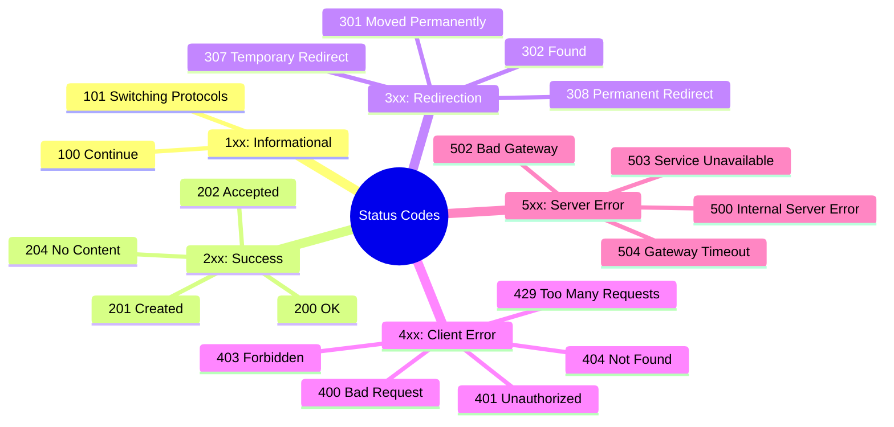
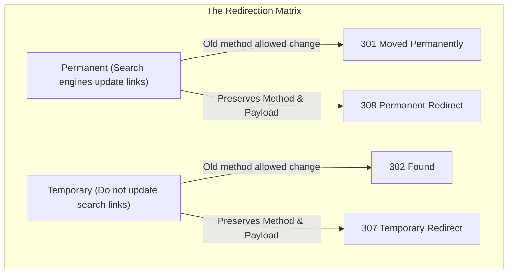
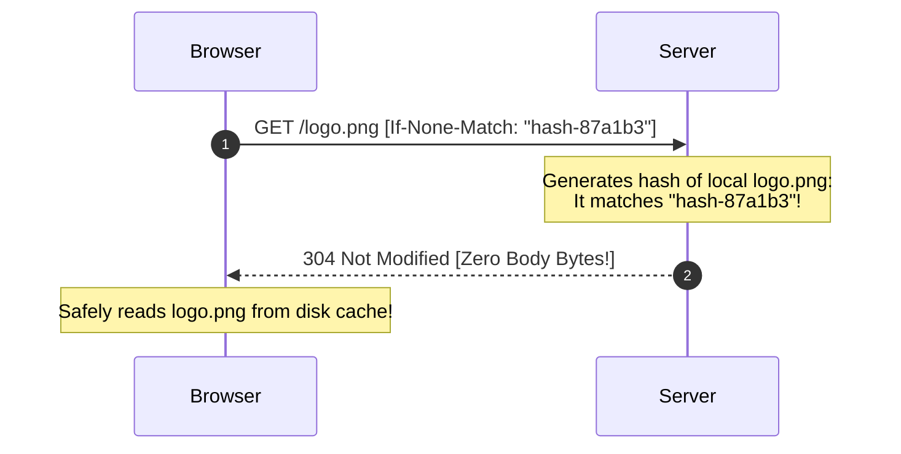

# Chapter V: The Royal Decrees and the Vatican Pigeons

> "HTTP responses are the formal royal decrees of the computational sovereign—stamped with standardized codes that tell the client whether their petition has been granted, redirected, or condemned."

---

## I. The Heraldry of Rehe and the Monastic Validation Protocol

In the year 1342, the Abbot of Saint-Denis in France faced an administrative crisis. 

He was compiling a library of theological manuscripts, but his scribes were working from older, potentially corrupted translations. 

He wanted to verify if his copy of the *City of God* by Saint Augustine matched the authoritative, papal manuscript preserved in the vaults of the Vatican.

The Abbot had two choices. 

He could pack the entire twenty-two books of the manuscript onto a mule, assign a team of armed monks to guard it, and spend four months traveling across the Alps to Rome to compare the texts line by line. 

This was slow, incredibly expensive, and carried a high probability of the monks being robbed or the manuscript being ruined by mountain rain. 

This is the <strong>Unconditional Transfer Problem</strong>—sending the entire mass of your state down a high-latency, high-risk transport line.

Instead, the Abbot used a primitive <strong>monastic validation protocol</strong>.

He ordered his head scribe to read the French manuscript and compile a short, unique administrative summary of its characters—a signature. 

They took the first letter of every paragraph, combined them, and stamped the summary onto a small piece of parchment with the abbey’s private wax seal. 

They placed the parchment into a tiny leather envelope, tied it to the leg of a homing pigeon, and released it toward Rome.

When the pigeon landed in the Vatican courtyard, the papal librarian took the parchment. 

He did not load a mule. 

He simply walked to the shelf, pulled down the authoritative papal manuscript, ran the exact same mathematical extraction on its characters, and compared his wax seal with the Abbot’s seal.

If the two seals were identical, the Vatican librarian did not copy the thousand-page manuscript. 

He took a tiny scrap of sheepskin, stamped it with a single blue mark: *"Not Modified,"* tied it to the pigeon, and sent it back to Saint-Denis.

When the pigeon returned to France, the Abbot looked at the blue mark. 

He knew instantly, with mathematical certainty, that his local manuscript was perfectly synchronous with the sovereign copy in Rome. 

He had verified the state of a massive dataset across a thousand miles of hostile territory in a matter of days, using nothing more than a pigeon, a wax seal, and a three-digit equivalence protocol.

This is the exact logical blueprint of <strong>HTTP Validation Caching</strong> using <strong>ETags (Entity Tags)</strong>.

Let us look at a second, more political analogy: the <strong>Heraldic Calls</strong> of the Holy Roman Empire.

When the Emperor’s herald rode into a provincial town square to deliver a decree, he did not engage in a fluid, conversational debate. 

He blew a silver trumpet and announced a standardized numeric decree:
*   If he announced a <strong>1xx Decree</strong>, it meant: *"Hold on, the court is currently deliberating. Stand by for further instructions."*
*   If he announced a <strong>2xx Decree</strong>, it meant: *"Your petition to build a mill has been formally granted. Here is your permit."*
*   If he announced a <strong>3xx Decree</strong>, it meant: *"The registry office has moved to Nuremberg. Pack your bags and go there."*
*   If he announced a <strong>4xx Decree</strong>, it meant: *"You filled out the wrong tax form, or you are trying to enter the royal treasury without a seal. Go home and fix it."*
*   If he announced a <strong>5xx Decree</strong>, it meant: *"The castle walls have collapsed, the treasury is on fire, and the registry clerk has fled. We cannot process your request."*

The townspeople did not need to read the entire scroll to understand what to do. 

The first digit of the herald's call determined their entire behavioral path.

In the digital world, <strong>HTTP Responses</strong> are these formal heraldic calls. 

When a server replies to a client, it does not just dump raw bytes. 

It wraps the response in a strict, triple-part administrative envelope: the <strong>Status Line</strong>, the <strong>Metadata Headers</strong>, and the optional <strong>Payload Body</strong>. 

And the most critical marker on that envelope is the three-digit <strong>Status Code</strong>—the universal grammar of server-side outcome.

[^1]: The three-digit status code taxonomy was formalized in HTTP/1.0 by RFC 1945 in 1996. The designers modeled it after earlier FTP and SMTP protocol responses from the 1970s, which had proven that dividing outcomes into strict numeric decades ($2xx, 3xx$) allowed dumb clients to parse complex server states with simple logical gates.

---

## II. The Five Royal Classes: A Complete Taxonomy of Outcome

Let us map the five distinct classes of the HTTP response empire:



Let us dissect the deep, operational mechanics of these five groups:

### 1. 1xx: The Informational Deliberators

The 1xx status codes are intermediate progress reports. 

They are the only HTTP responses that <strong>do not close the transaction</strong>. 

The server sends a 1xx response to say: "I have received your request, and I am still working. Keep the socket open."

*   <strong>101 Switching Protocols</strong>: This is the gateway to real-time communication. When a browser wants to establish a persistent <strong>WebSocket</strong> connection for a chat app, it cannot do so directly. It must start with a standard HTTP GET request carrying an `Upgrade: websocket` header. The server receives the request, evaluates the cryptographic handshake, and replies with `HTTP/1.1 101 Switching Protocols`. From that microsecond on, the HTTP grammar is discarded, and the socket transitions into a bidirectional WebSocket highway.
*   <strong>100 Continue</strong>: The efficiency shield. If a client wants to upload a massive 2GB video file, it does not want to upload the entire payload only to have the server say: "You are not logged in, request rejected." The client sends *only the headers* carrying an `Expect: 100-continue` marker. The server reads the headers, validates the permissions, and replies with `100 Continue`. The client then uploads the 2GB body. If the permissions are invalid, the server replies with `401 Unauthorized` immediately, saving massive network bandwidth.

### 2. 2xx: The Successful Permissions

The 2xx codes declare that the petition was successfully processed. But different successes require different semantic labels:

*   <strong>200 OK</strong>: The standard success certificate. The request succeeded, and the requested data is loaded inside the response body.
*   <strong>201 Created</strong>: The builder's seal. Used specifically in `POST` requests to indicate that a <strong>brand-new resource has been successfully created</strong> in the database. A well-designed API will append a `Location: /v1/users/102` header, telling the client exactly where the new creation resides.
*   <strong>202 Accepted</strong>: The asynchronous promise. Used in heavy, time-consuming operations (like video processing or PDF generation). The server says: "I have validated your request, and I have queued the job. I am not finished yet, but you do not have to wait. Here is a `job_id` you can poll later."
*   <strong>204 No Content</strong>: The silent success. The request succeeded, but there is <strong>no body to return</strong>. This is the standard, elegant response for a successful `DELETE` request—the resource is gone, so returning an empty JSON object `{}` is redundant.

### 3. 3xx: The Territorial Relocators

Redirections are the diplomatic passports of the web, instructing the browser to find the resource at a different coordinate. 

But we must differentiate between <strong>Permanent</strong> and <strong>Temporary</strong> relocations:



*   <strong>301 Moved Permanently vs. 308 Permanent Redirect</strong>:
    Under a `301` redirection, if a search engine bot hits `http://old-url.com` and receives a 301, it permanently updates its index to `https://new-url.com`. 
    However, the early implementations of `301` had a bug: if the client sent a `POST` request to the old URL, the browser would rewrite the method to a `GET` when calling the new redirected URL, discarding the body. 
    To resolve this, the IETF designed <strong>`308 Permanent Redirect`</strong> in RFC 7538. 
    A `308` guarantees that the browser <strong>must preserve the HTTP method and request body</strong> exactly during the redirection.
*   <strong>302 Found vs. 307 Temporary Redirect</strong>:
    Identical to the permanent split, but for temporary relocations. 
    Use `307` to temporarily redirect a payment checkout `POST` request to a secondary server while guaranteeing that the browser does not rewrite it to a passive `GET` request.

### 4. 4xx: The Client's Contempt

The 4xx codes declare that the client made a semantic or protocol error. 

The server rejects the petition because the client violated the contract.

*   <strong>400 Bad Request</strong>: The general syntax failure. The payload was corrupted, the JSON was malformed, or required parameters were missing.
*   <strong>401 Unauthorized vs. 403 Forbidden</strong>:
    One of the most frequent developer design errors. 
    Think of a secure nightclub. 
    `401 Unauthorized` (which should technically be named "Unauthenticated") means: *"You have no ticket. You must show me your ID before I can talk to you."* 
    `403 Forbidden` means: *"I know exactly who you are, Harshit. I read your ID. But you are wearing sweatpants, and this is a black-tie club. You do not have permission to enter."* 
    A `401` requires the client to log in; a `403` tells the client to go away because logging in again will not help.
*   <strong>404 Not Found</strong>: The classic search failure. The resource does not exist at this coordinate.

### 5. 5xx: The Sovereign's Collapse

The 5xx codes declare that the client did everything right, but the server collapsed under its own weight or crashed during execution.

*   <strong>500 Internal Server Error</strong>: The general server-side crash. A null-pointer exception occurred in the Node.js runtime, a database connection failed, or the code threw an unhandled error.
*   <strong>502 Bad Gateway</strong>: An infrastructure routing failure. The load balancer (like NGINX or Cloudflare) connected to the upstream application server, but the application server returned a corrupted response or was offline.
*   <strong>503 Service Unavailable</strong>: The capacity shield. The server is alive, but it is currently overloaded with traffic or undergoing maintenance. WAFs return this to tell bots to back off.
*   <strong>504 Gateway Timeout</strong>: The upstream timeout. The gateway stood waiting for the application server to compile the response, but the application server took too long, and the gateway hung up the connection.

---

## III. The Monastic Protocol in Code: ETag Validation and HTTP Caching

Let us explore how the Vatican pigeon validation protocol is written inside our actual HTTP headers.

Caching is the process of storing copies of server responses close to the user to bypass the slow network journey. 

We manage this using two distinct header mechanisms: <strong>Freshness Caching</strong> and <strong>Conditional Validation</strong>.

### 1. Freshness Caching (Cache-Control)

With freshness caching, the server declares exactly how long the client is allowed to read the response from its own local disk without ever asking the server.

We control this using the `Cache-Control` header:
`Cache-Control: public, max-age=31536000`

This instructs the browser (and any intermediate CDN proxies) to cache the asset for exactly one year ($31,536,000$ seconds). 

If the user visits the page tomorrow, the browser does not make a network call. 

It loads the stylesheet instantly from RAM or disk, displaying `Status Code: 200 OK (from disk cache)`.

But what if you deploy a critical update in your stylesheet next week? 

Because the browser is locked to its local disk cache for a year, the user will continue to load the old stylesheet, shattering the layout.

To prevent this, you must <strong>never cache dynamic HTML pages</strong>. 

Instead, you use:
`Cache-Control: no-cache, no-store, must-revalidate`

*   `no-store`: Instructs the browser and intermediate proxies to <strong>never write the response to disk</strong>. 
    This is critical for sensitive banking APIs or personal user dashboards.
*   `no-cache`: A confusingly named setting. It does *not* mean "do not cache." 
    It means: *"You may store a copy in your local cache, but you are strictly forbidden from reading it until you validate it with the origin server."*

### 2. Conditional Validation (ETags and Last-Modified)

This brings us back to our Vatican pigeon. 

When a client receives a response with `Cache-Control: no-cache`, the server attaches a unique stamp: an <strong>ETag</strong> (usually a cryptographic hash of the file contents).

```http
HTTP/1.1 200 OK
Cache-Control: no-cache
ETag: "hash-87a1b3"
Content-Length: 1042
```

The browser receives the response and writes the HTML and the ETag into its local cache index.

Next month, the user visits the page again. 

The browser has a copy of the HTML, but because of `no-cache`, it cannot read it directly.

Instead, the browser opens a TCP socket to the server and fires a <strong>Conditional Request</strong>. 

It takes the cached ETag and appends it to the request headers using `If-None-Match`:

```http
GET /index.html HTTP/1.1
Host: sriniously.com
If-None-Match: "hash-87a1b3"
```

The server receives the request, loads the current version of the HTML from disk, computes its hash, and compares the hashes.

*   If the hash has changed, the server compiles the new HTML, packages it inside a <strong>`200 OK`</strong> response with the new ETag, and sends it down the wire.
*   If the hash has not changed (the local copy is perfectly synchronous), the server does not send the HTML file. 
    It returns a <strong>`304 Not Modified`</strong> response with <strong>zero body bytes</strong>.



Through this mechanism, we save massive server CPU, database bandwidth, and transport latency. 

A page that would normally cost 5MB of transfer now costs less than 100 bytes of headers.

---

## IV. The Semantic Lie: Why We Do Not Wrap 500s in 200s

One of the most dangerous design patterns in modern API development is the <strong>200 OK Error Wrapper</strong>.

It occurs when a developer writes their Node.js error handlers to intercept exceptions, compile an error JSON payload, and return it with a `200 OK` status code:

```http
HTTP/1.1 200 OK
Content-Type: application/json

{
  "success": false,
  "error": "database_connection_failed",
  "message": "We could not access our records."
}
```

To the developer, this seems clean. 

They can write their frontend JavaScript fetch client with a simple check:

```javascript
// A fragile model
const res = await fetch('/api/data');
const data = await res.json();
if (!data.success) { renderErrorMessage(data.message); }
```

But by wrapping a database crash in a `200 OK` royal decree, they have committed a <strong>semantic lie</strong> that ruins the entire network infrastructure:

1.  <strong>CDN Caching Disasters</strong>: 
    If you place a CDN (like Cloudflare or Akamai) in front of your server, the CDN is designed to cache successful `200 OK` responses automatically. 
    If your database crashes and you return a `200 OK` with `{ "success": false }`, the CDN will capture that crash payload and cache it! 
    Even when your database comes back online, the CDN will continue to serve the cached error payload to thousands of visitors for hours, completely freezing your application.
2.  <strong>Blind Monitoring Systems</strong>: 
    Enterprise monitoring tools (like Datadog, New Relic, or AWS CloudWatch) analyze your network health by scraping your status codes. 
    They track your error rate: $\frac{\text{5xx Requests}}{\text{Total Requests}}$. 
    If you return `200 OK` for database failures, your monitoring dashboards will report a perfect 100% green health index while your customer support queues explode with complaints.
3.  <strong>WAF Blocking Failures</strong>: 
    Web Application Firewalls (WAFs) monitor status codes to detect automated attacks. 
    If a bot is hammering your login endpoints with invalid passwords, a WAF checks for a high rate of `401 Unauthorized` responses and blocks the bot's IP. 
    If you return `200 OK` for failed login attempts, the WAF is completely blinded, allowing the bot to continue its brute-force attack indefinitely.

The rule is absolute: <strong>Let the status code speak the structural truth of the system.</strong> 

If a request fails because of client inputs, return a `4xx`. 

If the database crashed, return a `500 Internal Server Error`. 

Never lie to the network.

---

## V. Key Takeaways

We have now mapped the complete, elegant grammar of the web. Let us review the key parameters of the protocol layers:

| Layer / Model | Transport Protocol | Latency Profile | Core Benefit | The Bottleneck |
| :--- | :--- | :--- | :--- | :--- |
| <strong>GET</strong> | TCP (RFC 793) | ~50 - 150ms | Keep-Alive persistent connection recycling | Head-of-Line Blocking at application layer |
| <strong>HTTP/2</strong> | TCP (RFC 793) | ~30 - 80ms | Frame Multiplexing on a single socket | Head-of-Line Blocking at transport layer |
| <strong>HTTP/3</strong> | QUIC over UDP | ~10 - 50ms | Stream Independence and integrated TLS 1.3 | High CPU packet validation overhead |
| <strong>Serverless</strong> | On-Demand Routing | ~100 - 600ms | Automatic, infinite scaling with zero idle cost | Cold Starts and Stateless connection pool limits |

Understanding HTTP methods and CORS boundaries is not merely a tool for loading web pages; it is the ultimate administrative framework of global distributed systems. In the next chapter, we will inspect the seven primary verbs of this language—the HTTP methods—and trace the precise boundaries that separate safe, idempotent, and mutable operations.

---

[Next Chapter → Routing: The Grand Switchboard →](./06_Routing.md)
