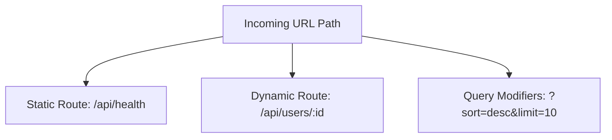

# Chapter VI: The Grand Switchboard and the Nested Routing Pathology

> "Routing is the great administrative switchboard of the backend—mapping the chaotic incoming streams of human will onto discrete, logical execution cells."

---

## I. The London GPO and the Manual Switchboard Operator

In the year 1864, the London General Post Office (GPO) was the nervous system of the British Empire. 

Every morning, hundreds of thousands of letters from Yorkshire, Calcutta, Edinburgh, and Jamaica were dumped onto massive wooden sorting tables in the central hall.

A clerk standing at the table would pick up an envelope. 

It did not say: *"To the Duke of Westminster, Bedroom #4, Grosvenor House, London."* 

It said: *"To the Duke of Westminster, London."*

The clerk did not drop the envelope in a massive bucket and walk house to house searching for the Duke. 

Instead, they ran it through a highly structured, hierarchical filter—a **Prefix Trie**. 

*   First, they threw it into the **London West (W)** bin.
*   The W bin was taken to a secondary clerk who sorted it by district: **Mayfair**.
*   The Mayfair clerk sorted it by street: **Grosvenor Street**.
*   The street postman carried it to the gate: **Grosvenor House**.
*   The Duke’s butler received the letter at the gate, sorted it by current location, and placed it on a silver tray outside the Duke's library.

The letter was routed step-by-step, matching its nested string segments against a tree of physical rules. 

At no point did any individual clerk need to know the entire map of the world. 

They only needed to know their local prefix branches.

Let us look at a second, more mechanical analogy: the **Manual Telephone Switchboard** of the 1920s.

When a caller picked up their telephone receiver, an electrical current flowed down a copper wire into the central office, dropping a metal shutter on a massive wooden console in front of a switchboard operator. 

The operator inserted a brass plug into the corresponding jack, flipped a key, and said: *"Number, please?"*

The caller did not say: *"I wish to execute code block 42."* 

They said: *"Connect me to the Mayor's Office."*

The operator took a long, fabric-covered patch cord, reached across the console, and inserted the brass tip into the specific jack labeled *"Mayor."* 

The incoming voice was instantly routed to the mayor's desk. 

If the next caller asked for the police chief, the operator plugged the cord into a different jack.

```text
Incoming Caller ───────> [Operator Console] ───────> (Mayor's Jack) ───> Mayor's Phone
                                            └───────> (Police Jack) ───> Police Phone
```

The underlying copper wire was identical. 

The electrical signals were identical. 

But the **routing decision**—the operator’s physical selection of the plug jack—directed the flow of current to completely different human brains and logical functions.

In modern backend development, **Routing** is this manual switchboard operator.

When a TCP packet containing an HTTP request lands on your server port, it is just a flat stream of ASCII characters. 

The router is the component that inspects the **URL Path** (the destination address) and the **HTTP Method** (the active verb), evaluates them against a registered prefix tree, and dispatches the request to the specific JavaScript, Go, or Rust function—the **Handler**—designed to execute that specific logic.

---

## II. The Decoupling of the File: A History of URL Mapping

Routing did not spring fully formed from the minds of framework authors. 

It is the product of a thirty-year struggle to decouple **Resource Semantics** from **Physical Disk Storage**.

### 1. The Era of the Mirror (1991–1995)

In the earliest days of the web, servers like **NCSA HTTPd** and early **Apache** had no routing logic. 

They were purely directory mirrors.

The URL path was the exact physical path of a file on the server's hard drive:

```text
GET /about/team.html ───> Server looks for: /var/www/html/about/team.html
```

If the file existed, the server read it from disk and piped it down the socket. 

If you wanted to rename a folder or reorganize your code, you had to move files on the server's hard disk—instantly breaking every bookmark and link in the world. 

The URL was bound to the hardware of the server.

### 2. The Dynamic File Script (1995–2004)

The rise of server-side scripting languages like **PHP** and **ASP** added programmability, but maintained the filesystem mirror paradigm.

A request for `/users.php?id=42` executed the file `users.php` on disk, which processed the database query.

```text
GET /users.php?id=42 ───> Server executes: /var/www/html/users.php
```

While this allowed dynamic pages, it was incredibly fragile. 

If a hacker discovered a vulnerability in `users.php`, they could target it directly. 

Furthermore, your URLs looked messy, carrying file extensions (`.php`, `.asp`, `.pl`) and complex query parameters that made them unreadable to humans and search engines.

### 3. The Centralized Router Revolution (2004–Present)

The breakthrough came with MVC (Model-View-Controller) frameworks in the mid-2000s, spearheaded by **Ruby on Rails** and **Django**.

Rails introduced the concept of the **Centralized Router**—a single configuration file (`routes.rb`) that declared maps between abstract URL patterns and controller methods:

```ruby
# The Decoupled Rails Router
get '/users/:id', to: 'users#show'
```

For the first time, **the filesystem was completely decoupled from the URL**. 

The file on disk could be named `user_controller.rb` and live deep in a nested folder, but the public URL could be `/users/42`. 

The URL was now a **design choice**, a clean semantic interface constructed for humans and RESTful architecture, completely independent of the server's folder layout.

---

## III. The Taxonomy of Paths: Static, Dynamic, and Query Parameters

Modern routers classify incoming routes into three distinct parameter groups, each carrying different semantic weights:



### 1. Static Routing

Static routes are literal string matches. 

The path must be exactly identical to the request URL:

```javascript
app.get('/api/health', healthHandler);
app.post('/api/auth/login', loginHandler);
```

Because static routes do not contain variables, routers can resolve them with near-zero latency using a simple **Hash Map** lookup. 

If the key `/api/health` exists in the route map, the router calls the handler immediately.

### 2. Dynamic Routing (Route Parameters)

Dynamic routes contain variable segments (route parameters), usually prefixed with a colon (`:id` or `:username`). 

They act as semantic wildcards that capture the value in that position:

```javascript
app.get('/api/users/:id', (req, res) => {
  const userId = req.params.id; // Extracts "42" or "harshit"
});
```

Because dynamic routes cannot be resolved with flat hash maps, routers construct a **Radix Tree (Prefix Tree)**.

A Radix Tree is an optimized search tree where common prefixes are merged into single nodes:

```text
                /api/
               /     \
             users/   posts/
            /              \
         :userId            :postId
```

When a request for `/api/users/42` arrives, the router traverses the tree:
1.  Matches prefix `/api/`.
2.  Matches branch `users/`.
3.  Reaches dynamic node `:userId` and extracts `"42"` as a parameter.
4.  Invokes the registered user handler.

> [!IMPORTANT]
> **Route parameters are extracted as strings, never numbers.** Even if the request is `/api/users/42`, `req.params.id` is the string `"42"`. The handler function is strictly responsible for validating, parsing, and casting this string to an integer before querying the database, preventing SQL injection and type crashes.

### 3. Query Parameters: Nouns vs. Adjectives

One of the most frequent design failures in RESTful APIs is the misuse of **Route Parameters** and **Query Parameters**.

What is the difference? 

Think of Route Parameters as **Nouns (the physical address of a house)** and Query Parameters as **Adjectives (the instructions given to the butler)**.

*   **Route Parameters** define the **identity** of the resource. 
    Without them, the resource cannot be located. 
    If you ask for `/api/users/42`, you are looking for a unique, physical user record.
*   **Query Parameters** (the fields after the `?` mark: `/api/users?sort=age&limit=10`) modify the **presentation** of the resource. 
    They do not change the identity of the collection; they filter, sort, paginate, or search it.

```text
GET /api/users/42             <─── Route Parameter: Identifies User #42 (Noun)
GET /api/users?status=active   <─── Query Parameter: Filters collection (Adjective)
```

If you write a route like `/api/users/active` to fetch active users, you have committed an architectural error. 

You are treating the state of the resource (active) as its unique physical identity. 

If the user changes their status to inactive, their URL would have to change! 

Instead, use query parameters: `/api/users?status=active`.

---

## IV. The Pathological Nesting: How Routing Systems Collapse

As backend architectures grow, developers frequently fall into the trap of **Route Nesting Madness**.

Imagine you are building a blogging platform. 

A user has posts, posts have comments, comments have likes. 

A naive developer will design the routing tree to mirror this relational hierarchy:

```text
/api/users/:userId/posts/:postId/comments/:commentId/likes/:likeId
```

This is a routing pathology. 

It creates massive, fragile URLs that are painful to maintain and slow to parse. 

Let us examine why this nested structure is a disaster:

1.  **Multiple Joins and Database Overhead**: 
    To process a request to update a comment at `/api/users/42/posts/101/comments/505`, your server-side handler must validate that user 42 actually owns post 101, and that post 101 owns comment 505. 
    You are forced to run multiple nested SQL joins or database lookups just to verify the path.
2.  **Stateless Redundancy**: 
    If your database uses globally unique UUIDs or auto-incrementing primary keys, comment `505` is already unique across the entire system. 
    You do not need the parent IDs in the path to locate it! 
    The comment has a single, absolute identity.
3.  **Front-End Fragility**: 
    A client application trying to delete a comment must keep track of the `userId` and `postId` in its local state just to construct the URL. 
    If the user navigates away or the UI state changes, compiling the URL becomes highly error-prone.

### The Rule of Flattening

To maintain clean, performant, and robust architectures, follow the **Rule of Flattening**:

> *"If a resource has a globally unique identifier, its address should be flat. Nesting is only permitted for locating items that cannot exist or be identified without their immediate parent."*

```diff
- /api/users/:userId/posts/:postId/comments/:commentId
+ /api/comments/:commentId
```

If you want to read a specific comment, query `GET /api/comments/505` directly. 

If you want to fetch all comments belonging to a specific post, use query parameters on the comments collection: `GET /api/comments?postId=101`. 

This keeps your routing prefix tree small, your URLs clean, and your database queries blazing fast.

---

## V. Key Takeaways

We have now mapped the complete, elegant grammar of the web. Let us review the key parameters of the protocol layers:

| Layer / Model | Transport Protocol | Latency Profile | Core Benefit | The Bottleneck |
| :--- | :--- | :--- | :--- | :--- |
| **GET** | TCP (RFC 793) | ~50 - 150ms | Keep-Alive persistent connection recycling | Head-of-Line Blocking at application layer |
| **HTTP/2** | TCP (RFC 793) | ~30 - 80ms | Frame Multiplexing on a single socket | Head-of-Line Blocking at transport layer |
| **HTTP/3** | QUIC over UDP | ~10 - 50ms | Stream Independence and integrated TLS 1.3 | High CPU packet validation overhead |
| **Serverless** | On-Demand Routing | ~100 - 600ms | Automatic, infinite scaling with zero idle cost | Cold Starts and Stateless connection pool limits |

Understanding HTTP methods and CORS boundaries is not merely a tool for loading web pages; it is the ultimate administrative framework of global distributed systems. In the next chapter, we will inspect the seven primary verbs of this language—the HTTP methods—and trace the precise boundaries that separate safe, idempotent, and mutable operations.

---

[Next Chapter → Serialization & Deserialization: The Babel Fish →](./07_Serialization.md)
