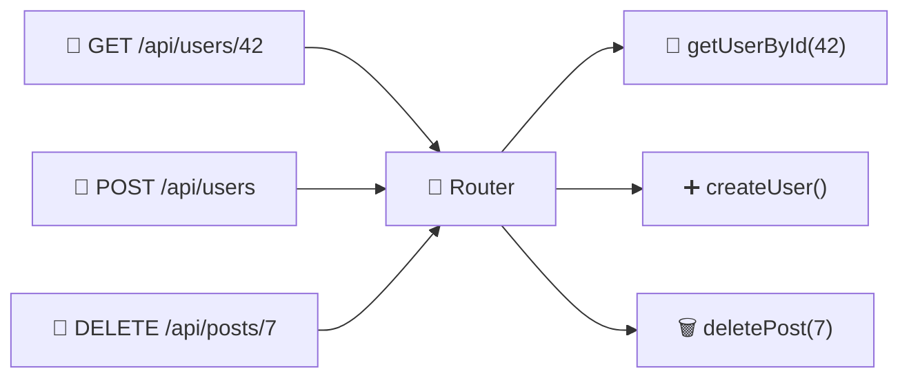

# 🛤️ Chapter 6: Routing

> *"HTTP requests explain WHAT we want to do with data. Routing tells us WHERE we should perform the action."*

---

## 📌 What is Routing?

When an HTTP request arrives at a server, the server needs to figure out **which piece of code should handle it**. A request to `GET /api/users/42` should be handled by different logic than a request to `DELETE /api/posts/7` — even though both arrive at the same server through the same TCP connection. The mechanism that maps incoming requests to the correct handler function is called **routing**, and it's one of the most fundamental concepts in backend development.

Routing works by examining two pieces of information from the incoming request: the **URL path** (which resource is being targeted) and the **HTTP method** (what action is being requested). The combination of these two determines which handler function is invoked. `GET /api/users` and `POST /api/users` hit the same URL path but trigger different handlers because their methods are different — one retrieves the list of users, the other creates a new user.



```javascript
// Express.js example — each route maps a method + path to a handler
app.get('/api/users',      getAllUsers);     // GET    /api/users
app.get('/api/users/:id',  getUserById);     // GET    /api/users/42
app.post('/api/users',     createUser);      // POST   /api/users
app.put('/api/users/:id',  updateUser);      // PUT    /api/users/42
app.delete('/api/users/:id', deleteUser);    // DELETE /api/users/42
```

---

## 🏛️ A Brief History: How Routing Evolved

Routing as a concept has evolved dramatically alongside the web itself. Understanding its history helps explain why modern routing systems work the way they do and why certain conventions exist.

In the earliest days of the web (early 1990s), there was no "routing" in the modern sense. Web servers like **NCSA HTTPd** and early **Apache** simply mapped URL paths to files on the server's filesystem. A request for `/about.html` would serve the file at `/var/www/html/about.html`. A request for `/images/logo.png` would serve the file at `/var/www/html/images/logo.png`. The URL *was* the file path, and the server's job was just to look up the file and send it back. There were no handler functions, no application logic, no dynamic content — just static file serving.

The introduction of **CGI (Common Gateway Interface)** in 1993 added the first layer of programmability. With CGI, a URL like `/cgi-bin/search.pl?q=hello` would execute a Perl script on the server and return its output. But CGI didn't really have "routing" either — the URL directly pointed to a specific script file, and each script was responsible for its own request handling. If you had 50 different endpoints, you had 50 different CGI scripts.

The next evolution came with **server-side scripting languages** like PHP (1995) and ASP (1996). These languages processed files based on their file extension — any `.php` file would be run through the PHP interpreter before being sent to the client. URL-to-file mapping was still the primary routing mechanism, but now the files could contain dynamic logic. A request for `/users.php?id=42` would execute `users.php`, which could read the `id` parameter and query a database. This was a significant step forward, but it meant that your URL structure was still dictated by your file system layout.

The real revolution came with **MVC (Model-View-Controller) frameworks** in the mid-2000s. **Ruby on Rails** (2004) and **Django** (2005) introduced the concept of a **centralized router** — a single component that examines incoming requests and dispatches them to the appropriate controller method. For the first time, URL paths were decoupled from the filesystem. You could define that `GET /users/42` should be handled by `UsersController#show` — the URL structure was a design decision, not a filesystem constraint. This was a paradigm shift that made clean, semantic URLs possible and laid the groundwork for RESTful API design.

In 2000, **Roy Fielding** published his doctoral dissertation introducing **REST (Representational State Transfer)**, which formalized the idea that URLs should represent **resources** (nouns) and HTTP methods should represent **actions** (verbs). Under REST conventions, `/api/users/42` is a resource (a specific user), and what you do with it depends on the method: GET reads it, PUT replaces it, PATCH updates it, DELETE removes it. This design philosophy has become the dominant paradigm for web API routing and is the convention used by virtually every modern web framework.

Today, frameworks like **Express.js** (Node.js), **FastAPI** (Python), **Gin** (Go), **Actix** (Rust), and **Spring Boot** (Java) all provide sophisticated routing systems with support for static routes, dynamic parameters, middleware chains, route grouping, and versioning. The fundamental concept — mapping a method + path to a handler function — remains unchanged, but the ergonomics and power of the tools have grown enormously.

---

## 📁 Static Routing

Static routes have **fixed, predefined URL paths** that don't contain any variable segments. The path is a literal string, and the router matches it through a simple string comparison. Static routes are used for endpoints that don't need to identify a specific resource — they either operate on collections (like listing all users) or perform actions that aren't resource-specific (like health checks, login, or registration).

```javascript
// These are all static routes — the path is always exactly the same
app.get('/api/users',      getAllUsers);
app.get('/api/health',     healthCheck);
app.get('/api/about',      getAboutInfo);
app.post('/api/login',     loginUser);
app.post('/api/register',  registerUser);
```

Static routes are the simplest and fastest type of route because the router can use a direct hash map or trie lookup to find the matching handler — there's no pattern matching or parameter extraction involved. When a request for `GET /api/health` arrives, the router checks its registered routes, finds an exact string match for `/api/health` with the GET method, and invokes the `healthCheck` handler. If no match is found, the router falls through to error handling (typically returning a 404 Not Found response).

| Property | Detail |
|---|---|
| **Path** | Fixed — exactly matches the URL |
| **Use case** | Pages/endpoints that don't vary |
| **Examples** | `/login`, `/register`, `/health`, `/about` |
| **Performance** | ⚡ Fastest — direct string match |

---

## 🔄 Dynamic Routing

Static routes can't handle a fundamental requirement of most APIs: identifying **specific resources**. If you have a million users in your database, you can't define a million static routes — you need a single route pattern that can match any user ID. This is where **dynamic routing** comes in.

Dynamic routes contain **variable segments** (called route parameters) in the URL path. These segments are typically prefixed with a colon (`:`) in the route definition, and they match any value in that position of the URL. When the router matches a dynamic route, it extracts the variable values from the URL and makes them available to the handler function through a parameters object.

```javascript
// :id is a route parameter — it matches any value in that position
app.get('/api/users/:id', (req, res) => {
    const userId = req.params.id;  // "42", "99", "harshit", etc.
    // Fetch user with this ID from the database
});

// Multiple dynamic segments
app.get('/api/users/:userId/posts/:postId', (req, res) => {
    const { userId, postId } = req.params;
    // Fetch a specific post by a specific user
});
```

When a request for `GET /api/users/42` arrives, the router tries to match it against its registered routes. The static route `/api/users` doesn't match because the request URL has an additional segment. The dynamic route `/api/users/:id` matches because `:id` acts as a wildcard that captures the value `"42"`. The router invokes the handler with `req.params.id` set to `"42"`, and the handler can use this value to query the database for user #42.

It's important to understand that route parameters are always extracted as **strings**. Even though `42` looks like a number, `req.params.id` will be the string `"42"`, not the number `42`. The handler function is responsible for converting it to the appropriate type and validating it — checking that it's a valid integer, that it's positive, and that a user with that ID actually exists in the database.

```
Route Pattern:  /api/users/:id

Matches:
  GET /api/users/42      → req.params.id = "42"     ✅
  GET /api/users/99      → req.params.id = "99"     ✅
  GET /api/users/harshit → req.params.id = "harshit" ✅

Does NOT match:
  GET /api/users          → ❌ (missing the :id segment)
  GET /api/users/42/posts → ❌ (too many segments)
```

---

## 🔍 Route Parameters vs Query Parameters

Both route parameters and query parameters pass data through the URL, but they serve fundamentally different purposes and follow different conventions. Confusing them is one of the most common mistakes new backend developers make, so understanding the distinction is important.

### Route Parameters (`:id`) — Identifying a Resource

Route parameters are part of the **URL path itself** and are used to identify a **specific resource**. They answer the question "which one?" A route parameter is typically required — the route won't match at all without it. When you see `/api/users/42`, the `42` is a route parameter that uniquely identifies a specific user. The resource can't be located without this identifier, which is why it's embedded in the path itself rather than being optional.

```javascript
// Route: /api/users/:id
app.get('/api/users/:id', (req, res) => {
    console.log(req.params.id);  // "42"
});
```

### Query Parameters (`?key=value`) — Filtering and Modifying the Request

Query parameters come **after the `?`** in the URL and are used to filter, sort, paginate, or otherwise modify how the server processes the request. They answer questions like "which subset?", "in what order?", and "how many?" Query parameters are almost always optional — the request should work without them (returning a default set of results), and each query parameter narrows or adjusts the results.

```javascript
// Route: /api/users
// URL: /api/users?role=admin&page=2&limit=10&sort=name&order=desc
app.get('/api/users', (req, res) => {
    console.log(req.query.role);   // "admin"
    console.log(req.query.page);   // "2"
    console.log(req.query.limit);  // "10"
    console.log(req.query.sort);   // "name"
    console.log(req.query.order);  // "desc"
});
```

### The Decision Rule

The key decision rule is simple: if the value **identifies a specific resource** (a specific user, a specific post, a specific order), it belongs in the path as a route parameter. If the value **modifies or filters** the response (pagination, sorting, searching, filtering by category), it belongs after the `?` as a query parameter.

| Feature | Route Params (`:id`) | Query Params (`?key=value`) |
|---|---|---|
| **Location** | In the URL path | After `?` in the URL |
| **Purpose** | Identify a **specific** resource | Filter, sort, paginate, search |
| **Required?** | Usually yes (route won't match without it) | Usually optional |
| **Example** | `/users/42` | `/users?role=admin&page=2` |
| **Access** | `req.params.id` | `req.query.role` |
| **SEO** | Good (clean URLs) | Less ideal for SEO |

---

## 📂 Nested Routes

Nested routes represent **hierarchical relationships** between resources. In many data models, resources have parent-child relationships: users have posts, posts have comments, comments have replies. Nested routes mirror this hierarchy in the URL structure, making it immediately clear which resources belong to which parent.

```
/api/users                          → All users
/api/users/42                       → Specific user
/api/users/42/posts                 → All posts BY user 42
/api/users/42/posts/7               → Specific post BY user 42
/api/users/42/posts/7/comments      → All comments ON post 7 BY user 42
/api/users/42/posts/7/comments/3    → Specific comment on that post
```

The nesting communicates ownership and scope. When you see `/api/users/42/posts`, you immediately understand that you're requesting posts that belong to user 42 — not all posts in the system. This is semantically richer than using a flat URL with query parameters (like `/api/posts?userId=42`), because the nesting makes the relationship between resources explicit in the URL itself.

```javascript
// Parent resource: Users
app.get('/api/users',             getAllUsers);
app.get('/api/users/:userId',     getUser);

// Nested: Posts belonging to a User
app.get('/api/users/:userId/posts',          getUserPosts);
app.get('/api/users/:userId/posts/:postId',  getUserPost);

// Deeply nested: Comments on a Post by a User
app.get('/api/users/:userId/posts/:postId/comments',            getComments);
app.get('/api/users/:userId/posts/:postId/comments/:commentId', getComment);
```



```mermaid
flowchart TD
    A["/api"] --> B["/users"]
    B --> C["/users/:userId"]
    C --> D["/users/:userId/posts"]
    D --> E["/users/:userId/posts/:postId"]
    E --> F["/users/:userId/posts/:postId/comments"]
    F --> G["/users/:userId/posts/:postId/comments/:commentId"]

    style A fill:#1a1a2e
    style B fill:#16213e
    style C fill:#0f3460
    style D fill:#533483
    style E fill:#e94560
    style F fill:#f57842
    style G fill:#f5d042
```

However, there's a practical limit to how deeply routes should be nested. A URL like `/users/42/posts/7/comments/3/reactions/1` is hard to read, hard to type, and suggests a coupling between resources that might not be necessary. If comments have globally unique IDs (which they should, if they're stored in a `comments` table with an auto-incrementing primary key), you don't need to nest them under users and posts — you can access them directly with `/api/comments/3`. The general guideline is to nest no more than **two to three levels deep**, and to flatten deeper hierarchies by giving resources their own top-level routes.

> [!WARNING]
> **Don't nest too deeply!** More than 3 levels of nesting makes URLs hard to read and maintain. If resources have unique IDs, consider flattening:
> ```
> Instead of:  /users/42/posts/7/comments/3
> Consider:    /comments/3              (if comments have unique IDs)
> ```

---

## 🔢 Route Versioning

APIs evolve over time. You might need to rename fields, change response structures, remove deprecated endpoints, or add new required parameters. But you can't just make these changes in place — existing clients (mobile apps, third-party integrations, other services) depend on the current API contract, and breaking it would cause their applications to crash. Route versioning solves this by allowing you to run **multiple versions of your API simultaneously**, giving existing clients time to migrate while new clients use the latest version.

### The Historical Context

API versioning became a major concern in the late 2000s and early 2010s as mobile applications and third-party integrations proliferated. When a web application's frontend and backend were maintained by the same team and deployed together, API changes were straightforward — you'd update both simultaneously. But when external clients entered the picture — iOS apps that took weeks to pass Apple's review process, Android apps on devices that might not update for months, third-party integrations maintained by entirely different companies — breaking API changes became a serious engineering and business problem.

Different companies adopted different versioning strategies, and the debate over the "right" approach became one of the web development community's recurring arguments. Over time, three main strategies emerged, with URL path versioning becoming the dominant choice for most public APIs.

### Strategy 1: URL Path Versioning (Most Common)

The version number is embedded directly in the URL path, typically as `/v1/`, `/v2/`, etc. This approach is used by GitHub, Stripe, Twitter, and most major API providers because it's explicit, easy to understand, and plays well with caching and routing infrastructure.

```javascript
// Version 1 — original
app.get('/api/v1/users', (req, res) => {
    res.json({ name: "Harshit", email: "harshit@example.com" });
});

// Version 2 — added fields, changed structure
app.get('/api/v2/users', (req, res) => {
    res.json({
        firstName: "Harshit",
        lastName: "N",
        email: "harshit@example.com",
        avatar: "https://cdn.example.com/harshit.jpg"
    });
});
```

Both versions coexist on the same server. Old clients continue calling `/api/v1/users` and getting the old response format. New clients call `/api/v2/users` and get the new format. The old version can be maintained indefinitely or deprecated with advance notice, giving clients time to migrate.

### Strategy 2: Header Versioning

The version is specified in a request header rather than the URL. This keeps URLs clean but makes the API harder to test (you need to set custom headers in your HTTP client) and harder to cache (CDNs typically cache based on URL, not headers).

```http
GET /api/users
Accept: application/vnd.myapi.v2+json
```

### Strategy 3: Query Parameter Versioning

The version is passed as a query parameter. This is easy to test in a browser but can interact poorly with caching and feels somewhat ad hoc.

```http
GET /api/users?version=2
```

| Strategy | URL | Pros | Cons |
|---|---|---|---|
| **Path** `/api/v1/` | `api.com/v1/users` | Clear, cacheable, easy | Clutters URL |
| **Header** | `api.com/users` | Clean URL | Harder to test |
| **Query** | `api.com/users?v=2` | Easy to test | Can be cached incorrectly |

> [!TIP]
> **URL path versioning** (`/v1/`, `/v2/`) is the most widely used approach. Companies like GitHub, Stripe, and Twitter use it because it's explicit, cacheable, and easy to understand. Unless you have a specific reason to use another strategy, path versioning is the safe default.

---

## 🌟 Catch-All Routes

A catch-all route matches **any URL path** that doesn't match a more specific route. It's the "else" clause at the end of your routing table — a fallback that handles everything the specific routes don't.

Catch-all routes serve several important purposes. The most common is providing **custom 404 pages** — instead of letting the framework return a generic "Not Found" response, you can return a friendly, branded error page with helpful suggestions. Another common use case is **Single Page Applications (SPAs)**: React, Vue, and Angular apps handle routing on the client side, so the server needs to serve the same `index.html` file for every URL path and let the client-side router take over.

```javascript
// Specific routes first — order matters!
app.get('/api/users',     getAllUsers);
app.get('/api/posts',     getAllPosts);
app.get('/api/health',    healthCheck);

// Catch-all route — matches EVERYTHING else
app.get('*', (req, res) => {
    res.status(404).json({
        error: "Not Found",
        message: `Route ${req.originalUrl} does not exist`,
        suggestion: "Check the API documentation at /api/docs"
    });
});
```

```javascript
// SPA Catch-All — serve React app for all non-API routes
app.use('/api', apiRouter);

app.get('*', (req, res) => {
    res.sendFile(path.join(__dirname, 'build', 'index.html'));
    // React Router will handle /about, /profile, /settings, etc.
});
```

> [!IMPORTANT]
> **Order matters!** Always define catch-all routes **LAST**. Routers evaluate routes in the order they're defined, and `app.get('*', ...)` matches every request. If you put it first, it will catch every request and none of your specific routes will ever be reached. This is one of the most common routing bugs in Express.js applications.

---

## 📊 Routing Summary

Routing is the backbone of every backend API. It maps incoming HTTP requests to the correct handler functions based on URL path and HTTP method. **Static routes** handle fixed paths with direct string matching. **Dynamic routes** use parameterized segments to identify specific resources. **Route parameters** identify *which* resource (and are typically required), while **query parameters** filter or modify *how* the response is generated (and are typically optional). **Nested routes** express hierarchical resource relationships, but should be kept to two or three levels to maintain readability. **Versioning** allows APIs to evolve without breaking existing clients, with URL path versioning being the most widely adopted strategy. And **catch-all routes** provide a fallback for unmatched requests, whether for custom 404 pages or SPA support.

| Concept | Syntax | Example | Use Case |
|---|---|---|---|
| **Static** | `/path` | `/api/login` | Fixed endpoints |
| **Dynamic** | `/path/:param` | `/api/users/:id` | Specific resources |
| **Route Param** | `:param` | `/users/42` | Identify resources |
| **Query Param** | `?key=value` | `/users?role=admin` | Filter/sort/paginate |
| **Nested** | `/parent/:id/child` | `/users/42/posts` | Hierarchical data |
| **Versioned** | `/v1/path` | `/api/v1/users` | API evolution |
| **Catch-All** | `*` | `app.get('*', ...)` | 404 pages, SPAs |

---

[← Previous: HTTP Responses](./05_HTTP_Responses.md) | [Next: Serialization & Deserialization →](./07_Serialization.md)
