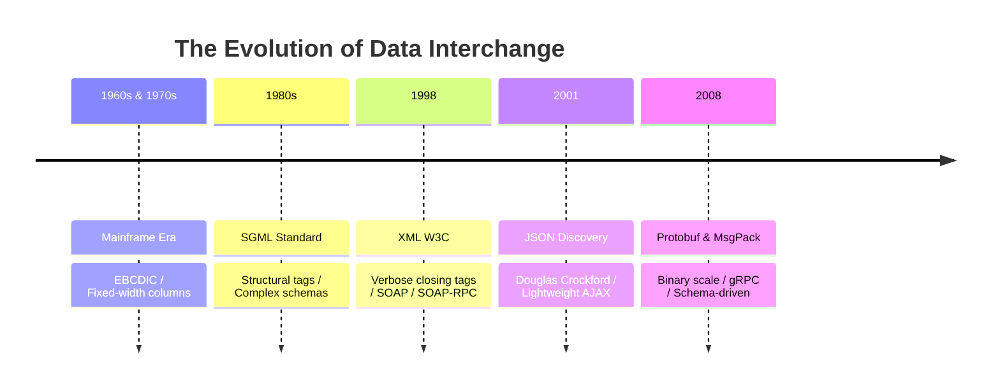
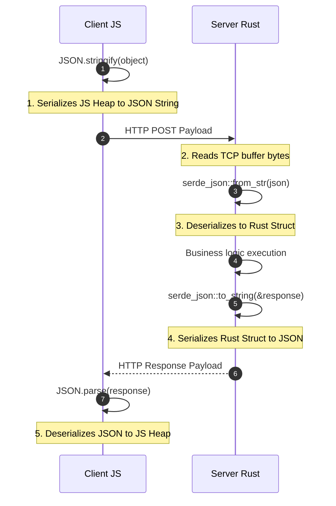

# Chapter VII: The Babel Fish and the Security of Deserialization

> "Serialization is the ultimate translation bridge of computing—dematerializing language-specific memory heaps into flat, universal serial strings before shipping them across the dark ocean fibers."

---

## I. The Granodiorite Slab and the Memory Safety Void

In the month of July, 1799, near the port city of Rashid (Rosetta) in Egypt, French soldiers under the command of Pierre-François Bouchard discovered a large, dark slab of granodiorite stone. 

The stone, dating back to 196 BC, was inscribed with three identical versions of a royal decree issued by King Ptolemy V.

The three scripts were completely different in their cognitive, semantic, and structural systems:
*   The top script was **Ancient Egyptian Hieroglyphs**—the ideographic, mystical language of the gods, rich in pictorial metaphors.
*   The middle script was **Demotic Script**—a cursive, simplified daily script used for trade and administration.
*   The bottom script was **Ancient Greek**—a highly structured, phonetic, alphabetic system used for diplomacy and philosophy.

```text
Hieroglyphs ───[Metaphorical / Pictorial] ────┐
Demotic     ───[Cursive / Administrative] ───┼───> [Rosetta Stone Schema]
Ancient Greek ──[Alphabetic / Legalistic] ────┘
```

The scribes who carved the Rosetta Stone did not try to build a direct, fluid translator for every single word. 

They did not create a complex dictionary map between hieroglyphs and Greek alphabets directly. 

Instead, they used the Greek text as a **flat, standardized reference schema**. 

Because they knew Greek was universally understood by the ruling classes across the Mediterranean, they could use it as a common standard. 

By translating their native, highly complex ideographic concepts into Greek, they preserved their meaning across thousands of years, allowing 19th-century scholars like Jean-François Champollion to decode the entire forgotten universe of ancient Egypt.

This is the **Rosetta Stone Problem** of distributed systems.

Consider a common real-world backend scenario. 

Your frontend is written in **JavaScript**, running inside Google's V8 engine in the browser. 

Your backend is written in **Rust**, compiled to bare-metal machine code running on a server in Virginia. 

These two languages live in completely different universes of type representation and memory layout:
*   In **JavaScript**, a user object lives inside a garbage-collected, highly dynamic heap. 
    It carries a prototype chain, supports dynamic runtime attribute modification, and represents every number as a 64-bit IEEE 754 floating-point value.
*   In **Rust**, a user struct is a stack-allocated block of memory with strict compile-time ownership, zero runtime prototypes, statically defined fields, and distinct, sized integer types like `u32`, `i64`, and `f64`.

If JavaScript tried to hand its raw memory pointer directly to Rust, the result would be a catastrophic disaster. 

Rust has no concept of a V8 prototype. 

If Rust tried to parse JavaScript's raw memory address, it would read it as unaligned garbage, violate memory safety, and trigger a **segmentation fault**, crashing the server.

To bridge this language barrier, we do not write custom converters for every possible language pair (which would require $O(N^2)$ translators for $N$ languages). 

Instead, we agree on a **common reference standard**—a flat, language-agnostic serial string.

We call the process of converting a dynamic, language-specific in-memory structure into this flat, transmittable format **Serialization**. 

We call the reverse process—reconstructing a private, language-specific memory structure from the flat format—**Deserialization**.

Together, they act as the computational **Babel Fish**—the organic translator dropped into the ear canal, allowing JavaScript heaps, Rust stacks, and Python dictionaries to speak to one another across the stateless boundaries of the web.

---

## II. The Quest for Universal Interchange: A Brief History

How did we arrive at this neutral territory? 

The history of data interchange is a thirty-year march from rigid binary mainframes to verbose enterprise text, and finally to modern binary scale.



### 1. The Fixed-Width Columns of the Mainframe Era (1960s–1970s)

In the early days of computing, systems were homogeneous. 

If you ran an IBM mainframe, your COBOL programs wrote data in **EBCDIC** encoding using **fixed-width text records**. 

A record was a flat card of 80 characters: the first 10 characters were the first name, the next 10 were the last name, and the next 5 were the age.

```text
[Harshit   ][Neginhal  ][021] ───> 80-character fixed punch card format
```

This was extremely fast to parse, but it was incredibly brittle. 

If a name exceeded 10 characters, it was silently truncated. 

If you wanted to add a middle name, you had to redefine the entire column database schema, breaking every program that read the files.

### 2. The Verbose Enterprise of XML (1998–2000s)

To make data **self-describing**, the W3C published the **XML (eXtensible Markup Language)** recommendation in 1998. 

XML wrapped every data field in descriptive tags:

```xml
<user>
  <name>Harshit</name>
  <age>21</age>
</user>
```

XML was rigorous. 

It supported **XSD Schemas** for strict type validation, namespaces to prevent naming collisions, and XSLT for dynamic document transformations. 

But it was **exhaustingly verbose**. 

In XML, the structural tags `<name>` and `</name>` often consumed more bytes than the actual data payload. 

Yet, XML powered the first generation of global web services under the **SOAP (Simple Object Access Protocol)** and XML-RPC umbrellas.

### 3. Douglas Crockford’s Minimalist Discovery: JSON (2001)

In 2001, Douglas Crockford began promoting a minimalist subset of JavaScript's object literal syntax as a language-independent data standard: **JSON (JavaScript Object Notation)**.

Crockford did not invent JSON. 

He discovered it. 

He realized that JavaScript's native syntax for objects, arrays, and primitives was incredibly clean, easy for humans to read, and remarkably fast to parse.

JSON discarded the verbosity of XML: no namespaces, no custom attributes, no processing instructions—just keys, values, and array brackets. 

A JSON payload was typically **30% to 50% smaller than its XML equivalent**. 

As AJAX-driven interactive web applications (like Gmail in 2004 and Google Maps in 2005) exploded, JSON rapidly displaced XML, becoming the absolute, undisputed king of the public web.

### 4. The Binary Scale: Protobuf and MessagePack (2008–Present)

As tech giants grew to massive scale, text-based JSON encountered its own bottlenecks. 

At Google, microservices processed billions of requests per second. 

Converting integers to text strings, repeating the keys `"name"` and `"age"` in every single packet, and parsing text streams consumed massive CPU and network bandwidth.

In 2008, Google open-sourced **Protocol Buffers (Protobuf)**. 

Protobuf is a **binary serialization format** that requires a shared schema (`.proto` file). 

Because both the client and server know the schema, the keys do not need to be sent in the packet. 

The name field is replaced with a single integer tag (`1`), and numbers are packed in their compact binary representation.

Today, we enjoy a layered system: **JSON** dominates public web APIs where readability is key, while **Protobuf** and **gRPC** govern high-performance internal microservices.

---

## III. The Solution: The Two-Way Bridge

Let us trace the exact lifecycle of serialization and deserialization across our systems:



### 1. In JavaScript: `JSON.stringify()`

When we call `JSON.stringify(user)` in JavaScript, the V8 engine inspects the object and compiles it into a clean, flat string. 

During this process, everything language-specific is systematically **stripped away**:
*   **Prototypes are dropped**: The string does not contain any reference to JavaScript's prototype chains or methods.
*   **Functions are ignored**: If the object contains a method `sayHello: () => console.log('hello')`, it is silently discarded.
*   **Undefined is removed**: Keys with `undefined` values are pruned.
*   **Map and Set objects are flattened**: They become empty objects `{}` unless converted manually.

What remains is a pure, language-agnostic text representation of state:
`'{"name":"Harshit","age":21}'`

### 2. In Rust: `serde`

When the Rust server receives this string, the **Serde (Serialize/Deserialize)** library takes over. 

Because Rust is statically typed, Serde reads the JSON string and **maps the values directly onto a compiler-verified struct**:

```rust
#[derive(Deserialize)]
struct User {
    name: String,
    age: u32,
}
```

Serde validates that the JSON matches the schema. 

If the JSON is malformed, it throws a parsing error before the bad data can infect your database logic.

---

## IV. The Trojan Horse: Insecure Deserialization

Because deserialization allows untrusted network inputs to reconstruct objects in your application’s memory heap, it is one of the most critical security vectors in all of software engineering.

Let us inspect the two primary classes of deserialization threats:

### 1. The Remote Code Execution (RCE) Gadget Chain

In languages like **Java** and **Python**, native serialization libraries do not just transmit data—they attempt to **reconstruct the behavior of the object**.

In Java, the native `ObjectInputStream.readObject()` method was designed to let programs serialize complex class structures, including their methods. 

When you deserialize an untrusted Java object, the runtime automatically executes internal hooks (like `readObject()` or `hashCode()`) to restore the object’s internal state.

Attackers realized they could exploit this to trigger **Gadget Chains**. 

A gadget chain is a sequence of class method calls already present in the server's codebase (often inside library dependencies like Apache Commons) that, when executed sequentially during deserialization, ultimately invoke system terminal commands:

```text
Untrusted Bytes ───> [ObjectInputStream] ───> readObject() ───> TransformedMap.decorate() ───> InvokerTransformer.transform() ───> Runtime.exec("rm -rf /")
```

This is exactly how the catastrophic **2017 Equifax Breach** occurred, exposing the personal financial data of 147 million people. 

The attackers exploited an insecure deserialization vulnerability in the Apache Struts framework to gain shell access to the corporate network.

> [!CAUTION]
> **Never deserialize untrusted data using native Java serialization or Python's `pickle` library.** Both allow arbitrary object graph reconstruction and carry a near-100% guarantee of Remote Code Execution (RCE) vulnerabilities if exposed to the public internet. Use strict, stateless data formats like JSON or Protobuf instead.

### 2. The JavaScript Prototype Pollution

In JavaScript, we do not have class-based RCE gadget chains, but we have **Prototype Pollution**.

Because JavaScript is prototype-based, every object inherits properties from `Object.prototype`. 

If a developer writes a naive merge function to copy properties from a deserialized JSON string into an existing object:

```javascript
// A vulnerable recursive merge function
function merge(target, source) {
  for (let key in source) {
    if (typeof target[key] === 'object' && typeof source[key] === 'object') {
      merge(target[key], source[key]);
    } else {
      target[key] = source[key];
    }
  }
}
```

An attacker can send a malicious JSON payload containing the special keys `__proto__` or `constructor`:

```json
{
  "__proto__": {
    "isAdmin": true
  }
}
```

When the server deserializes this JSON and runs the merge function, it traverses the `__proto__` pointer and **injects the `isAdmin` property directly into the global `Object.prototype`**.

From that microsecond on, **every single object created in the application inherits `isAdmin: true`**. 

A regular user visiting the site will bypass authorization checks because `user.isAdmin` evaluates to `true` globally, triggering complete system compromise.

To prevent this, you must **always validate deserialized JSON payloads using strict runtime schemas** (like Zod) and freeze or sanitize keys containing prototype paths (`__proto__`, `constructor`, `prototype`).

---

## V. Key Takeaways

We have now mapped the complete, elegant grammar of the web. Let us review the key parameters of the protocol layers:

| Layer / Model | Transport Protocol | Latency Profile | Core Benefit | The Bottleneck |
| :--- | :--- | :--- | :--- | :--- |
| **GET** | TCP (RFC 793) | ~50 - 150ms | Keep-Alive persistent connection recycling | Head-of-Line Blocking at application layer |
| **HTTP/2** | TCP (RFC 793) | ~30 - 80ms | Frame Multiplexing on a single socket | Head-of-Line Blocking at transport layer |
| **HTTP/3** | QUIC over UDP | ~10 - 50ms | Stream Independence and integrated TLS 1.3 | High CPU packet validation overhead |
| **Serverless** | On-Demand Routing | ~100 - 600ms | Automatic, infinite scaling with zero idle cost | Cold Starts and Stateless connection pool limits |

Understanding HTTP methods and CORS boundaries is not merely a tool for loading web pages; it is the ultimate administrative framework of global distributed systems. In the next chapter, we will inspect the seven primary verbs of this language—the HTTP methods—and trace the precise boundaries that separate safe, idempotent, and mutable operations.

---

[Back to Card Catalog Index →](./index.html)
