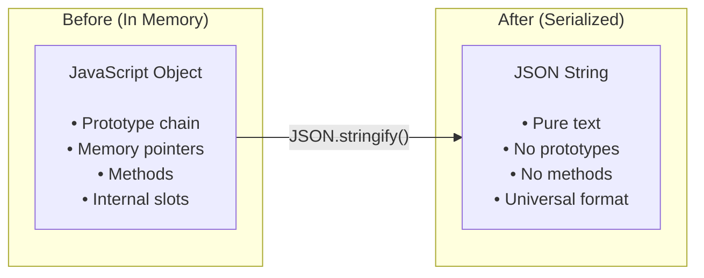
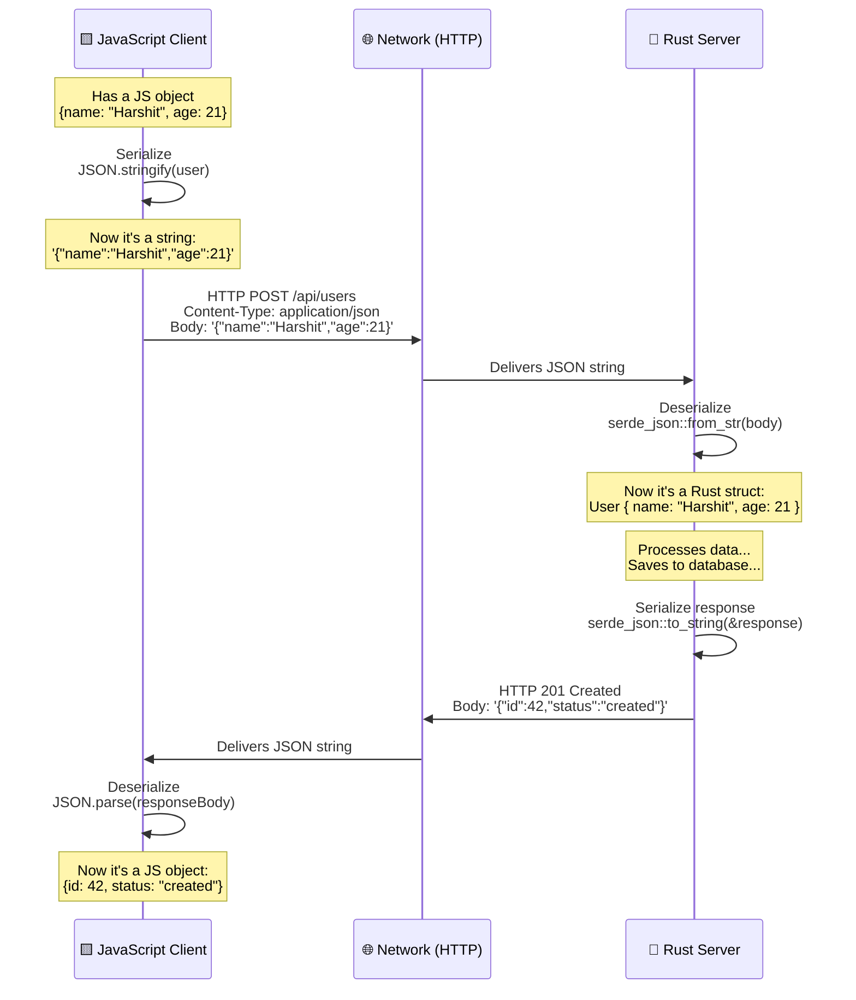
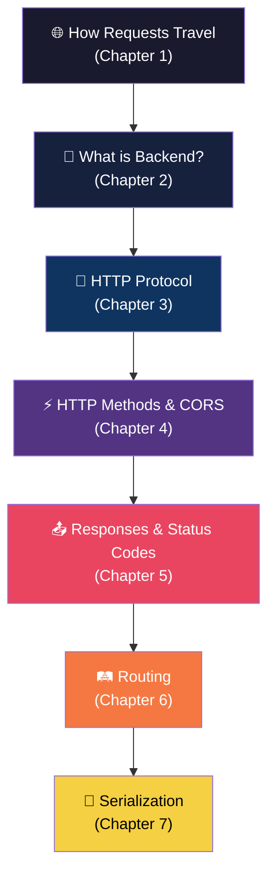

# 🔄 Chapter 7: Serialization & Deserialization

> *"How do a JavaScript client and a Rust server — two completely different languages — actually communicate with each other?"*

---

## 📌 The Problem: Language Barrier

Consider a common real-world scenario: your frontend is written in JavaScript and your backend is written in Rust. These two languages have completely different type systems, memory models, and internal data representations. A JavaScript object lives in V8's garbage-collected heap memory, carries a prototype chain, supports dynamic property addition, and represents numbers as 64-bit floating-point values. A Rust struct is a stack-allocated value with strict ownership semantics, statically defined fields, and distinct integer types like `u32`, `i64`, and `f64`. You cannot simply take the raw memory bytes of a JavaScript object and send them to a Rust program — the Rust compiler would have no idea how to interpret that memory layout, and the data would be meaningless garbage.

```
JavaScript Object:                    Rust Struct:
──────────────────                    ────────────
const user = {                        struct User {
  name: "Harshit",                        name: String,
  age: 21,                                age: u32,
  hobbies: ["coding", "music"]            hobbies: Vec<String>,
};                                    }
```

This incompatibility isn't limited to JavaScript and Rust. Every programming language has its own internal representation of data: Python uses dictionaries with reference counting, Java uses objects on a garbage-collected heap with a class hierarchy, Go uses structs with a different memory layout than Rust's. If every language pair needed a custom translation mechanism, the number of translators would grow quadratically with the number of languages — an untenable situation. What we need instead is a **common standard** — a lingua franca that every language can translate to and from.

---

## 🏛️ A Brief History: The Quest for Universal Data Interchange

The problem of exchanging data between different systems is as old as computing itself, and the solutions have evolved through several distinct eras, each reflecting the technology and priorities of its time.

In the mainframe era of the 1960s and 1970s, data interchange was mostly handled through **fixed-width text records** and **binary file formats** that were tightly coupled to specific hardware architectures. A COBOL program on an IBM mainframe would write data in EBCDIC encoding with fixed column positions, and any system that wanted to read it had to understand that exact format. This worked within homogeneous environments but broke down as soon as different systems needed to communicate.

The 1980s saw the emergence of **SGML (Standard Generalized Markup Language)**, an ambitious attempt to create a universal framework for defining markup languages. SGML was powerful but extraordinarily complex — its specification ran to hundreds of pages, and implementing a fully compliant parser was a major undertaking. Very few systems outside of large enterprises and government agencies ever adopted it. Despite its complexity, SGML planted an important seed: the idea that data could be **self-describing**, with tags that explained what each piece of data meant.

In 1996, a group led by **Jon Bosak** at Sun Microsystems began developing **XML (eXtensible Markup Language)**, which was essentially a simplified subset of SGML designed for the web. XML was published as a W3C Recommendation in **1998** and quickly became the dominant data interchange format for the enterprise software world. XML's great strength was its rigour: it supported schemas (XSD) for strict validation, namespaces for avoiding naming conflicts, and XSLT for transforming documents. Its great weakness was its verbosity — a simple key-value pair like a user's name required an opening tag, the value, and a closing tag (`<name>Harshit</name>`), making XML documents dramatically larger than the data they contained. Despite this, XML powered the entire first generation of web services (SOAP, WSDL, XML-RPC) and remained the dominant format for data interchange well into the 2000s.

The turning point came in **2001**, when **Douglas Crockford** began promoting a lightweight data format based on JavaScript's object literal syntax. He called it **JSON (JavaScript Object Notation)** and registered the domain json.org. Crockford didn't invent a new syntax — he simply formalized a subset of JavaScript's existing object notation as a language-independent data format. JSON was dramatically simpler than XML: no schemas, no namespaces, no processing instructions, no CDATA sections — just objects, arrays, strings, numbers, booleans, and null. A JSON document was typically 30–50% smaller than the equivalent XML, was far easier to read and write, and could be parsed natively by JavaScript with a single function call (`JSON.parse()`). As AJAX-driven web applications exploded in the mid-2000s (Gmail launched in 2004, Google Maps in 2005), JSON rapidly displaced XML as the format of choice for web APIs. By the early 2010s, JSON had become the de facto standard for virtually all web API communication.

Meanwhile, as systems grew to massive scale, companies like Google encountered the limits of text-based formats. Even JSON was too verbose and too slow to parse for internal communication between thousands of microservices processing billions of messages per day. In **2008**, Google open-sourced **Protocol Buffers (Protobuf)**, a binary serialization format that required a pre-defined schema (a `.proto` file) but achieved dramatically smaller payload sizes (3–10x smaller than JSON) and dramatically faster serialization/deserialization speeds. Protobuf powered Google's internal systems and became the foundation for **gRPC**, Google's high-performance RPC framework. Other binary formats followed: **MessagePack** (2008) offered a "binary JSON" that was simpler than Protobuf (no schema required) but still smaller and faster than text-based JSON. **Apache Avro** (2009) and **Apache Thrift** (2007, originally from Facebook) offered their own approaches to efficient binary serialization.

Today, the data interchange landscape is settled into clear tiers: **JSON** dominates web APIs and public-facing interfaces; **Protobuf** dominates high-performance internal microservice communication; and **XML** persists in legacy enterprise systems, government data exchanges, and specific domains like healthcare (HL7/FHIR) and finance (FpML). YAML is widely used for configuration files but rarely for API communication.

---

## 💡 The Solution: Serialization and Deserialization

The common thread across all these formats is a two-step process that allows any programming language to communicate with any other: **serialization** (converting an in-memory data structure into a transmittable format) and **deserialization** (converting a received format back into an in-memory data structure). Together, they form the bridge that lets a JavaScript client talk to a Rust server, a Python script talk to a Go microservice, or a Java application talk to a C# service — all without either side needing to know anything about the other's internal memory layout.

---

## 🔄 What is Serialization?

**Serialization** is the process of converting an in-memory data structure — an object, struct, class instance, dictionary, or any language-specific representation of data — into a standardized format that can be transmitted over a network, written to a file, or stored in a database. The key insight is that serialization strips away everything language-specific (prototype chains, memory pointers, methods, ownership semantics) and preserves only the **data values and their structure**.

```
In-Memory Object  ──── Serialization ────→  Transmittable Format
(language-specific)                          (language-agnostic)
```

In JavaScript, serialization is performed by `JSON.stringify()`, which takes a JavaScript object and produces a JSON string. The resulting string contains only the data — the object's key-value pairs, arrays, nested objects, strings, numbers, booleans, and nulls. Everything else is lost: methods and functions are silently dropped, the prototype chain is ignored, `undefined` values are removed, `Date` objects are converted to ISO 8601 strings, `Map` and `Set` objects become empty objects, and circular references throw an error. This loss of information is not a bug — it's the entire point. The serialized format needs to be language-agnostic, and language-specific features like JavaScript's prototype chain or Rust's ownership semantics have no meaning outside their respective languages.

```javascript
// In-memory JavaScript object
const user = {
    name: "Harshit",
    age: 21,
    hobbies: ["coding", "music"]
};

// Serialization: Object → JSON string
const jsonString = JSON.stringify(user);

console.log(jsonString);
// '{"name":"Harshit","age":21,"hobbies":["coding","music"]}'

console.log(typeof jsonString);
// "string" — now it's just a string of characters that can be sent over HTTP!
```



---

## 🔄 What is Deserialization?

**Deserialization** is the reverse process — converting a received format (like a JSON string arriving in an HTTP response body) back into an in-memory data structure that the receiving language can work with natively. The receiving language reads the standardized format, maps the data values to its own native types, and constructs a language-specific object, struct, or dictionary.

```
Transmittable Format  ──── Deserialization ────→  In-Memory Object
(language-agnostic)                                (language-specific)
```

The beauty of this system is that the deserializing language doesn't need to know or care about what language produced the JSON. A Rust server receiving `{"name":"Harshit","age":21}` doesn't know whether it was serialized by JavaScript, Python, Go, or hand-typed by a developer. It simply reads the JSON, maps `"name"` to a `String` field, maps `"age"` to a `u32` field, and constructs a native Rust struct. The JSON format acts as the neutral territory where both languages can meet.

```rust
use serde::{Deserialize};

// Define the struct that matches the JSON shape
#[derive(Deserialize)]
struct User {
    name: String,
    age: u32,
    hobbies: Vec<String>,
}

// Deserialization: JSON string → Rust struct
let json_str = r#"{"name":"Harshit","age":21,"hobbies":["coding","music"]}"#;
let user: User = serde_json::from_str(json_str).unwrap();

println!("{}", user.name);    // "Harshit"
println!("{}", user.age);     // 21
println!("{:?}", user.hobbies); // ["coding", "music"]
```

In Rust, the `serde` library (short for **ser**ialize/**de**serialize) is the standard tool for this work. The `#[derive(Deserialize)]` attribute tells the compiler to automatically generate deserialization code for the struct, and `serde_json::from_str()` parses the JSON string and populates the struct fields. Every major programming language has equivalent libraries: Python has `json.loads()`, Go has `encoding/json`, Java has Jackson and Gson, C# has System.Text.Json.

---

## 🔄 The Complete Flow

When a JavaScript frontend sends data to a Rust backend and receives a response, serialization and deserialization happen at every boundary crossing. The frontend serializes the JavaScript object into a JSON string (using `JSON.stringify()`), sends it as the body of an HTTP POST request, and the backend deserializes the JSON string into a Rust struct (using `serde_json::from_str()`). After processing, the backend serializes the response struct into a JSON string (using `serde_json::to_string()`) and sends it back. The frontend then deserializes the JSON response into a JavaScript object (using `JSON.parse()`). Four serialization/deserialization operations happen in a single request-response cycle — two on each side.



---

## 📦 Common Serialization Formats

### 1. JSON (JavaScript Object Notation) — The King 👑

JSON is the **most widely used** serialization format for web APIs today, and its dominance is unlikely to be challenged anytime soon. Its success comes from a rare combination of virtues: it's human-readable (you can glance at a JSON document and understand its structure), it's natively supported in JavaScript (the language of the web), it's supported by virtually every programming language ever created (with built-in libraries or widely used third-party parsers), and it's simple enough that the entire specification fits on a single webpage.

JSON supports six data types: strings (always double-quoted), numbers (integers and floating-point), booleans (`true`/`false`), null, objects (unordered key-value pairs enclosed in curly braces), and arrays (ordered lists enclosed in square brackets). This small set of types is sufficient to represent virtually any data structure, and the simplicity of the type system is a feature, not a limitation — it means every language can map JSON types to its native types without ambiguity.

```json
{
    "name": "Harshit",
    "age": 21,
    "isStudent": true,
    "hobbies": ["coding", "music"],
    "address": {
        "city": "Delhi",
        "country": "India"
    }
}
```

However, JSON does have real limitations. It doesn't support binary data (images, files, audio must be Base64-encoded, inflating their size by ~33%). It doesn't support comments (which makes JSON configuration files annoying to maintain). It doesn't enforce schemas (the server trusts that the client sent correctly shaped data, and must validate it manually). And large numbers can lose precision because JSON numbers are IEEE 754 floating-point values (JavaScript's `Number.MAX_SAFE_INTEGER` is 2^53 - 1, so very large IDs from databases using 64-bit integers may be silently truncated).

| Pros | Cons |
|---|---|
| ✅ Human-readable | ❌ Larger payload size (verbose) |
| ✅ Natively supported in JavaScript | ❌ No support for binary data |
| ✅ Supported by virtually every language | ❌ No comments allowed |
| ✅ Easy to debug | ❌ No schema enforcement |
| ✅ Universal standard | ❌ Numbers can lose precision |

---

### 2. XML (eXtensible Markup Language) — The Veteran

XML was the dominant data interchange format before JSON's rise, and it still powers a significant portion of enterprise and legacy systems. XML emerged from **SGML** (1986) and was published as a W3C Recommendation in **1998**. For nearly a decade, XML was the foundation of web services — the entire SOAP (Simple Object Access Protocol) ecosystem, which dominated enterprise web services in the 2000s, was built entirely on XML. SOAP messages were XML documents, WSDL (Web Services Description Language) service definitions were XML, and XSD schemas for validating message structure were XML.

XML's strength lies in its rigour and self-describing nature. Every piece of data is wrapped in descriptive tags (`<name>Harshit</name>`), schemas (XSD) can enforce strict validation of document structure, namespaces prevent naming conflicts when combining data from multiple sources, and XSLT transformations can convert XML documents between different structures. However, this rigour comes at the cost of extreme verbosity — representing the same data in XML typically requires 2–3x more bytes than JSON, and parsing XML is significantly slower and more complex.

```xml
<user>
    <name>Harshit</name>
    <age>21</age>
    <isStudent>true</isStudent>
    <hobbies>
        <hobby>coding</hobby>
        <hobby>music</hobby>
    </hobbies>
    <address>
        <city>Delhi</city>
        <country>India</country>
    </address>
</user>
```

Today, XML remains dominant in specific domains: healthcare data exchange (HL7/FHIR uses XML and JSON), financial services (FpML), government document standards (UBL, ebXML), RSS feeds, and legacy enterprise systems that were built on SOAP. For new web APIs, however, JSON has almost entirely replaced XML.

| Pros | Cons |
|---|---|
| ✅ Self-describing with tags | ❌ Very verbose (lots of tags) |
| ✅ Schema validation (XSD) | ❌ Harder to parse |
| ✅ Supports namespaces | ❌ Larger payload than JSON |
| ✅ Supports comments | ❌ Less readable than JSON |

---

### 3. Protocol Buffers (Protobuf) — Google's Champion

Protocol Buffers is a **binary serialization format** created by Google and open-sourced in **2008**. It was designed to solve a specific problem that Google faced internally: their systems processed billions of messages per day between thousands of microservices, and even JSON's modest overhead (verbose keys repeated in every message, text-based encoding of numbers) added up to significant bandwidth and CPU costs at that scale.

Protobuf takes a fundamentally different approach from JSON and XML. Instead of being self-describing (where each message carries its own structure), Protobuf requires a **pre-defined schema** written in a `.proto` file. Both the sender and receiver share this schema, which allows the actual messages to be incredibly compact — field names are replaced with small integer tags, data types are encoded in their most efficient binary representation, and there's no structural overhead (no braces, no quotes, no colons, no commas). The result is messages that are 3–10x smaller than JSON and that serialize/deserialize dramatically faster.

```protobuf
// Define the schema in a .proto file
message User {
    string name = 1;
    int32 age = 2;
    bool is_student = 3;
    repeated string hobbies = 4;
    Address address = 5;
}

message Address {
    string city = 1;
    string country = 2;
}
```

Protobuf also provides built-in schema evolution (you can add new fields without breaking existing clients), strong typing (the compiler catches type mismatches at build time rather than at runtime), and automatic code generation (the `protoc` compiler generates serialization/deserialization code in your language of choice). The tradeoff is that Protobuf messages are not human-readable — they're binary blobs that require the schema to interpret, making debugging harder. You can't just curl an endpoint and read the response; you need tooling to decode it.

Protobuf is the foundation of **gRPC**, Google's high-performance RPC framework that's widely used for inter-service communication in microservice architectures. Companies like Netflix, Square, and Lyft use Protobuf/gRPC for internal communication while exposing JSON-based REST APIs for external clients.

| Pros | Cons |
|---|---|
| ✅ Very small payload (3-10x smaller than JSON) | ❌ Not human-readable (binary) |
| ✅ Very fast serialization/deserialization | ❌ Requires schema definition (.proto files) |
| ✅ Strict schema with versioning | ❌ Harder to debug |
| ✅ Used by Google, Netflix, etc. | ❌ Additional tooling needed |

---

### 4. MessagePack — Binary JSON

MessagePack (created in 2008 by Sadayuki Furuhashi) is often described as "binary JSON" — it represents the same data types as JSON (strings, numbers, booleans, null, arrays, maps) but encodes them in a compact binary format instead of text. Unlike Protobuf, MessagePack doesn't require a schema — you can serialize any JSON-like data structure directly, just like you would with `JSON.stringify()`, but the output is binary and significantly smaller.

```
JSON:        {"name":"Harshit","age":21}     → 30 bytes
MessagePack: 82 A4 6E61... (binary)          → 19 bytes (37% smaller)
```

MessagePack is popular in domains where bandwidth is constrained but schema management overhead isn't justified — gaming (where messages need to be small and fast), IoT devices (which have limited bandwidth and processing power), and caching systems (Redis supports MessagePack as a serialization option).

---

### 5. YAML — Human-Friendly

YAML (YAML Ain't Markup Language, a recursive acronym) uses indentation-based syntax to represent data structures in a format that's arguably the most human-readable of all. It was first proposed in **2001** and has become the standard format for configuration files in the DevOps and cloud-native ecosystem — Docker Compose files, Kubernetes manifests, GitHub Actions workflows, and Ansible playbooks are all written in YAML.

```yaml
name: Harshit
age: 21
isStudent: true
hobbies:
  - coding
  - music
address:
  city: Delhi
  country: India
```

YAML is rarely used for API communication because its indentation-based syntax is fragile (a misplaced space can change the meaning of a document), its parser is complex (YAML supports features like anchors, aliases, and multi-document streams that add parsing overhead), and it's significantly slower to parse than JSON. But for configuration files that humans write and read frequently, YAML's readability makes it a strong choice.

---

## 📊 Format Comparison Table

| Feature | JSON | XML | Protobuf | MessagePack | YAML |
|---|---|---|---|---|---|
| **Readability** | ⭐⭐⭐⭐ | ⭐⭐⭐ | ⭐ | ⭐ | ⭐⭐⭐⭐⭐ |
| **Payload Size** | Medium | Large | Very Small | Small | Medium |
| **Parse Speed** | Fast | Slow | Very Fast | Fast | Slow |
| **Schema** | ❌ (optional with JSON Schema) | ✅ (XSD) | ✅ (required) | ❌ | ❌ |
| **Binary Data** | ❌ (Base64 workaround) | ❌ | ✅ | ✅ | ❌ |
| **Web API Use** | 🥇 Dominant | Legacy | gRPC/microservices | Gaming/IoT | Config files |
| **Browser Support** | ✅ Native | ✅ Built-in parser | ❌ Needs library | ❌ Needs library | ❌ Needs library |

---

## 🛡️ Deserialization: Security Concerns

Deserialization is one of the most security-sensitive operations in backend development. When you deserialize data from an external source, you're allowing untrusted input to create objects and populate fields in your application's memory. If this process isn't handled carefully, it can lead to severe vulnerabilities.

The most well-known category is **insecure deserialization**, which has been a recurring source of critical vulnerabilities across many languages and frameworks. In languages like Java and Python, deserializing untrusted data can lead to **remote code execution (RCE)** — an attacker crafts a malicious serialized payload that, when deserialized, triggers the execution of arbitrary code on the server. The infamous **2017 Equifax breach**, which exposed the personal data of 147 million people, was caused in part by a vulnerability in Apache Struts' handling of Java deserialization. Java's `ObjectInputStream.readObject()` method was particularly notorious — deserializing an untrusted Java object could trigger a chain of method calls (known as a "gadget chain") that ultimately executed arbitrary system commands. This class of vulnerability was so prevalent that **OWASP** (the Open Web Application Security Project) included "Insecure Deserialization" as number 8 on their Top 10 Web Application Security Risks.

Even in languages where deserialization doesn't directly execute code, there are still significant risks. **Prototype pollution** in JavaScript occurs when an attacker includes `__proto__` properties in a JSON payload, which can modify the prototype chain of all objects in the application and potentially lead to privilege escalation. **Denial of service** attacks can craft extremely large or deeply nested payloads that exhaust the server's memory or stack space during parsing. And the most common risk of all — **injection attacks** — occurs when deserialized data is used directly in database queries or system commands without validation.

> [!CAUTION]
> **Deserialization is a security-sensitive operation!** When you deserialize data from an untrusted source, you're letting external input create objects in your application.
>
> **Risks include:**
> - **Injection Attacks**: Malicious JSON could contain SQL injection payloads
> - **Prototype Pollution** (JavaScript): Attacker modifies `__proto__` to inject properties
> - **Denial of Service**: Extremely large or deeply nested payloads can crash your server
> - **Remote Code Execution**: In some languages (Java, Python), deserializing untrusted data can execute arbitrary code
>
> **Always validate and sanitize deserialized data!**

```javascript
// ❌ DANGEROUS — never trust raw deserialized data
const user = JSON.parse(requestBody);
db.query(`SELECT * FROM users WHERE name = '${user.name}'`);  // SQL Injection!

// ✅ SAFE — validate and use parameterized queries
const user = JSON.parse(requestBody);
if (typeof user.name !== 'string' || user.name.length > 100) {
    return res.status(400).json({ error: "Invalid name" });
}
db.query('SELECT * FROM users WHERE name = $1', [user.name]);
```

---

## 🔑 Key Takeaways

Serialization and deserialization solve one of the most fundamental problems in distributed computing: enabling programs written in different languages, running on different machines, with incompatible memory layouts, to exchange data seamlessly. The solution is elegant — convert language-specific in-memory data structures into a standardized, language-agnostic format for transmission, then convert them back into native data structures on the receiving end. **JSON** has become the dominant format for web APIs because of its readability, universal support, and native JavaScript integration — a success story driven by the rise of AJAX and the web's shift from XML-based SOAP services to lightweight REST APIs. **Protobuf** fills the niche where JSON's verbosity becomes a performance bottleneck, offering dramatically smaller and faster binary serialization for high-throughput microservice communication. And regardless of which format you use, **always validate deserialized data** before using it — untrusted input is the root cause of most web application vulnerabilities.

---

## 📚 The Complete Backend Foundations Map



---

[← Previous: Routing](./06_Routing.md) | [🏠 Back to Index](./README.md)
