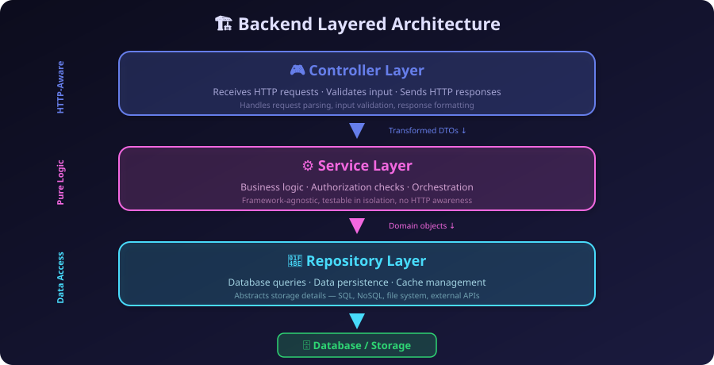
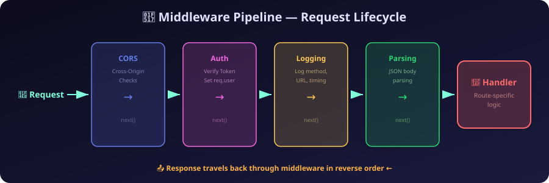

# 🏗️ Chapter 8: Server Architecture & The Request Lifecycle

> *"How does a server actually process a request internally without turning into an unmaintainable mess of intertwined code?"*

---

## 🛤️ The Request Lifecycle: From the Server's Perspective

In earlier chapters, we discussed how a request travels across the internet, bouncing through DNS resolvers, establishing TCP connections, and finally arriving at the server. But what happens once the request actually crosses the threshold of your backend application? The server doesn't simply instantly execute the exact line of code you wrote to handle it. Instead, the request goes through a highly structured, orchestrated lifecycle. Understanding this lifecycle is critical to building robust backend systems, as it dictates where and how you should intercept, validate, and process incoming data.

When raw TCP/HTTP bytes arrive at the server's network interface, the operating system hands them off to your web server (like NGINX) or directly to your application framework (like Express.js, Spring Boot, or Actix). The framework's first job is **parsing**. It reads the raw text stream of the HTTP request, parses the headers, extracts the HTTP method and URL, and constructs a structured `Request` object. Alongside this, it creates a blank `Response` object, which provides the methods you will use to send data back to the client. 

Once these objects are created, the request begins its journey through the application code. It enters the **Middleware Pipeline**, passing through a series of interceptors that can inspect, modify, or reject the request early on (such as parsing JSON bodies or checking authentication). Assuming the request survives the middleware pipeline, the framework's **Router** examines the HTTP method and path to determine which specific function should handle it. The request is then passed to the **Handler**.

The **Handler** (sometimes referred to as the route handler or endpoint function) is the ultimate destination for the request. If middleware acts as the security guards and ushers, the handler is the main event. 

### The Role of the Handler
The handler's core responsibility is to fulfill the specific intent of the client's request. When you write a backend application, the handlers are where you map specific URLs (like `POST /users`) to actual application behavior. 

Its role can be broken down into three distinct phases:
1. **Reception**: It receives the fully parsed and enriched `Request` object (which now contains parsed JSON, verified user IDs from auth middleware, etc.) and the blank `Response` object.
2. **Orchestration**: The handler acts as the conductor. It shouldn't contain massive blocks of complex math or database queries itself. Instead, it extracts the relevant data from the request and orchestrates the heavy lifting by calling the appropriate Service layer functions.
3. **Termination**: Unlike middleware, which passes the baton using `next()`, the handler represents the end of the line. Its final, mandatory responsibility is to construct the HTTP response (setting the correct status code like `201 Created` or `404 Not Found`, and formatting the JSON body) and send it back to the client using methods like `res.send()` or `res.json()`. Once the handler sends the response, the lifecycle of that specific request is officially terminated.

---

## 🧅 The Layered Backend Architecture

In the early days of web development (think early PHP or Perl CGI scripts), developers would often write all their logic in a single, massive handler function. A single file might handle connecting to the database, running a SQL query, validating user input, checking if the user was an admin, processing business rules, and generating the final HTML output. As applications grew in complexity, this approach became a maintenance nightmare. Code could not be reused, testing was virtually impossible without a live database, and changing one part of the system often broke something entirely unrelated.

To solve this, modern backend architectures strictly follow the **Separation of Concerns** principle. The most universally adopted pattern is the **Three-Tier Architecture** (or Layered Architecture), which divides the backend into three distinct vertical layers.

### 1. The Controller Layer (The Bouncer & Translator)
The Controller layer is the outermost layer of your application logic. It sits right behind the router and is the only layer that should ever know anything about HTTP. 

When a request reaches a specific endpoint, the Controller is the first to greet it. Its primary responsibilities are purely related to handling the incoming request and formatting the outgoing response. The Controller extracts the parameters from the URL, reads the query string, and pulls data out of the request body. It then performs structural **validation** to ensure the incoming data is in the correct format.

Crucially, the Controller **does not contain any business logic**. Once it has extracted and validated the data, it calls the Service layer, passing it clean, formatted data structures (often called Data Transfer Objects, or DTOs). 

**Why do we separate the Controller from the Service layer?** The separation is essential because your business logic should not be tethered to HTTP. Imagine you build an e-commerce checkout function inside an HTTP controller. Later, your company decides to implement a background cron job that automatically renews subscriptions using that same checkout logic, or you need to expose that logic via a WebSockets interface or a Command Line Tool. If your checkout logic is tightly coupled to the HTTP `req` and `res` objects, you cannot reuse it in those non-HTTP contexts. By keeping the Controller thin and focused solely on HTTP translation, your core logic remains independent and versatile.

### 2. The Service Layer (The Brain)
The Service layer contains the core **Business Logic** of your application. It should be completely oblivious to the fact that it is running inside a web server. It knows nothing about HTTP methods, status codes, headers, or JSON parsing. 

The Service layer is where the actual "work" of your application happens. If you are building a banking app, the Service layer is where you write the logic to ensure a user cannot transfer more money than they have in their account. It performs complex **Authorization** checks (e.g., "Is this user allowed to edit this specific article?"). It calculates taxes, triggers email notifications, and orchestrates calls to multiple external APIs or different databases.

**Why should it be isolated?** Beyond reusability, isolating the Service layer is critical for **testability**. Because the Service layer consists of pure functions that simply take inputs and return outputs—without needing a mock HTTP server or network requests—you can easily write thousands of unit tests to verify your complex business rules in milliseconds.

### 3. The Repository Layer (The Librarian)
The Repository layer (sometimes called the Data Access Layer or DAL) is strictly responsible for communicating with the database or persistent storage. 

While the Service layer knows *what* needs to be done, the Repository layer knows *how* to store and retrieve the data to make it happen. The Service layer shouldn't know whether you are using PostgreSQL, MongoDB, or saving data to flat files. Instead, the Service layer calls a generic method like `userRepository.findByEmail(email)`. The Repository layer receives this request, translates it into the specific SQL query or ORM (Object-Relational Mapping) command required by your database, executes it, and returns the data as native objects back to the Service layer.

### What Happens After the Controller Gets Data from the Service Layer?
The flow of data is cyclical. The Controller calls the Service layer. The Service layer calls the Repository layer. The Repository fetches data from the database and returns it to the Service layer. The Service layer processes that data, applies business rules, and returns a computed result back to the Controller.

Once the Controller receives the final result from the Service layer, its job is to translate that native result back into the language of the web. It decides the appropriate HTTP status code (e.g., `201 Created` for a successful insertion, `403 Forbidden` if the service rejected the action), formats the data into JSON, XML, or HTML, and uses the `Response` object to send it back to the client.

---

## 🧮 Validations and Transformations

Data entering your system is inherently untrusted. A fundamental rule of backend development is: **Never trust the client**. Validations and transformations act as the defense mechanism to ensure data integrity, prevent crashes, and protect against malicious attacks.

### Where do Validations and Transformations happen?
Validations and transformations occur at multiple boundaries, but they are primarily handled right at the edge of the application, inside the **Controller Layer**, before the data ever reaches the Service layer.

### The Need for Validations and Transformations
Why do we need them? If your database expects an integer for a user's age, and the client sends the string `"twenty"`, the database query will crash. If your application expects an email address, and the user sends a massive 5-megabyte string of malicious SQL code, it could compromise your entire system. Validations ensure that the data conforms to the expected shape, type, and constraints.

### Explain Transformations
**Transformations** (also known as coercion or sanitization) happen alongside validation. Transformation is the process of modifying incoming data to fit the required format before processing it. HTTP transmits everything as text. If a user submits a form where they checked a box, the server might receive the string `"true"`. A transformation step converts the string `"true"` into an actual boolean `true`. Other common transformations include trimming leading and trailing whitespace from passwords, converting email addresses to lowercase to ensure uniqueness, or parsing a string date like `"2024-05-12"` into a native Date object.

### Frontend vs Server-Side Validation
It is crucial to understand the distinct purposes of frontend and server-side validation.
- **Frontend Validation**: This is done in the browser using HTML attributes (like `required` or `type="email"`) and JavaScript. The *only* purpose of frontend validation is **User Experience (UX)**. It provides immediate, helpful feedback to the user without making them wait for a network round trip.
- **Server-Side Validation**: This is done on your backend. The purpose of server-side validation is **Security and Data Integrity**. You can never, ever rely solely on frontend validation because an attacker can easily bypass the browser. They can open a terminal and use `curl`, Postman, or a custom script to send raw HTTP requests directly to your server, completely ignoring any JavaScript checks you wrote. **All validation that actually matters must be implemented on the server.**

---

## 🚦 Middleware: The Unsung Hero

If handlers are the final destination for a request, **Middleware** is the toll booth, security checkpoint, and baggage claim on the road to get there.

### Request, Response, Next in Middleware
Middleware refers to functions that sit in the middle of the request-response cycle. A middleware function inherently has access to three things:
1. The **Request object (`req`)**: To inspect incoming headers, URLs, or body data.
2. The **Response object (`res`)**: To optionally send a response back to the client early.
3. The **`next` function**: A callback function that tells the framework, "I'm done with my job, pass this request to the next middleware in line."

When a middleware function executes, it must either send a response (terminating the cycle) or call `next()`. If it does neither, the request will hang in limbo forever, eventually timing out.

### Why do we even need Middleware? Can't we do the same in Handlers?
Technically, yes. You could parse JSON bodies, check authentication tokens, log the request, and check CORS headers inside *every single handler function*. However, this violently violates the **DRY (Don't Repeat Yourself)** principle. 

Middleware exists to extract **cross-cutting concerns**—tasks that apply to many or all routes—into centralized, reusable, modular functions. By handling these repetitive tasks globally in middleware, you keep your handlers clean, concise, and focused solely on their specific endpoint logic.

### Handler vs. Middleware: The Difference and When to Choose
- **Middleware** intercepts the request to perform general tasks (auth, logging, parsing) and usually passes control forward by calling `next()`. You use middleware when you want to apply logic across multiple routes or globally.
- **Handlers** are the final endpoint. They contain the specific logic for that exact route and almost never call `next()`. Instead, they terminate the lifecycle by sending the final response (`res.send()`).

### Common Middleware Implementations

#### 1. Why CORS is Implemented in Middleware
**CORS (Cross-Origin Resource Sharing)** is a browser security feature that prevents a website on one domain from maliciously making requests to an API on a different domain. Browsers enforce this by sending an `OPTIONS` "preflight" request to the server, asking, "Is this domain allowed to talk to you?" 
Because CORS applies to virtually every endpoint on an API, handling it inside individual handlers would be incredibly tedious. By placing CORS in a global middleware at the very top of the pipeline, it can automatically intercept every preflight request and attach the necessary `Access-Control-Allow-Origin` headers before the request even reaches your application logic.

#### 2. Logging and Monitoring
Logging middleware records the HTTP method, URL, timestamp, user agent, and response time of every incoming request. This is critical for analytics, debugging production issues, and monitoring server health. By placing it high in the pipeline, it can track every request seamlessly.

#### 3. Data Parsing
Raw HTTP requests arrive as streams of bytes. If a client sends a JSON payload, your server doesn't inherently understand it as a JavaScript object or Python dictionary. Parsing middleware (like `express.json()` in Node.js) reads the incoming byte stream, parses the JSON string into a native object, and attaches it to `req.body`. 

#### 4. Compression
Servers often need to compress large responses (like heavy JSON payloads or HTML files) using algorithms like Gzip to save bandwidth and speed up load times. Compression middleware intercepts the outgoing response stream, compresses the data on the fly, and modifies the headers, saving you from having to compress data manually in your handlers.

#### 5. Global Error Handling
Things will inevitably go wrong—databases will time out, or null pointer exceptions will occur. A Global Error Handling middleware sits at the very end of the pipeline. If any middleware or handler throws an unexpected error, the framework catches it and forwards it to this specialized middleware. It prevents the server from crashing, logs the error securely, and returns a standardized, user-friendly error response (like a `500 Internal Server Error`) to the client without leaking sensitive stack traces.

### Why Ordering of Middleware is Important
The order in which you define middleware in your code is exactly the order in which they execute. This ordering is critical.
If you place your Logging middleware *after* your Authentication middleware, any requests that fail authentication will be rejected before they ever reach the logger, meaning you will have no record of failed login attempts or potential attacks. 
Similarly, if you place your routing handlers *before* your JSON parsing middleware, the handlers will attempt to read `req.body`, find that it is completely empty or undefined, and crash, because the parser hasn't done its job yet.

### Explain Request Context
Because the `Request` object is passed sequentially through the entire middleware pipeline before reaching the handler, middleware can be used to build **Request Context**. 
Request Context is the practice of decorating the `req` object with useful metadata as it flows down the chain. For example, an Authentication middleware verifies a JWT token, extracts the user's ID, and attaches it to the request as `req.user = { id: 42 }`. A geolocation middleware might look at the IP address and attach `req.country = "US"`. A tracing middleware might generate a unique ID and attach `req.correlationId = "abc-123"`. 
By the time the request finally arrives at the handler, it is a fully enriched object, carrying all the context the handler needs to process the request efficiently without having to redo the work.

---

[Next Chapter → Authentication & Authorization](./09_Authentication_and_Authorization.md)
