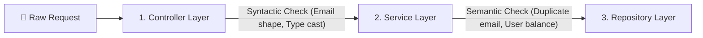
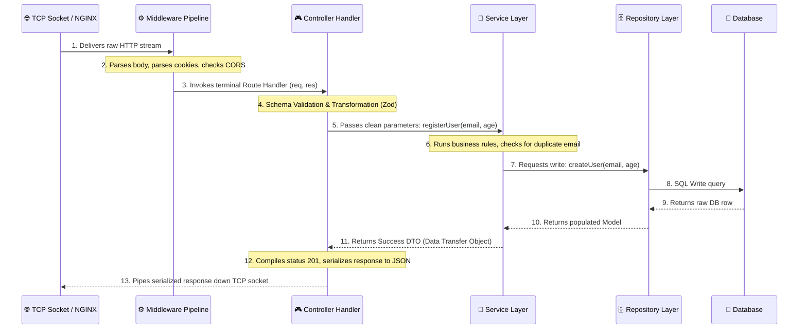
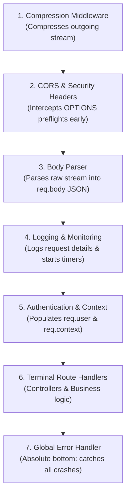

# Chapter VIII: Server-Side Architecture, Request Lifecycle & Middleware

> "Layered architecture is the great administrative partition of a backend—separating the customs border of the controller from the sovereign brain of the service and the stone vault of the repository."

---

## I. The Palace of Versailles and the Three Courts of Execution

In the peak of the 17th century, the Palace of Versailles operated not as a single cavernous hall where the King shouted orders directly to peasants, but as a highly layered, meticulously partitioned bureaucracy.

If a provincial merchant arrived at the gates wishing to petition the crown to build a canal in Lyon, they did not walk straight into the royal bedroom. 

They faced three distinct, highly isolated layers of royal administration:

```text
[Merchant] ───> [First Court: The Swiss Guard] (Controller)
                       │ (Validate passport, check weapons)
                       ▼
                [Second Court: The Royal Council] (Service)
                       │ (Calculate costs, assess tax laws, debate canal utility)
                       ▼
                [Third Court: The Vault of Deeds] (Repository)
                         (Retrieve land grants, commit ledger seals to stone)
```

### 1. The First Court: The Swiss Guard (The Controller)
At the outer gate stood the Swiss Guard. 

They did not know how to build a canal. 

They did not understand the economics of Lyon's silk trade. 

They only checked three things: Does this petitioner carry a valid passport? Are they smuggling weapons? Is their petition formatted on the correct royal parchment? 

If the passport was forged or the parchment was missing, the Guard turned them away instantly. 

This is the **Controller Layer**—the customs border agent of your backend.

### 2. The Second Court: The Royal Council (The Service)
If the Guard validated the petition, the merchant was escorted to the Royal Council. 

The Council consisted of civil engineers, tax assessors, and legal scholars. 

They did not stand at the gates checking passports. 

Instead, they took the validated petition and did the heavy cognitive work: they calculated the expected toll revenue of the canal, checked if the kingdom had sufficient funds, and debated whether the canal would anger the local Duke. 

This is the **Service Layer**—the sovereign business brain of your backend.

### 3. The Third Court: The Vault of Deeds (The Repository)
Once the Council approved the canal, they did not physically dig the vault or write the deed themselves. 

They sent an administrative clerk down to the damp, stone vaults beneath the palace. 

The archivist did not debate economics. 

They simply pulled the heavy iron drawers, retrieved the ancient land deeds of Lyon, stamped the new canal charter with the King’s royal wax seal, and locked it away in a granite drawer. 

This is the **Repository Layer**—the stone vault that communicates directly with the database.

---

## II. The Decoupling of the Brain: Why We Separate Controller and Service

In naive web tutorials, developers combine these three courts into a single, monstrous function:

```javascript
// ❌ THE ANTI-PATTERN: The Monstrous Single Handler
app.post('/api/canal', async (req, res) => {
  // 1. Controller work
  if (!req.body.location || typeof req.body.width !== 'number') {
    return res.status(400).send("Invalid input");
  }
  
  // 2. Service work
  const cost = req.body.width * 1000;
  if (cost > 50000) {
    return res.status(403).send("Budget exceeded");
  }
  
  // 3. Repository work
  const result = await db.query("INSERT INTO canals (loc, cost) VALUES ($1, $2)", [req.body.location, cost]);
  res.status(201).json(result);
});
```

This is a structural pathology. 

It is called **The Blob**. 

Let us dissect why coupling HTTP logic directly to business logic is a recipe for system paralysis:

1.  **The Protocol Lock-In**: 
    If you write your business rules (budget calculation, canal logistics) directly inside the Express.js route handler, your business logic is now **terminally bound to the HTTP protocol**. 
    What if you want to run the budget calculator from a scheduled cron job inside a CLI script? 
    What if you want to migrate your server to WebSockets or a fast gRPC queue? 
    You cannot. 
    Your calculator expects an Express `req` and `res` object, carrying headers, cookies, and HTTP-specific baggage.
2.  **Testability Paralysis**: 
    To unit-test the budget logic in the coupled code, you cannot simply pass numbers to a function. 
    You must construct mock HTTP requests, mock response objects, spin up a virtual network environment, and parse outgoing JSON streams. 
    Your tests become incredibly slow, verbose, and fragile.
3.  **The Law of Isolation**: 
    By decoupling the layers, we isolate concerns:
    *   **The Controller** is strictly concerned with **HTTP protocol details**. 
        It reads route parameters, parses cookies, handles content negotiation, and formats JSON outputs. 
        It has zero awareness of database schemas, SQL dialects, or business equations.
    *   **The Service** is strictly concerned with **pure business calculations**. 
        It receives raw, primitive data (strings, numbers), runs logic, orchestrates workflows, and returns clean data structures. 
        It has zero awareness of HTTP—it does not know if the request arrived via HTTP/1.1, HTTP/3, WebSockets, or a terminal command line.
    *   **The Repository** is strictly concerned with **raw data retrieval and persistence**. 
        It constructs SQL queries, interacts with ORMs, manages database connections, and abstracts the physical database layout from the service layer.

---

## III. Syntactic vs Semantic: The Two Gates of Validation

Before data can be processed, it must be verified. 

We perform validations and transformations at two distinct boundaries using two different criteria:



### 1. Syntactic Validation (The Controller Gate)
Syntactic validation checks the **structure and format** of the incoming data. 

It answers the question: *Is this data formatted correctly?*
*   Is the email a valid string containing an `@` symbol?
*   Is the password at least 8 characters long?
*   Is the age field a positive integer?

Because syntactic validation is purely structural, it requires no database queries or network lookups. 

We run it at the **Controller Layer** using schema libraries like **Zod** or **Joi**. 

If the client sends garbage format, the controller rejects the request instantly with a `400 Bad Request`, sparing the service and database layers from wasting computational energy.

### 2. Semantic Validation (The Service Gate)
Semantic validation checks the **meaning and business validity** of the data. 

It answers the question: *Does this formatted data make sense in the context of our current system state?*
*   The email is formatted correctly, but does another user already own this email in our database?
*   The transaction amount is a positive number, but does the user actually have enough cash in their account balance to execute it?

Because semantic validation requires inspecting the state of the database or checking business invariants, it must live inside the **Service Layer**.

### 3. Transformations: Parsing and Casting
Data arriving over network sockets is frequently flat text. 

A route parameter `/api/users/:id` captures the ID as the string `"42"`. 

Before your database can query it, we must execute a **Transformation**—casting the string `"42"` into the integer `42`.

Transformations also sanitize data:
*   Trimming whitespace from usernames (`" harshit "` to `"harshit"`).
*   Converting emails to lowercase to prevent duplicate record bugs.
*   Stripping internal fields (like `isAdmin: true` submitted by malicious clients).

These transformations are performed at the **Controller Layer** during the initial schema validation phase, ensuring that the service layer receives clean, perfectly cast, and typed data structures.

### 4. Frontend vs. Server-Side Validation: The Trust Boundary
A common amateur mistake is assuming that because you wrote beautiful validation logic in React or Vue, your backend is secure. 

**Frontend validation is NOT a security gate.** 

It is merely a user experience (UX) convenience, saving the user from waiting for a network round-trip to discover they misspelled their password.

Any hacker can bypass your React frontend completely. 

They can open their terminal and run:

```bash
curl -X POST -H "Content-Type: application/json" -d '{"email":"junk"}' https://api.yoursite.com/register
```

If your backend does not perform strict server-side validation, the raw junk will slide straight into your database, corrupting your state or triggering system crashes. 

**Rule of the Backend:** *Never trust the client. Validate everything, everywhere, at the server gate.*

---

## IV. The Server-Side Request Lifecycle: Step-by-Step

Let us trace the complete physical journey of a request once it lands on the server socket:



1.  **The TCP Gateway**: 
    The raw TCP packet lands on the server port, managed by NGINX or Node.js. 
    The stream is parsed into the initial JavaScript Request (`req`) and Response (`res`) objects.
2.  **The Middleware gauntlet**: 
    The request flows sequentially through the registered middleware stack (parsing bodies, validating CORS headers, verifying auth tokens).
3.  **The Controller Handler**: 
    The router maps the path to the specific controller function. 
    The controller runs Zod schema validation. 
    If successful, it extracts parameter strings, casts them to system types, and invokes the service layer.
4.  **The Service execution**: 
    The service isolates the logical flow. 
    It checks business rules and calls the repository layer.
5.  **The Repository commit**: 
    The repository translates the request into an active SQL query, executes it against the database, maps the database rows back to clean system objects, and returns them to the service.
6.  **The Symmetrical return**: 
    The service returns a clean Success DTO to the controller. 
    The controller assigns the correct HTTP status code (`201 Created`), serializes the data to a JSON string using `JSON.stringify()`, and pipes it down the TCP socket to the client.

---

## V. The Interception Pipeline: Understanding Middleware

### 1. What is Middleware?
In web backends, **Middleware** is a functional pipeline of interception filters that execute sequentially before the request reaches the terminal route handler. 

In frameworks like Express, a middleware is a simple function with a triple-argument signature:

```javascript
function myMiddleware(req, res, next) {
  // 1. Intercept and inspect the request
  // 2. Perform actions or mutate the request object
  // 3. Call next() to pass execution to the next filter
}
```

```text
Incoming Request ───> [Middleware 1] ───next()───> [Middleware 2] ───next()───> [Route Handler]
```

If a middleware does not call `next()`, the pipeline is **short-circuited**. 

The request is terminated, and the execution never reaches your controller. 

This is extremely useful for blocking unauthenticated users or dropping malformed requests early.

### 2. Why Can't We Do This inside the Route Handlers?
Technically, you *could* write your authentication checks, body parsing, and logging logic directly inside every single route handler. 

But this violates the core software engineering tenet of **DRY (Don't Repeat Yourself)**.

If your application has 100 routes, and 80 of them require the user to be logged in, copying and pasting the authentication token verification logic inside 80 separate controllers creates a maintenance nightmare. 

If you discover a bug in your token logic, you must fix it in 80 places.

Middleware allows us to extract common cross-cutting concerns into a single, reusable function and declare it upstream:

```javascript
// Apply authentication to an entire group of routes upstream
app.use('/api/secure', authMiddleware);
```

### 3. Handler vs. Middleware: The Operational Boundary
*   **Middleware** is an **interceptor**. 
    It is designed to run common checks, enrich request metadata (like adding `req.user` after validating a token), or log transaction times. 
    It passes control down the stream using `next()`.
*   **Handlers (Controllers)** are the **terminal leaf** of the routing tree. 
    They are designed to execute the core, targeted business action (like creating a post) and **close the response loop** by sending bytes back to the client (`res.send()` or `res.json()`). 
    A handler never calls `next()`.

---

## VI. The Symmetrical Order: Why Middleware Order Rules All

Because middleware executes sequentially in the exact order they are registered in your application code, **ordering is the absolute law of routing execution**.

Let us examine what occurs when you arrange your middleware stack incorrectly:

```text
❌ THE CRITICAL DISASTER:
1. app.use(authMiddleware);  // Tries to read req.body.token
2. app.use(bodyParser);      // Parses the body stream to populate req.body
```

If a request arrives at the server, the `authMiddleware` executes first. 

It attempts to read the authenticated token from `req.body.token`. 

But because the `bodyParser` middleware has not run yet, `req.body` is `undefined`! 

The server crashes with a `TypeError: Cannot read property 'token' of undefined`, throwing a 500 error for every single request.

### The Correct Middleware Stack Order

To prevent ordering bugs, always structure your middleware stack from top to bottom like a funnel:



1.  **Compression**: Must live at the absolute top, ensuring all outgoing data streams are compressed before traveling down the socket.
2.  **CORS & Security**: Intercepts preflight `OPTIONS` calls early, returning appropriate headers before business logic runs.
3.  **Body Parser**: Reads the raw network bytes and populates the `req.body` object, making data accessible to all subsequent filters.
4.  **Logging**: Captures request paths and starts response timing clocks.
5.  **Authentication & Context**: Validates tokens, fetches the user from the database, and stores the state inside the thread-safe **Request Context** (`req.context`).
6.  **Route Handlers**: Runs your controllers.
7.  **Global Error Handler**: **Must live at the absolute bottom of the stack.** 
    If any controller or database query crashes, the error falls through the routing tree until it hits this catch-all error middleware, preventing raw stack traces from exposing security details and ensuring the client receives a clean, parameterized `500 Internal Server Error`.

---

## VII. Key Takeaways

*   **Layered Architecture** separates the presentation (Controller) from the execution (Service) and persistence (Repository) layers, protecting your business logic from protocol lock-in.
*   **Syntactic validation** (Zod) lives in the Controller, shielding the system from malformed inputs early. **Semantic validation** (DB queries) lives in the Service, enforcing business laws.
*   **Middleware** intercepts requests sequentially. The ordering is highly critical: body parsers must run before auth checks, and the global error handler must sit at the absolute bottom of the registry.
*   **Request Context** acts as the thread-safe storage vehicle that carries parsed user state down the pipeline.

---

[Next Chapter → Chapter IX: The Identity Ledger: Authentication, Authorization & Sessions →](./09_Authentication_and_Authorization.md)
