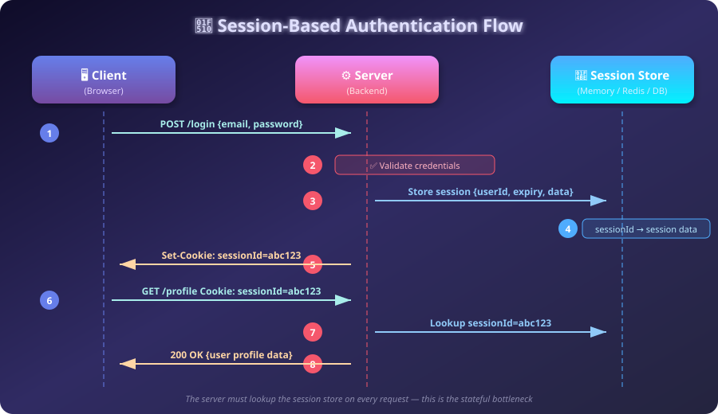
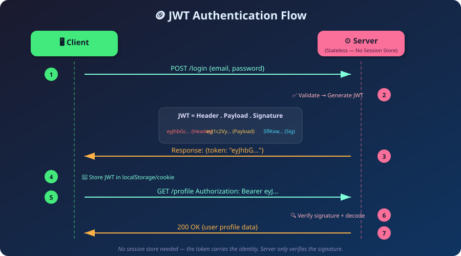
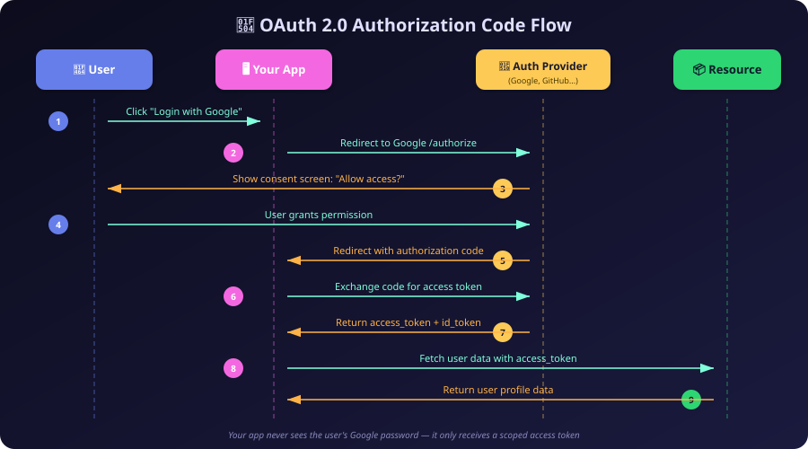

# 🔐 Chapter 9: Authentication & Authorization

> *"Who are you, and what are you allowed to do once you're inside?"*

---

## 🎭 The Core Difference: Authentication vs. Authorization

In the world of backend security, the terms "Authentication" and "Authorization" are frequently conflated, but they represent two entirely distinct, sequential stages of security. Understanding the difference is the first step to building secure systems.

### Authentication (AuthN)
**"Who are you?"**
Authentication is the process of identity verification. It is the act of proving to a system that you are indeed the person (or machine) that you claim to be. When you enter a username and password, swipe a keycard at an office building, use a fingerprint scanner on your phone, or click a "Login with Google" button, you are authenticating. You are providing credentials that only you should possess, thereby asserting your identity to the server.

### Authorization (AuthZ)
**"What are you allowed to do?"**
Authorization happens *strictly after* you have been successfully authenticated. It is the process of determining whether your verified identity has the necessary permissions to perform a specific action or access a specific resource. For example, you might successfully authenticate into your company's HR portal using your employee credentials. However, if you attempt to view the CEO's salary or modify your own vacation balance, the system's authorization checks will block you. You are authenticated (the system knows you are Bob from Accounting), but you are not authorized (Bob from Accounting does not have write access to payroll databases).

---

## 🍪 The Delivery Mechanism: Cookies

Before we can deeply understand how stateful and stateless authentication mechanisms work, we must understand how the browser remembers who we are. By design, the HTTP protocol is inherently stateless. Every single request you make to a server is treated as an entirely isolated event. The server has no memory of the request you made 5 seconds ago.

To build dynamic applications where users remain logged in across page loads, developers needed a way to force the browser to identify itself on every request. This led to the creation of **Cookies**.

A cookie is simply a small piece of text data (usually a key-value pair, like `sessionId=abc123xyz`) that the server sends to the user's browser. When the server wants the browser to remember something, it includes a `Set-Cookie` header in its HTTP response. The browser reads this header and saves the cookie on the user's hard drive. 

The magic of cookies lies in browser automation: once a cookie is set for a specific domain, the browser will automatically, invisibly append a `Cookie` header containing that exact text data to *every single subsequent HTTP request* made to that domain. This automatic transmission is what makes modern web authentication possible without requiring frontend developers to manually write JavaScript to attach tokens to every single image, CSS file, and API request.

---

## 🏛️ Stateful Authentication (Sessions)

In the earliest days of the web, sites were merely static HTML documents—brochures hosted online. But as the web evolved to become dynamic, giving rise to e-commerce shopping carts and private user forums, there arose an absolute need for servers to remember state across multiple interactions. This requirement birthed the concept of **Sessions**, or Stateful Authentication.

### How Session Works

When you use stateful authentication, the server retains a memory (a state) of your logged-in status. The flow works like this:
1. **Login**: The user submits their username and password to the server.
2. **Validation & Creation**: The server validates the credentials against the database. If correct, the server creates a "session object" in its own memory or in a fast, in-memory database like Redis. This session object contains the user's ID, their roles, and an expiration time.
3. **Session ID**: The server generates a random, cryptographically secure, and unique string called a **Session ID** (e.g., `s_984ht834y89hf`).
4. **Delivery**: The server sends this Session ID back to the user's browser via a `Set-Cookie` header.
5. **Subsequent Requests**: On every future request, the browser automatically sends the Session ID cookie back to the server.
6. **Lookup**: The server reads the Session ID from the cookie, looks it up in its session database, finds the corresponding session object, and realizes, "Ah, this request belongs to Harshit."

### Why Sessions Got Outdated
Session-based authentication is incredibly secure and works flawlessly for monolithic applications running on a single server. However, it completely breaks down when applications need to scale horizontally. 

Modern applications handle massive traffic by distributing requests across hundreds of servers using load balancers. If User A logs in, and the load balancer routes that login request to Server 1, Server 1 stores the session in its memory. When User A clicks a link two seconds later, the load balancer might route that next request to Server 2. Server 2 looks at the Session ID, checks its memory, finds nothing, and forces User A to log in again.

To fix this, companies had to introduce a centralized session database (like a massive Redis cluster) that all servers could read from. But at massive scale, forcing every single server to make a database query just to figure out who a user is on *every single request* becomes a massive performance bottleneck and a dangerous single point of failure.

---

## 🪙 Stateless Authentication (JWT)

To solve the severe scaling bottlenecks of stateful sessions, the industry shifted toward **Stateless Authentication** using a technology called **JWT (JSON Web Token)**.

### How Stateless Authentication Works

In a stateless architecture, the server does not remember anything. It does not store session objects in a database. Instead, it places the burden of memory entirely on the client, using cryptography to ensure trust.

1. **Login**: The user submits credentials.
2. **Generation**: The server validates the credentials. Instead of saving a session, the server creates a JSON object containing the user's identity data (e.g., `{ "userId": 42, "role": "admin" }`).
3. **Signing**: The server cryptographically signs this JSON payload using a secret key that only the server knows. This creates the JWT—a long, Base64-encoded string consisting of a Header, the Payload, and the Signature.
4. **Delivery**: The server sends the JWT to the client.
5. **Subsequent Requests**: The client sends the JWT back to the server on subsequent requests (often via the `Authorization: Bearer <token>` header).
6. **Verification**: The server receives the JWT. It looks at the payload, runs it through the cryptographic algorithm using its secret key, and checks if the resulting signature matches the signature attached to the token. If it matches, the server knows the token was created by its own secret key and hasn't been tampered with. **The server immediately knows the user is ID 42 and an admin, without ever querying a database.**

### Advantages of JWT over Sessions
1. **Infinitely Scalable**: Because the server doesn't need to look up a session in a database, verifying a JWT is just a fast mathematical operation. You can spin up 10,000 servers, and they can all verify tokens instantly without needing a shared Redis cluster.
2. **Cross-Domain Portability**: JWTs can be easily passed between different microservices and domains. An authentication service can issue a JWT, and an entirely separate video-processing service can verify it.
3. **Decoupled Clients**: Mobile apps, single-page web apps, and desktop clients can all handle JWTs natively without relying on browser-specific cookie behaviors.

### Disadvantages of JWT
1. **The Revocation Problem**: This is the fatal flaw of pure JWTs. Because the server does not store state, it cannot easily invalidate a token. If a user's laptop is stolen, or a malicious user needs to be instantly banned, you cannot simply "delete" their session. A valid JWT remains valid until its built-in expiration time runs out.
2. **Payload Size**: A JWT contains a JSON payload and a cryptographic signature, making it much larger than a simple 16-character Session ID. Sending a large JWT on every single HTTP request adds measurable bandwidth overhead.

### The Hybrid Approach of JWT
To solve the catastrophic revocation problem while maintaining scalability, modern systems employ a hybrid approach using two tokens: **Short-lived Access Tokens** and **Long-lived Refresh Tokens**.
- The **Access Token** is a stateless JWT. However, it is given a very short lifespan—usually 15 minutes. It is used to access APIs quickly and scalably. If it is stolen, the damage window is extremely small.
- The **Refresh Token** is a stateful token. It is a random string stored securely in a database, valid for weeks or months. 

When the 15-minute Access Token expires, the client silently sends the Refresh Token to a special `/refresh` endpoint. The server checks the database to see if the Refresh Token is still valid (checking state: "Is this user banned? Did they log out?"). If the state is valid, the server issues a brand-new 15-minute Access Token. This hybrid approach perfectly blends the high-performance scalability of stateless JWTs with the security and immediate revocation capabilities of stateful sessions.

---

## 🤖 API Key Authentication

Not all authentication involves human beings typing passwords into forms. A massive portion of internet traffic consists of servers talking to other servers—what we call **Machine-to-Machine (M2M) interaction**.

If your backend application needs to charge a customer's credit card using the Stripe API, your server cannot "log in" to Stripe with an email and password. Instead, you use **API Key Authentication**.
When you create a developer account on Stripe, they generate a long, random, permanent string (e.g., `sk_live_12345abcdef`). You store this key securely in your server's environment variables. Every time your server makes an HTTP request to Stripe, it includes this key, usually in a header like `Authorization: Bearer <API_KEY>`. 

API Keys are incredibly fast, simple to implement, and don't require complex token refresh cycles. They are perfect for server-to-server communication, but they are terrible for human users, as a human cannot memorize a 64-character random string, and embedding an API key in frontend code exposes it to the public.

---

## 🔄 OAuth 2.0 and OpenID Connect

### The Problem of Delegation
In the early 2000s, as the web became highly interconnected, a dangerous pattern emerged. If a new service—let's call it a photo-printing website—wanted to import your photos from Flickr, it would ask you to type your actual Flickr username and password directly into the photo-printing website. 

This was a massive security nightmare. By giving the photo-printing site your password, you were giving it absolute, unrestricted access to your entire Flickr account. It could delete your photos, change your password, or lock you out. We desperately needed a system of **Delegation**—a secure way to grant a third-party application limited access to our resources without ever handing over our master password. This pressing need led directly to the development of OAuth.

### OAuth 2.0 (Authorization)

OAuth 2.0 is an industry-standard protocol for **Authorization**. It allows a user to grant a third-party application limited access to their resources hosted on another server.
When you click "Connect my Google Calendar" in a productivity app, you are redirected to Google's servers. You log in directly on Google. Google then shows you a consent screen: *"This productivity app wants permission to read your calendar events. Allow?"* 

If you click Allow, Google redirects you back to the productivity app, handing the app a scoped **Access Token**. The app can use this token to read your calendar, but it cannot use it to read your Gmail or change your Google password. Crucially, the productivity app never saw your Google password.

### OpenID Connect (Authentication)
OAuth 2.0 was brilliantly designed for authorization (accessing resources like calendars or photos). But developers immediately started hacking it to do authentication (using "Login with Facebook" just to log a user into their own app). OAuth 2.0 wasn't designed to tell an app *who* the user was, only to grant access to APIs.

To standardize this hacked behavior, the industry built **OpenID Connect (OIDC)** as a layer on top of OAuth 2.0. OIDC introduces the concept of an **ID Token** (which is formatted as a JWT). Now, when you use "Login with Google", Google returns an Access Token (for APIs) AND an ID Token. The ID Token contains verified profile information—the user's name, email, and profile picture URL. OpenID Connect securely and standardly answers the authentication question: "Who is this user?"

---

## 🏢 Auth Providers: Why They Are Used More

Building a secure authentication system from scratch is astronomically difficult. A "simple" login system actually requires implementing secure password hashing algorithms (like bcrypt or Argon2), adding cryptographic salts to prevent rainbow table attacks, implementing rate limiting to stop brute force attacks, building secure password reset email flows, handling session invalidation, and building Two-Factor Authentication (2FA) systems. A single mistake in any of these areas can result in a catastrophic data breach.

Because the stakes are so high and the complexity so deep, modern development teams increasingly rely on **Auth Providers**—third-party Identity-as-a-Service platforms like Auth0, Clerk, Firebase Auth, or AWS Cognito. 

These providers act as dedicated identity servers. They handle all the cryptography, database security, 2FA, social logins, and compliance (like GDPR or HIPAA) out of the box. Developers simply redirect users to the Auth Provider's secure login page, and the provider redirects the user back to the application with a verified JWT. This offloads the immense liability of identity management to security experts, allowing developers to focus their time on building their actual application features.

---

## 🛡️ Authorization: Role-Based Access Control (RBAC)

Once a user is authenticated, how does the server know what they are allowed to do? While authentication tells the system *who* the user is, Authorization is the set of rules that dictate what that identity is permitted to access. The industry standard for managing these rules at scale is **Role-Based Access Control (RBAC)**.

In a naive system, you might assign permissions directly to a user: *"Harshit is allowed to edit articles, delete comments, and view analytics."* But when you have 10,000 employees, assigning individual permissions to every person becomes an unmanageable administrative nightmare.

RBAC solves this by introducing **Roles**. Instead of assigning permissions to users, you assign permissions to a Role, and then you assign Users to that Role.
- **Admin Role**: `[read:all, write:all, delete:all, manage:users]`
- **Editor Role**: `[read:articles, write:articles, edit:articles]`
- **Viewer Role**: `[read:articles]`

When a request reaches the server, the authorization middleware extracts the user's role from their JWT or session. It then checks if that specific role contains the required permission for the requested endpoint. If Harshit is an Editor, and he tries to access the `/api/manage-users` endpoint, the RBAC middleware sees he lacks the `manage:users` permission and immediately rejects the request with a `403 Forbidden` status code. RBAC allows companies to change permissions for thousands of users instantly just by updating a single Role definition.

---

## 🎯 Summary: When and Where to Use Which Authentication?

Choosing the right authentication strategy depends entirely on the architecture of your application:

1. **Building a traditional server-rendered website (PHP, Ruby on Rails, Django)?**
   Use **Stateful Sessions with Cookies**. The architecture is monolithic, making state management easy, and HttpOnly cookies provide excellent built-in protection against XSS attacks.
2. **Building a modern Single Page Application (React/Vue/Next.js) with a decoupled backend API?**
   Use the **Hybrid approach (Stateless JWT Access Tokens + Stateful Refresh Tokens)**. This gives your API the performance and scalability of stateless tokens, while retaining the ability to securely revoke sessions when necessary.
3. **Building an API intended for other developers or servers to integrate with?**
   Use **API Keys**. They are permanent, easy to embed in backend code, and require no complex token exchange flows for the integrating developer.
4. **Building an application that requires access to a user's data on another platform (like their Google Calendar or GitHub Repositories)?**
   Use **OAuth 2.0**. It is the absolute standard for secure delegation and API access.
5. **Want users to log in quickly without the friction of creating and remembering a new password?**
   Use **OpenID Connect** via social logins ("Login with Google/Apple"). Users hate creating passwords, and leveraging existing trusted identities drastically increases sign-up conversion rates.

---

[← Previous: Architecture & Middleware](./08_Architecture_and_Middleware.md) | [🏠 Back to Index](./README.md)
