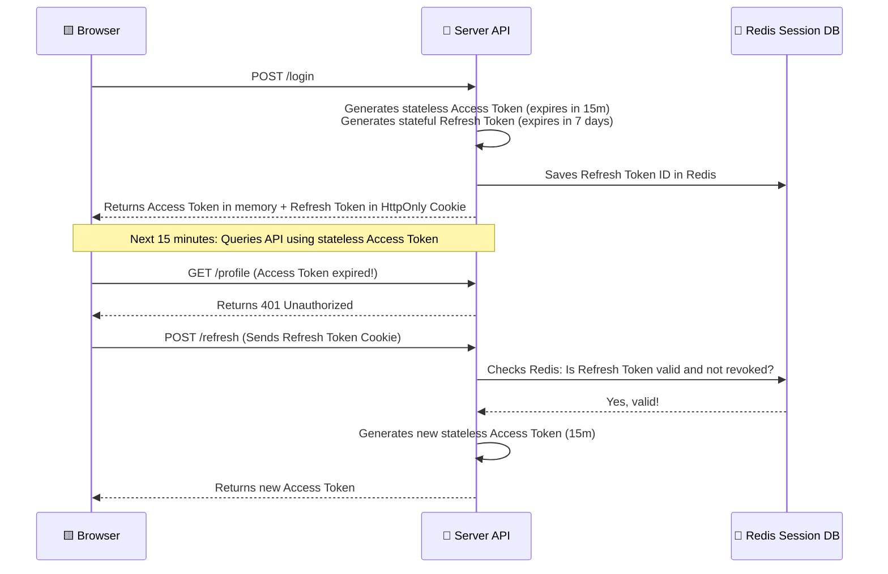

# Chapter IX: The Identity Ledger: Authentication, Authorization & Sessions

> "On the cryptographic distinction between proving identity and asserting privilege, the structural trade-offs of session stores and token chains, and what the tragedy of Shakuntala’s lost signet ring teaches the architect about stateless revocation."

---

## The Dramatic Frame: Shakuntala’s Lost Signet Ring

In the monumental classical dramatic tradition of ancient India, there is a legendary story that has survived across two millennia—the tragedy of Shakuntala and King Dushyanta, immortalized by the poet Kalidasa in the fourth century CE. The King, visiting a serene forest hermitage, falls deeply in love with the maiden Shakuntala and marries her in secret. When the time comes for him to return to his palace in the capital, he is faced with a logical synchronization challenge. How will the palace guards, the high priests, and the royal administration verify her identity when she eventually arrives at the city walls?

Dushyanta does not run a stateful session registry. He does not send a royal courier back to Pataliputra to log her name in the physical marriage ledgers in the palace archives. Instead, he opts for a **Stateless Token-Based Authentication System**. He takes his personal, gold-chased signet ring (*Anguliyaka*), carved with the unique royal crest, and slides it onto Shakuntala’s finger. This ring is a cryptographic masterpiece. It is a stateless, tamper-proof, and universally recognizable token of authenticity. Any guard in the kingdom can inspect the physical carving on the ring and verify the signature without needing to send a runner back to the central palace database.

> "The signet ring is the ancient prototype of the stateless JSON Web Token. The gold band carries the credential, and the intricate engraving represents the cryptographic signature, verified locally without dynamic state retrieval."

But then comes the tragedy. On her journey to the capital, while crossing the rushing waters of the Shachi tirtha river, Shakuntala bends down to pray. The signet ring slips from her finger, falls into the dark currents, and is immediately swallowed by a large fish.

When Shakuntala arrives at the royal court, she stands before Dushyanta. She presents her claims. But because a powerful curse has wiped the King's memory, he has no recollection of her. He searches his private, internal mental database—his active session cache—and finds nothing. He demands proof. He asks for the signet ring.

Shakuntala reaches for her hand, but her finger is bare. The stateless token is gone. Because the King has no stateful registry in the palace, and because the stateless token has been lost, Dushyanta has no way to verify her identity. He rejects her claims, casts her out of the court, and she collapses in tears outside the palace gates.

The ring is eventually recovered. A fisherman catches the fish, cuts it open, finds the signet ring, and presents it to the King. The moment Dushyanta holds the ring, the physical token restores his memory, and he is struck by overwhelming grief at his own administrative failure.

This classical drama is the ultimate mythological metaphor for the structural design trade-offs of **Stateful Sessions** versus **Stateless Tokens**, and the absolute hazard of **Token Revocation Failure**.

When a web server is designed, the architect is constantly faced with Dushyanta's dilemma: Should the system maintain an active, stateful registry of every logged-in user in a central database, checking the ledger on every single incoming request? Or should it hand the user a stateless, cryptographic token—a digital signet ring—that they carry in their browser, allowing the servers to verify their identity without querying the database?

If the stateless token is chosen, the system buys massive, horizontal scalability. But if a user’s token is stolen, or if the administrator needs to log them out immediately because their account was compromised, how can a digital ring swimming in the wild be revoked, when the servers have no central registry to cancel it?

---

## I. Authentication vs. Authorization: The Boundary Line

Before inspecting the engineering implementations, a strict semantic distinction must be established between the two load-bearing pillars of server security: **Authentication** and **Authorization**.

> [!NOTE]
> Think of Authentication as the outer gate keeper verifying the seal on a passport, while Authorization is the chamberlain verifying if the traveler's clearance matches the specific vault they are trying to enter.

Many developers treat these terms as interchangeable synonyms. This is a severe conceptual error that leads to fragile, insecure codebase designs.

### The Access Control Comparison

| Dimension | Authentication (AuthN) | Authorization (AuthZ) |
| :--- | :--- | :--- |
| **Core Question** | "Who are you? Are you truly who you claim to be?" | "What are you allowed to do? Do you have permission?" |
| **Verification Method** | Passwords, Passkeys, TOTP (MFA), JWT signatures, TLS Client Certificates. | Roles (RBAC), attributes (ABAC), ACL matrices, capability tokens. |
| **Execution Phase** | Pre-execution boundary (Edge Middleware / API Gateway). | Mid-execution (Controller/Service domain policy evaluation). |
| **Standard Failure Response** | `401 Unauthorized` (Authentication failed / missing credentials). | `403 Forbidden` (Authenticated, but permission denied). |

Authentication (AuthN) is the act of verifying a claimed identity. When a user logs in by submitting a username and a password, or by presenting a cryptographic signature from a physical YubiKey passkey, they are proving that they are the unique owner of that account. If the check succeeds, the system establishes their identity and attaches a unique identifier (such as user ID 42) to the request context.

Authorization (AuthZ) is the act of evaluating privilege. Once the system knows the user is ID 42, it must decide if they are allowed to execute the specific action they have requested.

If user 42 attempts to delete an invoice, the authorization engine evaluates their permissions: Is user 42 an administrator? Do they own this specific invoice? Has their account been flagged as suspended by the billing department? Even if their authentication is 100% valid (proven by their signet ring), the authorization check will return a `403 Forbidden` response if they do not have the privilege to modify that resource.

Authorization mechanisms generally fall into three structural paradigms:

### 1. Role-Based Access Control (RBAC)

A two-tier delegation system where users are assigned to Roles (e.g., `Editor`, `Administrator`, `Billing`), and those Roles are assigned specific Permissions (e.g., `invoice:delete`, `user:create`).

Mathematically, this can be modeled as sets and relations. Let \( U \) represent the set of Users, \( R \) the set of Roles, and \( P \) the set of Permissions. The user-to-role assignment relation \( \text{UA} \) and the role-to-permission assignment relation \( \text{PA} \) are defined as:

\[ \text{UA} \subseteq U \times R \]
\[ \text{PA} \subseteq R \times P \]

A user \( u \in U \) is authorized to execute a permission \( p \in P \) if and only if there exists a role \( r \in R \) such that the user is assigned that role, and the role is assigned that permission:

\[ \text{Authorized}(u, p) \iff \exists r \in R \text{ such that } (u, r) \in \text{UA} \land (r, p) \in \text{PA} \]

In more complex production environments, roles are not flat but structured as a hierarchical lattice (Hierarchical RBAC). A partial order relation \( \ge \) is established on the set \( R \). For instance, if \( r_{\text{admin}} \ge r_{\text{editor}} \ge r_{\text{viewer}} \), then the role \( r_{\text{admin}} \) automatically inherits all permissions mapped to \( r_{\text{editor}} \) and \( r_{\text{viewer}} \).

While RBAC is extremely simple to implement and fast to query (requiring simple joins or set intersection checks in memory), it suffers from a systemic design flaw known as **Role Explosion**.

Consider a scenario where permissions must be restricted by department, geographic location, and resource ownership. Under a pure RBAC model, the administrator is forced to create distinct roles for every permutation: `Editor_DepartmentA_US`, `Editor_DepartmentB_UK`, `Viewer_DepartmentA_IN`. The cardinality of the role set \( |R| \) explodes exponentially, rendering role mapping tables unmaintainable and highly prone to security misconfigurations.

### 2. Attribute-Based Access Control (ABAC)

To solve the limits of RBAC, Attribute-Based Access Control decouples privileges from static roles, moving authorization to a dynamic, policy-driven evaluation of attributes. ABAC evaluates attributes across four distinct dimensions at the exact millisecond the request is executed:

*   **Subject Attributes**: Attributes describing the user agent initiating the request (e.g., security clearance, department, job title, age, account status, authentication method strength).
*   **Resource Attributes**: Attributes describing the object being accessed (e.g., owner ID, creation date, security classification level, department ownership, file type).
*   **Action Attributes**: Attributes describing the operation being attempted (e.g., HTTP verbs, read, write, delete, approve, export).
*   **Environment Attributes**: Attributes describing the technical and physical context of the request (e.g., client IP address CIDR block, current time of day, geographic region, network route safety, active system threat level).

Let \( S, Re, A, E \) represent the attribute state spaces of the Subject, Resource, Action, and Environment respectively. An ABAC policy \( \Pi \) is a boolean function that maps the combined attribute space to an authorization decision:

\[ \Pi(S, Re, A, E) \to \{\text{Allow}, \text{Deny}\} \]

This evaluation is performed dynamically at runtime, typically using dedicated policy execution engines (such as Open Policy Agent using the Rego declarative policy language, or custom relational database query predicates).

A concrete production example of an ABAC policy written in Rego formats:

```rego
package authz

default allow = false

allow {
    input.action == "edit"
    input.resource.type == "invoice"
    input.subject.department == "Finance"
    input.resource.status == "draft"
    net.cidr_contains("10.0.0.0/8", input.environment.ip_address)
    is_business_hours
}

is_business_hours {
    input.environment.time >= "09:00"
    input.environment.time <= "17:00"
}
```

> [!CAUTION]
> Because ABAC requires parsing multiple dynamic attributes and evaluating nested rules at runtime, its computational complexity is higher than simple RBAC set intersections. Subsecond API latency requirements necessitate caching attribute sets in high-speed, local caches (like Redis or in-process memory maps) and optimizing SQL join paths.

### 3. The Hampi Gate Check: An Indian Systems Analogy

To ground these abstract security concepts, consider the defense and revenue administration of the legendary **Vijayanagara Empire** (fourteenth to seventeenth centuries CE) at its fortified capital, Hampi. The city was protected by seven concentric rings of massive granite walls, with access controlled by heavily guarded gateways (such as Bhima's Gate, Singarada Gate, and the Domed Gate).

To govern movement and collect customs taxes (*shulka*), the imperial administration deployed a sophisticated, physical access control system using stamped pass tokens, historically referred to as **Mudras**.

The guard officers at the gates (*Dvarapalas*) performed both role-based and attribute-based security checks. A permanent, stamped metal *Mudra* (bronze or iron) was issued to military commanders (**Nayakas**) and high-ranking administrative emissaries (**Dutas**). This token established their role (RBAC). The moment a guard verified the cast symbol on the token, the gate was opened, granting access to secure inner zones like the royal enclosure or military barracks based strictly on the role-permission mapping.

However, for merchants (**Vartakas**) and foreign traders importing goods into the city's bazaars, a static role check was insufficient. The *Dvarapalas* executed a dynamic, multi-attribute policy check (ABAC) using ephemeral, stamped clay or palm-leaf tokens:

*   **Subject Attributes**: The merchant’s registered guild membership (Shreni), their country of origin, and their tax exemption certificates.
*   **Resource Attributes**: The specific cargo being transported. War horses imported from Persia or diamonds from the Kollur mines required specific royal permits, whereas local agricultural grain did not.
*   **Action Attributes**: Attempting to sell in the municipal market (requiring license trade validation) vs. passing through to outer trading posts.
*   **Environment Attributes**: The gate of entry (specific goods were restricted to designated gates for tax measurement), the time of day (no merchant entry was permitted after the evening temple drums signaled sunset), and seasonal water levels of the Tungabhadra river irrigation canals (which closed low-lying gates to prevent flooding and smuggling).

The clay pass token served as a stateless, signed credential. The frontier outpost chief (*Gadi-Nayaka*) stamped the clay with their unique signet and painted a daily-changing vegetable-dye mark on the side. This dye mark acted as an ephemeral cryptographic signature, preventing replay attacks using old tokens. The local gatekeeper at the Hampi walls validated the signature and claims on the token locally, without needing to send a physical runner back to the frontier post—completely bypassing the massive latency of animal-based communications.

---

## II. Password Hashing Cryptography: The Cryptographic Vault

Before establishing sessions or issuing tokens, the backend server must securely verify the credentials submitted by a user. Passwords must never be stored in cleartext, nor should they be protected using reversible encryption. They must be stored as one-way, cryptographically secure, collision-resistant hashes.

A fundamental security boundary exists between hashing and encryption:

> "Encryption is a two-way function designed for confidentiality, where data is transformed using an encryption key and recovered using a matching decryption key. Hashing is a one-way mathematical function \( f: \{0, 1\}^* \to \{0, 1\}^d \) designed for integrity and non-reversibility, where it is computationally impossible to reconstruct the input message from the output hash."

### 1. The Fast-Hash Vulnerability

A common beginner mistake is to store passwords using standard cryptographic hash functions such as MD5, SHA-1, or SHA-256. These algorithms were designed for file integrity verification and digital signatures. They are engineered to be extremely fast and computationally cheap, running in microseconds.

This high throughput is catastrophic for password security. A modern graphics processing unit (GPU) cluster or a custom Application-Specific Integrated Circuit (ASIC) can calculate billions of SHA-256 hashes per second. If an attacker steals the user database containing SHA-256 hashes, they can perform a brute-force dictionary attack across trillions of combinations at negligible cost. To defend against GPU/ASIC-accelerated cracking, password hashing algorithms must be **intentionally slow** and **resource-heavy**, scaling computational cost through time, memory, and parallelism parameters.

### 2. Bcrypt: The Blowfish Key Schedule

Invented by Niels Provos and David Mazières in 1999, Bcrypt is based on the Blowfish symmetric block cipher. It utilizes a modified key setup algorithm called **Eksblowfish** (Expensive Key Setup), which forces the setup of the internal S-boxes and subkeys to take a parameterizable number of iterations.

The primary configuration parameter for Bcrypt is the **Work Factor** (or cost), denoted as \( k \). The algorithm executes \( 2^k \) iterations of the Eksblowfish key schedule. Every increment of \( k \) exactly doubles the execution time, allowing system administrators to increase the computational cost of hashing as hardware performance improves over time.

Bcrypt automatically handles salt generation. A cryptographically secure 128-bit salt is generated using a CSPRNG and prepended to the final hash string. This salt ensures that identical passwords generate completely different hashes, neutralizing precomputed **Rainbow Table** attacks.

The output is formatted as a standardized string containing the algorithm version, cost, salt, and hash:

```text
$2b$12$FPtC6qQnU7jFvN0s8D9bZe5e8ZqH6B4K5W7qR8yF8uG9vH0wI1xY2
  └──┘ └┘ └──────────────────────┘└──────────────────────────┘
  Ver Cost        Salt (22 chars)        Hash (31 chars)
```

A critical limitation of Bcrypt is that it strictly truncates input passwords at **72 bytes**. Any characters beyond the 72nd byte are completely ignored by the Eksblowfish key schedule.

> [!WARNING]
> To support long passphrases (which can easily exceed 72 bytes in modern security models) without triggering silent truncation, developers must pre-hash the password using a fast cryptographic hash like SHA-256 before passing it to the Bcrypt library. This maps any arbitrary input length to a uniform 32-byte (256-bit) binary value.

### 3. PBKDF2: Password-Based Key Derivation Function 2

Formalized in RFC 2898, PBKDF2 is a standard key derivation function that applies a pseudorandom function (typically HMAC-SHA256) to the input password along with a salt over a high number of iterations.

Let \( P \) be the password, \( S \) the salt, \( c \) the iteration count, and \( \text{dkLen} \) the desired length of the derived key. The algorithm computes blocks \( T_i \) of the derived key \( \text{DK} \):

\[ \text{DK} = T_1 \parallel T_2 \parallel \dots \parallel T_k \]

Where each block \( T_i \) is computed using the function \( F \):

\[ T_i = F(P, S, c, i) = U_1 \oplus U_2 \oplus \dots \oplus U_c \]

Where the first iteration \( U_1 \) is the hash of the salt concatenated with the block index, and subsequent iterations \( U_j \) hash the output of the previous step:

\[ U_1 = \text{PRF}(P, S \parallel \text{INT}(i)) \]
\[ U_j = \text{PRF}(P, U_{j-1}) \]

While PBKDF2 is widely adopted and cryptographically sound, it has a major architectural weakness: it requires **negligible memory** to compute. It only needs a few bytes of CPU registers to hold the state variables.

Because of this tiny memory footprint, PBKDF2 is highly susceptible to parallelized GPU and ASIC acceleration. A modern high-performance GPU can allocate thousands of parallel execution cores to calculate PBKDF2 hashes simultaneously, since there is no memory bandwidth bottleneck to choke the processor.

### 4. Argon2id: The Memory-Hard Standard

Released as the winner of the Password Hashing Competition in 2015 and formalized in RFC 9106, Argon2 is the absolute gold standard for modern password storage. It is explicitly designed to be **memory-hard**, forcing the hashing process to consume significant, parameterizable blocks of RAM. This memory requirement saturates hardware buses and renders GPU/ASIC acceleration highly inefficient and prohibitively expensive.

Argon2 is implemented in three variants:

*   **Argon2d (Data-Dependent)**: Modifies memory access patterns based on the password input. This offers maximum resistance against GPU cracking attacks, but it introduces a vulnerability to side-channel cache timing attacks (since an attacker with local OS privileges can monitor CPU cache timing to infer memory access offsets).
*   **Argon2i (Data-Independent)**: Uses password-independent memory access sequences. This is slower than Argon2d but completely immune to cache timing side-channel attacks, making it suitable for key derivation.
*   **Argon2id (Hybrid)**: Employs a hybrid approach. It uses data-independent memory access for the first pass over memory (protecting against cache timing attacks) and data-dependent access for subsequent passes (maximizing GPU/ASIC resistance). It is the recommended standard for password storage.

Argon2id's work factor is controlled by three independent parameters:

| Parameter | Description | Production Value Range | Attack Vector Defense |
| :--- | :--- | :--- | :--- |
| **Memory (\( m \))** | Memory block size in Kibibytes (KiB). | \( 65536 \text{ KiB} \) (64MB) to \( 262144 \text{ KiB} \) (256MB). | Fills GPU cache, forcing slow off-chip RAM lookups. |
| **Time (\( t \))** | Number of sequential passes over the memory array. | \( 1 \) to \( 3 \) passes. | Increases computation duration, raising GPU cost. |
| **Parallelism (\( p \))** | Number of parallel execution threads. | \( 2 \) to \( 8 \) threads. | Maps execution to available multi-core server hardware. |

The memory hardness of Argon2id is achieved by allocating an array of \( B \) blocks, where each block is exactly 1024 bytes. The array is filled sequentially:

\[ B[i] = G\Big(B[i-1], B[j]\Big) \]

Where \( G \) is a compression function based on the Blake2b cryptographic hash, and \( B[j] \) is a previously computed block selected either data-independently (in the first pass) or data-dependently (in subsequent passes). An attacker cannot compute \( B[i] \) without holding the entire matrix of blocks in physical RAM, creating an insurmountable memory-bandwidth bottleneck for mass-parallel cracking rigs.

### 5. Hashing as a Denial-of-Service Vector

While high password-hashing parameters protect passwords at rest, they introduce a high-risk system vulnerability: **Authentication Endpoint Exhaustion**.

Suppose the login endpoint `/api/login` utilizes Argon2id configured with a memory parameter \( m = 64\text{MB} \) and time parameter \( t = 3 \), consuming \( 150\text{ms} \) of CPU time and 64MB of RAM per check. If a malicious botnet floods the endpoint with 100 parallel requests per second carrying fake usernames and passwords, the application servers must execute the full Argon2id check for each request before realizing the credentials do not exist in the database.

The server cluster’s CPU and memory bounds will saturate immediately:

\[ \text{Memory Consumption} = 100 \text{ req/s} \times 64 \text{ MB} = 6.4 \text{ GB of RAM per second} \]

This memory allocation spike triggers the operating system's Out-Of-Memory (OOM) killer, crashing the server processes and triggering a complete service outage.

To defend against this vulnerability, the system architect must implement several protective layers:

*   **IP-Rate Limiting at the Reverse Proxy**: Limit the number of POST requests allowed to the `/api/login` route per unique IP using token bucket algorithms implemented in high-performance proxy layers (e.g., Nginx, Cloudflare).
*   **Username Throttling**: Enforce a strict sliding window lock on a per-username basis, preventing database and CPU execution for parallel requests targeting the same account name.
*   **Worker Pool Isolation**: Dedicate a separate thread pool or microservice to handle password validation. This prevents high authentication traffic from consuming the connection pools and event loop threads of the main API gateway.

---

## III. Stateful Sessions: The Traditional Registry

Once the password has been successfully verified, the backend must establish a persistent session with the client. The classic administrative paradigm is **Stateful Session Management**.

In this model, the server acts like a meticulous imperial scribe who records every transaction in a centralized, physical ledger. When the client submits valid credentials, the server generates a cryptographically secure, high-entropy string of bytes known as the **Session ID** (typically 32 bytes of randomness from a CSPRNG, represented in hex or base64).

The server writes this Session ID as a key in a centralized, high-performance database (such as a clustered Redis cache), mapping the key to a serialized JSON object containing user identity claims, roles, and device metadata:

```text
Key: "session:z8a9f2bc7d83ef0a1e0b5c11"
Value: {
  "userId": 42,
  "roles": ["Editor"],
  "username": "harshit",
  "createdAt": 1774889200
}
TTL: 86400 seconds (24 hours)
```

### 1. Signed Cookie Mechanics

To prevent session spoofing and tamper attacks, the Session ID is transmitted to the client's browser inside a signed HTTP cookie.

In a signed cookie architecture, the server does not transmit the raw session identifier directly. Instead, it appends a cryptographic signature to the cookie value, calculated using a secret key held only by the server:

\[ \text{Signed Cookie} = \text{SessionID} \parallel "." \parallel \text{HMAC-SHA256}(\text{SecretKey}, \text{SessionID}) \]

When a request arrives, the server extracts the cookie, splits the Session ID from the signature, and recalculates the HMAC. If the recalculated signature does not match the submitted signature, the server discards the request as a malicious forgery.

> [!IMPORTANT]
> Cookie signing protects the session store database from connection exhaustion. If cookies were not signed, an attacker could flood the server with random, forged Session IDs, forcing the server to execute millions of pointless SQL or Redis read lookups, draining database resources. Signing allows the server to drop forged requests at the network interface boundary.

### 2. Clustered Shared Session Memory

While stateful sessions are highly secure—permitting the server to terminate a session instantly by deleting the key from Redis—they hit a massive architectural wall when scaled horizontally across a cluster of 10 or 100 application servers behind a load balancer.

To prevent session synchronization errors, the architecture must migrate to a centralized Redis cluster. However, this introduces a mandatory network hop on every request:

\[ T_{\text{Stateful}} = T_{\text{NetworkHop}} + T_{\text{CacheLookup}} + T_{\text{Parsing}} \]

In a modern virtualized VPC, the round-trip network latency between the application server and the Redis node is typically \( 0.5\text{ms} \) to \( 1.5\text{ms} \). While this appears small, under a workload of 20,000 requests per second, the cumulative latency overhead consumes significant thread execution capacity and can trigger **Socket Pool Exhaustion** if the server runs out of TCP sockets to query the Redis cluster.

Furthermore, memory sizing calculations are critical. If the system maintains \( N = 5,000,000 \) concurrent active sessions, and each serialized session object requires \( 1\text{KB} \) of storage including Redis metadata overhead, the cluster must hold:

\[ \text{Memory}_{\text{Redis}} = 5,000,000 \times 1 \text{ KB} = 5 \text{ GB of persistent RAM} \]

The Redis cluster must be configured with a strict eviction policy, such as `volatile-lru` (Least Recently Used among keys with an active TTL), to prevent memory saturation from crashing the cache nodes.

### 3. Browser Security Boundaries

Because cookies are stored automatically by the browser and transmitted on every single outgoing HTTP request to the target domain, they are a primary target for security exploits. Three load-bearing security parameters must be configured on the `Set-Cookie` header:

*   **HttpOnly**: Instructs the browser that the cookie must never be accessed by client-side scripting APIs (such as `document.cookie`). If an attacker successfully executes a Cross-Site Scripting (XSS) exploit, they can steal local storage tokens, but the signed session cookie remains completely invisible to their scripts inside the browser's protected C++ memory boundary.
*   **Secure**: Instructs the browser to only transmit the cookie over encrypted **HTTPS** channels. This prevents the cookie from being leaked in cleartext when a user connects via an unencrypted public Wi-Fi access point, neutralizing packet sniffing and man-in-the-middle exploits.
*   **SameSite**: The primary defense against **Cross-Site Request Forgery (CSRF)** attacks. SameSite controls whether the browser automatically appends cookies to cross-origin requests:
    *   `SameSite=Strict`: The browser *never* appends the cookie if the request originates from a different domain. This is highly secure but degrades user experience (e.g., if a logged-in user clicks a link from a search engine to their dashboard, they will arrive unauthenticated).
    *   `SameSite=Lax`: The browser blocks cookie transmission on cross-origin POST forms and AJAX requests, but allows it on safe, top-level navigations (such as clicking a standard `<a>` hyperlink). This is the standard production default, offering a balanced trade-off between security and usability.

---

## IV. Stateless Tokens: JSON Web Tokens (JWT) vs. PASETO

To bypass the Redis lookup latency and database scaling limits of stateful session registries, modern distributed architectures implement **JSON Web Tokens (JWT)**, formalized in RFC 7519.

Instead of maintaining a central record of logged-in users, the server serializes the user’s identity claims, signs them cryptographically, and hands the token to the client to hold. The client carries their own state on every request inside the `Authorization: Bearer <token>` header. The server verifies the signature mathematically, completely eliminating database reads.

### 1. Architectural Exploits on JWTs

Because JSON Web Tokens rely on client-supplied headers and are highly flexible, implementation bugs have historically compromised thousands of production environments:

#### A. The "alg: none" Signature Bypass

The JWT specification mandates support for a `none` signing algorithm, designed for debugging inside isolated physical server environments. In a naive validation implementation, the library decodes the header, extracts the value of the `alg` claim, and switches its validation strategy dynamically:

```javascript
// VULNERABLE PARSING PATTERN
const header = decodeHeader(token);
if (header.alg === 'none') {
  // Completely bypasses cryptographic signature verification!
  return decodePayload(token); 
}
```

An attacker exploits this by taking a valid token, changing the payload claims (e.g., modifying `isAdmin: false` to `isAdmin: true`), updating the header to `{"alg": "none"}`, and omitting the signature segment entirely. The server accepts this forged payload as authentic, executing the request with administrative privileges.

#### B. Symmetric-to-Asymmetric Key Confusion Attacks

A more sophisticated exploit occurs when an asymmetric signing architecture is converted into a symmetric validation channel by a malicious payload.

Consider a microservice configured to verify tokens signed with asymmetric **RS256** (RSA Public/Private key pair). The microservice possesses the central authentication server's **Public Key** to verify signatures. An attacker downloads this public key (which is intentionally exposed to the public via JSON Web Key Set endpoints).

The attacker constructs a forged payload claiming admin rights. They sign this token using symmetric **HMAC-SHA256 (HS256)**, using the server's public key string as the raw, symmetric private secret key. The attacker submits the forged token carrying the header `{"alg": "HS256"}`.

```javascript
// VULNERABLE DOWNSTREAM CHECK
const algorithm = decodedToken.header.alg;
const key = (algorithm === 'HS256') ? publicRSAKeyString : publicRSAKey;
jwt.verify(token, key, { algorithms: ['HS256', 'RS256'] });
```

When the naive library parses the token, it reads `alg: HS256`. It treats the public RSA key string as a raw symmetric secret key. It computes the HMAC-SHA256 of the token payload using the public key string as the secret. Because the attacker *also* computed their signature using that exact same public key string as the secret, the mathematical signatures match perfectly. The server trusts the token and grants access.

**Mitigation**: Key confusion and signature bypass exploits are eliminated by hardcoding the allowed algorithms list in the verification configuration. A verification server must never trust the algorithm declared in the client's token header:

```javascript
// SECURE CONFIGURATION
const verifiedPayload = jwt.verify(token, publicRSAKey, { 
  algorithms: ['RS256'] // Enforce RS256 strictly. HS256 tokens will fail immediately!
});
```

### 2. PASETO: Platform-Agnostic Security Tokens

To address the systematic design flaws of JSON Web Tokens, cryptographers designed **PASETO (Platform-Agnostic Security Tokens)**. PASETO completely eliminates algorithm negotiation. The developer does not choose from a menu of hundreds of cryptographic permutations; instead, they choose a strict, non-negotiable **Protocol Version**.

A PASETO token is formatted as a period-separated string containing four elements:

```text
v4.local.eyJzdWIiOiIxMjM0NTY3ODkwIi... .Zm9vdGVy
```

*   **Version**: Explicitly declares the protocol standard version (e.g., `v4`).
*   **Purpose**: Declares whether the token is encrypted or signed:
    *   `local`: Symmetric encryption. Provides both confidentiality and integrity using Authenticated Encryption with Associated Data (AEAD).
    *   `public`: Asymmetric digital signatures. Standardizes asymmetric validation using public/private key pairs.
*   **Payload**: The encrypted or signed claim payload.
*   **Footer**: Optional unencrypted metadata (such as key IDs).

The cryptographic suites for PASETO are tightly locked down to modern, high-speed, and secure primitives:

| Protocol Version | Purpose | Cryptographic Cipher Suite | Security Guarantees |
| :--- | :--- | :--- | :--- |
| **v4.local** | Symmetric Encryption | XChaCha20-Poly1305 (256-bit AEAD) | Confidentiality, Integrity, Replay Defense. |
| **v4.public** | Asymmetric Signing | Ed25519 (Edwards-curve Digital Signature Algorithm) | Authenticity, Non-Repudiation, Local Verification. |

Crucially, PASETO prevents **Canonicalization Attacks** (where boundary markers between joined strings are blurred to forge signatures) by employing **Pre-Authentication Encoding (PAE)**. Before signing or encrypting any data, PASETO encodes the exact byte length of every input parameter as an 8-byte little-endian integer before concatenating the inputs. This guarantees that parameters can never overlap or be parsed ambiguously by downstream services.

---

## V. Cryptographic Rigor: Key Exchanges & Token Signatures

To build robust token verification pipelines, the underlying mathematics and runtime complexities of symmetric and asymmetric signing algorithms must be examined.

### 1. Symmetric Signing: HMAC-SHA256

HMAC (Hash-based Message Authentication Code) is a symmetric cryptographic signing algorithm. Both the authentication server and the downstream validation servers must share a single private secret key. The formulation is designed to resist hash-extension attacks:

\[ \text{HMAC}(K, m) = \text{H}\Big((K' \oplus \text{opad}) \parallel \text{H}\big((K' \oplus \text{ipad}) \parallel m\big)\Big) \]

Where:
*   \(\text{H}\) is the cryptographic hash function (SHA-256).
*   \(K\) is the shared secret key. If \(K\) is longer than the SHA-256 block size (64 bytes), it is hashed to a 32-byte digest first. If it is shorter, it is padded with trailing zeros to 64 bytes, producing \(K'\).
*   \(\text{opad}\) is the outer padding byte value (\(0\text{x}5\text{C}\) repeated 64 times).
*   \(\text{ipad}\) is the inner padding byte value (\(0\text{x}3\text{6}\) repeated 64 times).
*   \(\oplus\) represents bitwise exclusive-OR (XOR), and \(\parallel\) represents string concatenation.

By nested-hashing the message with separate inner and outer keys derived from \(K\), HMAC mathematically prevents attackers from appending unauthorized data to a signed token, ensuring absolute data integrity.

### 2. Asymmetric Signing: RSA-SHA256 (RS256)

Asymmetric algorithms eliminate the key distribution risk of symmetric systems. The central authentication server holds a private key to sign tokens, while downstream microservices hold the matching public key to verify signatures. RSA's security is founded on the mathematical difficulty of factoring the product of two large prime numbers.

To generate an RSA key pair:

1.  Select two distinct, high-entropy prime numbers \(p\) and \(q\).
2.  Compute the modulus:
    \[ n = p \cdot q \]
    The bit length of \(n\) defines the key strength (typically 2048 or 4098 bits).
3.  Compute Euler's totient function:
    \[ \phi(n) = (p-1)(q-1) \]
4.  Choose a public exponent \(e\) such that \(1 < e < \phi(n)\) and the greatest common divisor \(\gcd(e, \phi(n)) = 1\). The industry standard standard is \(e = 65537\) (\(0\text{x}10001\blank\)), which optimizes verification speeds.
5.  Compute the private exponent \(d\) as the modular multiplicative inverse of \(e\) modulo \(\phi(n)\):
    \[ d \equiv e^{-1} \pmod{\phi(n)} \]

The public key is the pair \((e, n)\), and the private key is \((d, n)\).

When signing a token payload \(m\), the server hashes the message and pads it using the PKCS#1 v1.5 padding standard to produce a padded integer \(M \in [0, n-1]\). The signature \(S\) is computed using modular exponentiation:

\[ S \equiv M^d \pmod n \]

To verify, downstream servers recover the padded hash \(M'\) using the public key:

\[ M' \equiv S^e \pmod n \]

The signature is accepted if and only if the recovered \(M'\) matches the independently calculated PKCS#1 v1.5 padded hash of the token header and payload.

### 3. Elliptic Curve Cryptography: ES256 & Ed25519

While RSA is highly secure, its 2048-bit to 4096-bit signatures consume significant network bandwidth and CPU cycles during modular exponentiation. Modern architectures prefer **Elliptic Curve Cryptography (ECC)**, which achieves identical security boundaries with dramatically smaller keys and signatures.

**ECDSA (ES256)** operates on the Weierstrass curve P-256 defined over a finite field:

\[ y^2 = x^3 - 3x + b \pmod p \]

ECDSA keys are 256 bits long, and signatures are exactly 64 bytes (512 bits) divided into two coordinate values, \( r \) and \( s \). However, ECDSA has a severe implementation flaw: its signature calculation requires a cryptographically random nonce value \( k \) for every signature. If the CSPRNG repeats even a single bit of \( k \) across two different signatures, an attacker can mathematically reconstruct the server's private key.

**Ed25519** (RFC 8032) utilizes a twisted Edwards curve:

\[ -x^2 + y^2 = 1 - \frac{121665}{121666}x^2y^2 \pmod{2^{255}-19} \]

Ed25519 utilizes **deterministic signature generation**, where the nonce \( k \) is derived via a SHA-512 hash of the private key combined with the message. This eliminates the risk of private key leakage due to entropy exhaustion in the OS random number generator.

### 4. JSON Web Key Sets (JWKS) and Key Rotation

To distribute public keys securely without hardcoding them in configuration files, authentication servers publish their active public keys at a standardized HTTP endpoint: `/.well-known/jwks.json`.

The response is a JSON object containing an array of public keys tagged with a unique Key ID (`kid`):

```json
{
  "keys": [
    {
      "kty": "RSA",
      "use": "sig",
      "alg": "RS256",
      "kid": "auth-key-v1-2026",
      "n": "u1W2obg73...[Modulus]",
      "e": "AQAB"
    }
  ]
}
```

When a downstream service receives a token, it reads the `kid` in the header, looks up the corresponding public key in its local JWKS cache, and verifies the signature. If a token arrives with a new, unknown `kid`, the downstream service performs a single HTTP fetch to the JWKS endpoint to retrieve the newly rotated public keys.

> [!SECURITY]
> To prevent the "JWKS Cache Exhaustion Denial of Service" exploit—where an attacker floods the server with forged tokens carrying randomized `kid` values, forcing the server to launch millions of parallel outbound HTTP requests to the JWKS endpoint—the downstream service must enforce a strict rate limiter on JWKS fetch operations and cache the results for a minimum of 24 hours.

---

## VI. The Revocation Paradox: Access vs. Refresh Tokens

The primary operational hazard of stateless authentication is the inability to revoke access instantly. Because the server does not track issued tokens, a valid token cannot be invalidated before its expiration timestamp (\( \text{exp} \)) passes.

To resolve this performance-security paradox, modern enterprise architectures implement a **Two-Token Hybrid Protocol** consisting of short-lived **Access Tokens** and long-lived, stateful **Refresh Tokens**.



The hybrid architecture operates through a tightly orchestrated lifecycle:

1.  **The Access Token**: A stateless, short-lived JWT (typically with a **15-minute** expiration window). It is stored in client memory (or in a secure, non-persistent session cookie) and sent in the headers of all downstream API requests. Application servers verify the signature locally and instantly.
2.  **The Refresh Token**: A long-lived, stateful token (typically with a **7-day** expiration window). It is stored securely as an HttpOnly, Lax cookie, and its matching unique ID is written to the centralized Redis session store database.
3.  **The Silent Refresh**: When the 15-minute access token expires, the client's web browser intercepts the failed request and makes a silent POST request to the `/api/refresh` endpoint, carrying the stateful Refresh Token in the cookie headers. The authentication server validates the Refresh Token against the Redis database. If it is active and has not been revoked, the server issues a brand-new 15-minute access JWT.

This dual-token system solves the revocation dilemma. If a user's account is compromised, the administrator simply deletes their active Refresh Token from the centralized Redis database. The attacker will retain access to the system for a maximum of 15 minutes (until the active access JWT expires). The moment the access token expires and the client attempts the refresh handshake, the database check fails, and the session is terminated instantly.

### 1. Refresh Token Rotation (RTR) and Family Tracking

While the hybrid model is highly resilient, it is vulnerable if a Refresh Token is stolen from the client. To mitigate this threat vector, enterprise backends implement **Refresh Token Rotation (RTR)**.

Under RTR, the authentication server issues a brand-new Refresh Token *every single time* the client performs a refresh operation. The server maintains a persistent **token family tree** in the database, mapping the linear descent of issued tokens:

\[ \text{RefreshParent} \to \text{RefreshChild}_1 \to \text{RefreshChild}_2 \]

If an attacker steals a valid Refresh Token (\( \text{RefreshChild}_1 \)) and submits it to `/api/refresh`, the server will verify it, write a new token (\( \text{RefreshChild}_2 \)) to the database, and return it to the attacker.

A few minutes later, the legitimate user’s client attempts to refresh using their cached token (\( \text{RefreshChild}_1 \)). The server intercepts this request and checks the database history. It detects a **Double-Use Violation**: the token \( \text{RefreshChild}_1 \) has already been used!

The server immediately flags the token family as compromised. It deletes the *entire token family tree* from Redis, terminating every active access and refresh token associated with that account. The legitimate user is forced to log in again, and the attacker is instantly locked out, containing the breach immediately.

### 2. Distributed Revocation Gates & Bloom Filters

For high-security banking, enterprise medical, or industrial control APIs, a 15-minute window of unrevoked access is unacceptably wide. The gateway must check access token revocation instantly.

Checking a blocklist database of revoked access tokens on every API request introduces the exact same database lookup latency that stateless tokens were designed to eliminate.

To achieve sub-millisecond, memory-efficient validation, modern API gateways implement a **Bloom Filter** as a front-end revocation gate.

> "A Bloom filter is a space-efficient, probabilistic data structure used to test set membership. It can return false positives (stating an element is in the set when it is not), but it can never return false negatives (stating an element is not in the set when it is)."

Let the Bloom filter represent a bit array of size \( m \), initialized with all bits set to 0. The filter uses \( k \) independent cryptographic hash functions \( h_1, h_2, \dots, h_k \), each mapping a revoked token ID (\( \text{jti} \)) to one of the \( m \) array positions.

When an access token is revoked, its identifier \( x \) is inserted by hashing it through the \( k \) functions and setting the corresponding bits in the array to 1:

\[ \forall j \in [1, k], \quad \text{BitArray}[h_j(x)] = 1 \]

When a request arrives, the server checks if the incoming token’s \( \text{jti} \) is in the filter. It hashes the ID and checks if all corresponding bits are 1. If any bit is 0, the token is guaranteed to be valid, and the request is immediately authorized with **zero database calls**. If all bits are 1, the token is flagged as potentially revoked, and the gateway executes a fallback lookup in the Redis database to confirm revocation.

The false-positive probability \( p \) is a function of the bit array size \( m \), the number of hash functions \( k \), and the number of inserted revoked keys \( n \):

\[ p \approx \left( 1 - e^{-kn/m} \right)^k \]

By sizing \( m \) dynamically based on the expected revocation volume during a token's 15-minute TTL, architects can ensure false-positive rates remain below \( 0.01\% \), achieving immediate revocation checks with negligible RAM consumption.

---

## VII. Federated Identity: OAuth 2.0 & OpenID Connect (OIDC)

In distributed systems, servers must regularly collaborate across service boundaries, and clients must authorize third-party applications to access resources without disclosing their master passwords.

### 1. The OAuth 2.0 Delegation Protocol

Formalized in RFC 6749, **OAuth 2.0** is an authorization framework designed specifically to delegate access permissions. Instead of exposing raw credentials to a third-party application, the user authenticates with a centralized Identity Provider (IdP). The IdP issues a scoped, temporary **Access Token** to the third-party application, permitting restricted access to secure endpoints.

### 2. Authorization Code Flow with PKCE

Single-Page Applications (SPAs) and native mobile apps are vulnerable to **Authorization Code Interception Attacks**, where a malicious local application intercepts the temporary authorization code returned in the browser redirect. To neutralize this threat, RFC 7636 mandates the use of **Proof Key for Code Exchange (PKCE)**.

The PKCE protocol executes a secure mathematical handshake in five phases:

1.  **Generate the Code Verifier**: The client application generates a cryptographically random, high-entropy string \( V \) (using characters in the range `[A-Z]`, `[a-z]`, `[0-9]`, `-`, `.`, `_`, `~`).
2.  **Generate the Challenge**: The client calculates the SHA-256 hash of the verifier string and encodes it using Base64URL to produce the Code Challenge \( C \):
    \[ C = \text{Base64URL}(\text{SHA-256}(V)) \]
3.  **Send the Challenge**: The client redirects the user to the authorization server, appending the challenge \( C \) and the hashing method `S256` to the query parameters.
    ```http
    GET /authorize?client_id=app123&response_type=code&code_challenge=C&code_challenge_method=S256 HTTP/1.1
    Host: identity.example.com
    ```
4.  **Submit the Code and Verifier**: After the user logs in, the authorization server redirects the client with a short-lived authorization code. The client then sends a direct server-to-server POST request to exchange the code for tokens, transmitting the original raw Code Verifier \( V \) in the body:
    ```http
    POST /token HTTP/1.1
    Host: identity.example.com
    Content-Type: application/x-www-form-urlencoded

    client_id=app123&code=auth_code_9283&code_verifier=V&grant_type=authorization_code
    ```
5.  **Validate the Handshake**: The authorization server hashes the submitted `code_verifier` \( V \) using SHA-256 and verifies that the output matches the `code_challenge` \( C \) sent in the initial request. If they align, it guarantees the client requesting the tokens is the exact same client that initiated the login, neutralizing interception vectors completely.

### 3. OpenID Connect (OIDC)

OAuth 2.0 is strictly an **Authorization** framework. It issues keys, but it does not specify what identity details are printed on them. To standardize identity verification, the industry built **OpenID Connect (OIDC)** as an authentication layer directly on top of the OAuth 2.0 protocol.

OIDC mandates the issuance of a standardized, signed JWT known as the **ID Token**. This token contains standardized user profile claims (such as `sub` for user ID, `iss` for issuer, `aud` for audience, `email`, and `profile`). OIDC also standardizes the `/userinfo` endpoint, ensuring that clients can request profile pictures, display names, and language preferences in a clean, language-agnostic format, forming the backbone of modern Single Sign-On (SSO) systems.

### 4. Machine-to-Machine (M2M) Integrations

When two servers need to communicate directly without any human interaction (such as a billing service querying the Stripe payment gateway API), browser cookies and interactive OAuth redirects are unusable. These systems rely on **API Key Authentication** or the **OAuth Client Credentials Grant**.

Production-grade API keys must be constructed to support developer operations and prevent security leakage:

*   **Prefix Identifiers**: API keys must be prefixed with specific, standardized text sequences (e.g., `pk_live_` or `sk_test_`). This allows automated secret-scanning bots (such as GitHub Token Scanning) to easily parse repository commits and immediately flag leaked credentials.
*   **Hashing at Rest**: Secure backends never store raw API keys in their databases. They store the **SHA-256 hash** of the API key. When a client submits their key inside the `Authorization: Bearer <key>` header, the server hashes the key locally and queries the database for the matching hash. If the database is compromised, the attacker only obtains the non-reversible hashes, keeping the active API keys secure.
*   **Constant-Time Comparison**: During signature or API key verification, developers must never use standard string equality operators (such as `==` or `===`). Standard comparison functions abort on the first mismatched character, causing the execution time of the comparison to vary depending on how many characters match. An attacker can exploit this via **Timing Attacks**, measuring API response latencies to guess the API key character-by-character.
    
    To prevent timing exploits, the system must employ a constant-time comparison algorithm that always checks every single bit of the string, ensuring identical execution durations:
    \[ \text{Time}_{\text{Compare}} = O(1) \]
    This is implemented via bitwise XOR operations across all bytes of the compared arrays:
    
    ```javascript
    function constantTimeCompare(a, b) {
      if (a.length !== b.length) return false;
      let result = 0;
      for (let i = 0; i < a.length; i++) {
        result |= a.charCodeAt(i) ^ b.charCodeAt(i);
      }
      return result === 0;
    }
    ```

---

## VIII. Ancient Indian Guild Administration: The Shreni Ledger

While modern web architects view stateless verification and stateful registries as cutting-edge achievements of digital networks, the core challenge—proving identity and delegation of authority across wide distances without real-time database lookups—has ancient precedents. One of the most brilliant parallel designs occurred during the Mauryan and Gupta eras in ancient India, through the governance of the **Shrenis** (autonomous merchant and artisan guilds).<a href="#fn4" id="fnref4">⁴</a>

The Shrenis functioned as self-governing administrative units. They operated with their own judicial systems, mints, and rules. As merchants traveled along the vast trade corridors of the *Uttarapatha* (the Grand Trunk Road network), they crossed numerous borders, provincial boundaries, and royal toll checkpoints (*Ghatikadvara*). At each checkpoint, a merchant had to prove two claims: first, their identity as a member of a certified guild, and second, their authorization to receive custom tax exemptions and conduct transactions in distant municipal markets.

In an era before telecommunications, the royal gatekeepers could not perform a real-time, stateful SQL lookup. They could not send a runner across five hundred miles to query the central registry of the guild-chief (**Jyesthaka**) to verify if a merchant was in good standing. A stateful session lookup was physically impossible due to the latency of animal-based transport.

To solve this, the Shrenis engineered a **Stateless Cryptographic Token system** using physical, stamped, clay-sealed emblems called **Mudras** or **Lanchhanas**.

When a merchant set out on a trade mission, the *Jyesthaka* issued a physical emblem. The guild-chief pressed their unique, master bronze or stone signet dye into a wet lump of clay, which was then baked until hard. This clay seal was carved with a unique iconographic combination of symbols representing the guild, the merchant’s rank, and the expiration time (such as the trade season). This was a physical **JSON Web Token**. The clay itself was the payload (claims), and the precise, master-carved symbol imprint was the **Cryptographic Signature**.

When the merchant arrived at the toll house, the gatekeeper did not send a carrier pigeon back to the guild headquarters. Instead, they performed a **Stateless Verification Check**.

The gatekeeper held a local public registration replica (public key) containing drawings or casts of the official guild signet seals. The gatekeeper aligned the contours of the merchant's physical clay seal with the local public registration casts.

If the signature shape aligned, the gatekeeper verified three structural claims:

*   **Identity**: The emissary was a valid representative of the verified Shreni.
*   **Permissions (Authorization)**: The specific iconographic markings indicated that this merchant was entitled to buy and sell silk without paying the municipal entry tax.
*   **Liveness**: The stamped date or trade season marking was checked against the current season. If the season had passed, the token was expired, and the gatekeeper rejected it.

A map can be constructed to align these ancient administrative components directly with modern software structures:

| Ancient Shreni Component | Modern Backend System Equivalent |
| :--- | :--- |
| **Guild-Chief (<em>Jyesthaka</em>)** | Authentication Server (Issues and signs credentials). |
| **Merchant Emissary (<em>Sarthavaha</em>)** | User Agent (Browser client holding credentials). |
| **Physical clay seal (<em>Mudra</em>)** | JSON Web Token (Stateless, self-contained signed credential). |
| **Master bronze/stone signet dye** | Private Cryptographic Key (Symmetric secret or Private asymmetric key). |
| **Local replica seal drawing** | Public Cryptographic Verification Key (Shared with downstream servers). |
| **Border Checkpoint (<em>Ghatika</em>)** | API Gateway / Authorization Middleware. |
| **Tax exemptions / market access** | Role-Based Access Control / Custom Scopes. |
| **Stamped trade season date** | Token Expiration Time Claim (`exp` timestamp). |

This direct structural parallel proves that the engineering trade-offs managed in cloud networks—trading centralization for verification latency—are structural invariants of administrative systems. Whether handling baked clay in 300 CE or parsed base64 strings in the modern cloud, delegation of authority must obey the same immutable laws of information theory.

---

## IX. Symmetrical Architectural Comparison Matrix

To synthesize the architectural decisions analyzed throughout this field guide, the physical, mathematical, and operational properties of the primary authentication paradigms are compared below:

| Dimension | Stateful Sessions | Stateless JWTs | Hybrid Tokens | Static API Keys |
| :--- | :--- | :--- | :--- | :--- |
| **Identity Registry** | Central database (Redis/SQL). Checked on every single request. | None. Verified cryptographically using secret keys. | Stateful Refresh store, Stateless Access Verification. | Encrypted storage in database. Checked on every request. |
| **Revocation Speed** | Instant. Deleting database row terminates access immediately. | Delayed (until access token TTL expires) or via blocklist lookup. | Fast (Access token TTL max 15m, Refresh token instantly revoked). | Instant. Deactivating or deleting the key blocks access. |
| **Horizontal Scalability** | Poor. Requires synchronized shared memory cache. | Excellent. Infinite horizontal scaling without database hits. | High. Fast stateless reads, stateful cache only hits during refresh. | Medium. Requires cache lookups to read key statuses. |
| **Primary Vulnerability** | CSRF (Session Hijack via third-party cookies). | Token Leakage via XSS, Cryptographic algorithm none exploit. | Storage theft of Refresh token, cookie theft. | Static secret leakage, lack of rotation, loose permissions. |
| **CPU Overhead** | Low. Simple string comparisons and database indexing. | High. Constant cryptographic hashing and modular calculations. | Medium. Cryptographic checks for Access, low database hits for Refresh. | Low. Standard hash comparisons (using secure constant-time compares). |
| **Network Bandwidth** | Low (Minimal session cookie header size \(\approx 50\text{B}\)). | High (JWT encapsulates claims data \(\approx 1\text{KB}\)). | Medium (Access token size is high, refresh cookie is low). | Low (Static api key header \(\approx 100\text{B}\)). |

What is the final lesson of this analysis?

> "Authentication is not a simple, passive detail. It is the core boundary that keeps a system secure. Secure the keys. Validate the signatures. And protect the sanctuary of your data in absolute peace."

If a system relies entirely on a stateless token without managing expiration windows and revocation blocklists, it behaves like King Dushyanta’s court. A lost signet ring leads to absolute administrative failure.

By understanding the cryptographic internals of JWT signatures, securing cookies with strict HttpOnly flags, and deploying multi-token access/refresh architectures, engineers ensure that their servers remain resilient bastions.

---

## Footnotes

1. Kalidasa's *Abhijnanashakuntalam* ("The Recognition of Shakuntala") is one of the supreme masterpieces of classical Sanskrit literature. It centers on the narrative theme of a physical "signet ring" acting as a stateless, tamper-proof proof of identity, whose physical loss breaks the validation channel completely, offering the oldest metaphorical description of stateless token vulnerabilities.
2. The JSON Web Token specification (RFC 7519) was developed by the IETF JSON Web Token Working Group in 2015. It was designed to support stateless, decentralized claims across distributed web clusters, bypassing the database-scaling limitations of traditional session stores.
3. The Proof Key for Code Exchange (PKCE) extension (RFC 7636) was published in 2015 to secure mobile and single-page applications. It forces clients to dynamically prove ownership of the authorization code by exchanging cryptographic challenge keys, mitigating interception exploits.
4. The *Shrenis* of ancient India are detailed extensively in epigraphical and literary records from the Mauryan and Gupta periods, including the famous Mandasor Stone Inscription. These guild organizations functioned as autonomous socio-economic corporations, using specialized terracotta and copper seals as tokens of authority and verification across regional municipal boundaries.

---

[Next Chapter → Chapter X: The REST Covenant: The Evolution, Constraints, and Design of APIs →](./10_REST_APIs.md)
