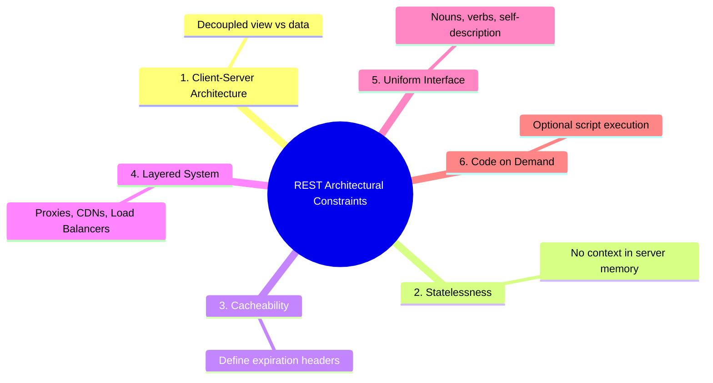

# Chapter X: The REST Covenant: The Evolution, Constraints, and Design of APIs

> "REST is not a protocol; it is a structural philosophy formalized by Roy Fielding to enforce the architectural constraints of the global web, enabling distributed systems to scale across space and time."

---

## I. The Crisis of the Monolith: From Tim Berners-Lee to Roy Fielding

In 1989, Sir Tim Berners-Lee laid down the fundamental pillars of the World Wide Web at CERN: <strong>HTML</strong> for document structure, <strong>HTTP</strong> for simple document transport, and <strong>URLs</strong> for document addresses. 

It was a beautiful, decentralized system designed for sharing static academic papers.

But as the web grew dynamically in the late 1990s, the industry faced a severe <strong>Scalability Crisis</strong>. 

Applications were emerging as dense, highly stateful monolithic trees. 

Every database action required custom, complex remote procedure protocols like <strong>SOAP (Simple Object Access Protocol)</strong> or <strong>CORBA</strong>. 

These protocols were violently complex: they required massive XML envelopes, tightly coupled the client compiler to the server runtime, and were absolute resource hogs. 

If a client wanted to get user details, they had to transmit a 500-line XML SOAP request, and the slightest change in the server's class structure would break the client instantly.

In the year 2000, <strong>Roy Fielding</strong>—one of the primary authors of the HTTP/1.1 specification—published his PhD dissertation at UC Irvine. 

Fielding did not propose a new software framework or library. 

Instead, he looked at the physical architecture of the web and extracted a set of <strong>six core structural constraints</strong>. 

He called this architectural style <strong>REST (Representational State Transfer)</strong>.

Fielding proved a simple, profound mathematical truth: if you construct your distributed API to strictly respect these six constraints, <strong>your system can scale infinitely across the physical internet, remaining decoupled and resilient over decades</strong>.

---

## II. The Six Pillars of the REST Covenant



### 1. Client-Server Architecture (Separation of Concerns)
The client and the server must remain strictly decoupled. 
*   <strong>The Client</strong> is concerned strictly with the presentation layer—user interface, layout adjustments, and screen rendering. 
*   <strong>The Server</strong> is concerned strictly with data storage, security validation, and business calculations.

Because they are decoupled, you can completely rewrite your frontend in React or iOS Swift without changing a single line of your database server; similarly, you can migrate your database from PostgreSQL to MongoDB without modifying the browser's view.

### 2. Statelessness
The server <strong>must not store any client context in its memory heap</strong>. 

Every incoming request from a client must carry 100% of the information required to understand and execute that request—including credentials, search filters, and targeted resource IDs. 

This constraint enables the infinite horizontal scalability we studied in Chapter IX.

### 3. Cacheability
Every server response must explicitly declare itself as cacheable or non-cacheable (using headers like `Cache-Control` or `ETag`). 

This allows clients and intermediate CDNs to cache responses, preventing redundant database queries, saving network bandwidth, and cutting response latencies to zero.

### 4. Layered System
The client must not be able to tell whether it is connected directly to the final application server or to an intermediate proxy, load balancer, CDN, or security gateway. 

This enables backends to scale horizontally, plug in security firewalls, or cache assets transparently without changing client configurations.

### 5. Uniform Interface
This is the heart of REST. 

It dictates that all interactions across the system must use a standardized, predictable, and symmetrical interface:
*   <strong>Identification of Resources</strong>: Resources are nouns mapped to clean, logical URLs (e.g., `/users/42`).
*   <strong>Manipulation through Representations</strong>: If a client holds a representation of a resource (like a JSON payload), it carries sufficient data to modify or delete the resource on the server.
*   <strong>Self-Descriptive Messages</strong>: Every HTTP request and response must carry enough metadata (like `Content-Type` headers) to explain how to parse the payload.
*   <strong>HATEOAS (Hypermedia As The Engine Of Application State)</strong>: The server returns hypermedia links along with data, allowing the client to dynamically discover what actions are available next (e.g., a bank account JSON includes links to `/withdraw` or `/deposit`).

### 6. Code on Demand (Optional)
The server can temporarily extend the functionality of the client by transmitting executable code (such as JavaScript scripts or compiled WebAssembly blocks) for the client to run locally.

---

## III. The Anatomy of an API URL

In a RESTful architecture, the <strong>URL (Uniform Resource Locator)</strong> is the coordinate system of your resources. 

Let us dissect the physical parts of a clean, production-grade API URL:

```text
  https://   api.yoursite.com   /v1/   users/42/posts   ?limit=10&page=2   #section
  └──┬───┘   └───────┬──────┘   └─┬┘   └──────┬───────┘   └───────┬──────┘   └───┬──┘
  Protocol       Domain       Version      Resource             Query        Fragment
```

1.  <strong>The Protocol (`https://`)</strong>: 
    The security wrapper. Enforces TLS encryption, protecting all transaction parameters from network snooping.
2.  <strong>The Subdomain / Host (`api.yoursite.com`)</strong>: 
    Separates the API boundary from the primary human-facing website domain (`yoursite.com`).
3.  <strong>The Version Prefix (`/v1/`)</strong>: 
    The API insurance policy. As your backend evolves, you will inevitably need to make breaking changes. 
    By versioning endpoints, you can serve `/v1/` to legacy mobile clients while hosting `/v2/` for modern browsers simultaneously.
4.  <strong>The Resource Path (`/users/42/posts`)</strong>: 
    The hierarchical coordinate. REST URLs strictly map to <strong>nouns in plural form</strong>. 
    This path identifies user #42's collection of posts.
5.  <strong>The Query Parameters (`?limit=10&page=2`)</strong>: 
    The search modifiers. Used for sorting, filtering, and paginating. 
    They do not change the core resource path; they merely restrict the volume of data returned.
6.  <strong>The Fragment (`#section`)</strong>: 
    An anchor point processed locally by the client, directing the browser viewport to a specific section of the data representation.

---

## IV. The Vocabulary of REST: HTTP Methods

REST maps the standard database operations (<strong>CRUD</strong>) to standard HTTP methods. 

To design clean APIs, we must respect their semantic rules and idempotency boundaries:

| CRUD Action | HTTP Method | Target URL | Has Request Body? | Safe? | Idempotent? |
| :--- | :--- | :--- | :--- | :--- | :--- |
| <strong>Create</strong> | `POST` | `/v1/posts` | ✅ Yes | ❌ No | ❌ No |
| <strong>Read</strong> | `GET` | `/v1/posts/42` | ❌ No | ✅ Yes | ✅ Yes |
| <strong>Replace</strong> | `PUT` | `/v1/posts/42` | ✅ Yes | ❌ No | ✅ Yes |
| <strong>Partial Update</strong> | `PATCH` | `/v1/posts/42` | ✅ Yes | ❌ No | ❌ No |
| <strong>Delete</strong> | `DELETE` | `/v1/posts/42` | ❌ No | ❌ No | ✅ Yes |

### 1. The Rule of Safe Methods
An HTTP method is <strong>Safe</strong> if it is strictly a read-only operation that <strong>does not modify the server state</strong>. 

`GET` is safe. 

If a client sends 10,000 `GET` requests to `/posts`, the database state remains completely unchanged. 

`POST` and `DELETE` are unsafe.

### 2. The Math of Idempotency: $f(f(x)) = f(x)$
An HTTP method is <strong>Idempotent</strong> if executing the request multiple times results in the exact same server state as executing it once.
*   <strong>`GET` is idempotent</strong>: Reading the same resource five times changes nothing.
*   <strong>`DELETE` is idempotent</strong>: If you send `DELETE /users/42`, the server deletes the user. 
    If you hit `DELETE /users/42` again, the server returns a `404 Not Found`, but the state of the database is identical to the first call—the user is still deleted.
*   <strong>`PUT` is idempotent</strong>: A `PUT` request replaces the entire resource. 
    If you replace a profile details block with new data, repeating that exact same replacement 100 times leaves the profile database looking identical to the first replacement.
*   <strong>`POST` is NOT idempotent</strong>: If a user clicks "Submit Payment" and the network hangs for a second, and they click "Submit Payment" again, a `POST /payments` call will charge the card twice, creating duplicate data rows!

---

## V. API Design: The Symmetrical Noun Rule

In amateur APIs, developers construct messy, verb-stuffed URL structures:

```text
❌ THE AMATEUR VERB PATHOLOGY:
*   GET /api/getAllUsers
*   POST /api/createUser
*   POST /api/deleteUser?id=42
```

This violates the Uniform Interface constraint. 

It makes the API unpredictable and hard to consume.

### The Rule of Plural Nouns
In a RESTful world, <strong>the URL path contains only nouns, and the HTTP method defines the action</strong>.

```text
✅ THE RESTFUL SYMMETRY:
*   GET /v1/users        (Read all users)
*   POST /v1/users       (Create a brand new user)
*   GET /v1/users/42     (Read user #42)
*   DELETE /v1/users/42  (Remove user #42)
```

By mapping the action to the HTTP method, the URL coordinates remain elegant, stable, and highly logical.

---

## VI. Going Beyond CRUD: What to do with Non-CRUD Operations

A common crisis in RESTful design is mapping actions that simply <strong>do not fit</strong> standard Create, Read, Update, or Delete boxes. 

Consider three real-world actions:
*   *Transfer money between two bank accounts.*
*   *Approve an essay inside a publishing queue.*
*   *Lock a cloud server to prevent deletion.*

None of these represent simple CRUD modifications. 

How do we represent them in REST? 

We have two elegant architectural solutions:

### 1. The custom Verb-As-Noun Endpoint
We treat the action as a sub-resource mapping, using a custom POST command to execute the action:
*   `POST /v1/accounts/42/transfers` 
    (We treat the transfer as a <strong>noun resource</strong>; the body contains target accounts and amounts).
*   `POST /v1/essays/100/approvals` 
    (We create an approval resource).

### 2. The Custom Verb Suffix (Beyond CRUD)
If creating a sub-resource feels overly complex, industry standards permit appending a custom verb suffix to the URL using a standard `POST` method:
*   `POST /v1/accounts/42/transfer`
*   `POST /v1/essays/100/approve`
*   `POST /v1/servers/5/lock`

Because these operations are unsafe and non-idempotent, we <strong>always use the `POST` method</strong> to execute them, ensuring the client browser understands the safety boundary of the transaction.

---

## VII. The Database Shield: The Absolute Need for Pagination

Imagine you build a social media API, and your database grows to hold 5,000,000 posts. 

If a client queries `GET /v1/posts` without any restrictions, your server will execute:

```sql
SELECT * FROM posts;
```

This is an <strong>infrastructure suicide query</strong>. 

Your database will attempt to load 5,000,000 rows into RAM. 

The server will choke trying to serialize a 2-gigabyte JSON string. 

The network socket will hang, and the server will crash with an out-of-memory error.

To protect our backend architecture, we must enforce <strong>Pagination</strong> on all collection endpoints, ensuring the client can only load data in small, manageable chunks:

### 1. Offset-Based Pagination
The client specifies the volume of items they want (`limit`) and the number of items to skip (`offset`):
`GET /v1/posts?limit=10&offset=20`

*   <strong>Pros</strong>: Extremely simple to implement. 
    Translates directly to SQL `LIMIT 10 OFFSET 20`.
*   <strong>Cons</strong>: Slow on deep pages. 
    If a database has to skip 100,000 rows (`OFFSET 100000`), the database must still read all 100,000 index markers in memory before throwing them away, causing severe latency. 
    Also vulnerable to <strong>item skipping bugs</strong> (if a post is deleted while a user is scrolling, the offset shifts, displaying duplicate posts).

### 2. Cursor-Based (Keyset) Pagination
The client requests items after a specific, unique database identifier (the cursor):
`GET /v1/posts?limit=10&after=post_id_9823`

*   <strong>Pros</strong>: Infinite scale. 
    Translates to a highly optimized database search: `SELECT * FROM posts WHERE id > cursor LIMIT 10`. 
    Runs in $O(1)$ time regardless of page depth. 
    immune to item shifting bugs.
*   <strong>Cons</strong>: Harder to implement. 
    Cannot skip to arbitrary pages (e.g., "Go to page 50").

---

## VIII. Key Takeaways

1.  <strong>REST</strong> is an architectural constraint treaty designed by Roy Fielding to decoupled distributed clients and servers, maximizing scale.
2.  <strong>URLs</strong> must strictly contain <strong>plural nouns</strong>, using standard HTTP verbs (`GET`, `POST`, `PUT`, `DELETE`) to dictate the computational action.
3.  <strong>Idempotency</strong> guarantees that duplicate requests (like network retries on `DELETE` or `PUT`) will leave the database state unchanged after the first success.
4.  <strong>Pagination</strong> (Offset or Cursor) is the absolute shield of server database performance, keeping network payloads lean and fast.

---

Curated & Written by the Antigravity curator engine.
