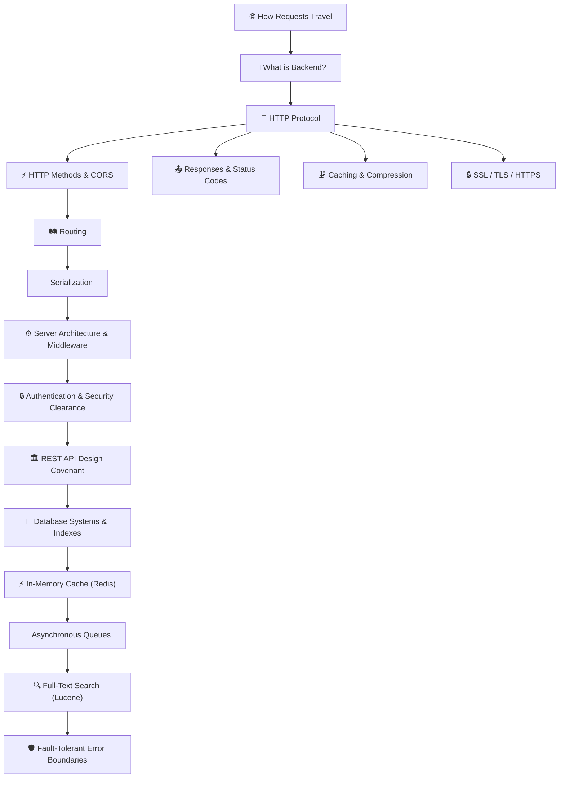

# 🚀 Backend Foundations — Complete Notes

link to hosted website>https://sriniously-backend-notes.vercel.app/ 

<strong>"Backend can be compressed into one sentence — the process we use to deal with data."</strong>

Comprehensive notes on backend fundamentals, HTTP, routing, serialization, layered architecture, request lifecycles, cookies, authentication protocols, database management systems, caching paradigms, REST API design, background jobs, full-text search engines, and fault-tolerant error boundaries.

---

## 📚 Table of Contents

| # | Chapter | Topics Covered |
|---|---|---|
| 1 | [📡 How Requests Travel on the Internet](./01_How_Requests_Travel.md) | DNS resolution, TCP handshake, TLS, load balancing, the Instagram like button journey |
| 2 | [🧠 What is Backend & Why Do We Need It?](./02_What_Is_Backend.md) | Security, external APIs, database communication, computing power |
| 3 | [🌐 HTTP — The Language of the Web](./03_HTTP_Deep_Dive.md) | Client-server vs serverless, TCP, HTTP message structure, headers, extensibility |
| 4 | [⚡ HTTP Methods & CORS](./04_HTTP_Methods.md) | GET/POST/PUT/PATCH/DELETE, idempotency, OPTIONS, CORS preflight flow |
| 5 | [📤 HTTP Responses, Status Codes & More](./05_HTTP_Responses.md) | Status codes (1xx-5xx), caching, content negotiation, compression, keep-alive, TLS/SSL |
| 6 | [🛤️ Routing](./06_Routing.md) | Static/dynamic routes, query vs route params, nested routes, versioning, catch-all |
| 7 | [🔄 Serialization & Deserialization](./07_Serialization.md) | The language barrier problem, JSON, XML, Protobuf, MessagePack, security |
| 8 | [⚙️ Server-Side Architecture & Middleware](./08_Architecture_and_Middleware.md) | MVC, Controller-Service-Repository separation, validations, request lifecycle, middleware ordering |
| 9 | [🔒 Authentication, Authorization & Identity](./09_Authentication_and_Authorization.md) | Stateful sessions, stateless JWT, cookies, hybrid authentication, OAuth 2.0 delegation, OIDC |
| 10 | [🏛️ The REST Covenant](./10_REST_APIs.md) | Roy Fielding's PhD constraints, plural nouns, custom CRUD operations, cursor pagination |
| 11 | [💾 The Great Ledger: DBMS & Persistence](./11_Database_Management_Systems.md) | WAL logs, SQL vs NoSQL, Postgres supremacy, Up/Down migrations, parameterized queries, triggers, indexes |
| 12 | [⚡ The Echo Chamber: Caching & Redis](./12_Caching_and_In_Memory_Databases.md) | Latency spectrum, CDN caching, Redis in-memory storage, cache strategies, LRU/LFU/TTL eviction |
| 13 | [🧵 The Silent Loom: Asynchronous Task Queues](./13_Background_Jobs.md) | Producers, brokers, worker scaling, visibility timeouts, at-least-once delivery, idempotency rules |
| 14 | [🔍 The Inverted Library: Full-Text Search](./14_Full_Text_Search.md) | Relational LIKE bottlenecks, inverted indices, BM25 scoring algorithm, Distributed Lucene sharding |
| 15 | [🛡️ The Resilient Bastion: Error Handling](./15_Error_Handling.md) | Logic/DB/API failures, readiness/liveness health checks, OWASP secure authentication bounds, global middleware handlers |
| 16 | [⚙️ The Genetic Code: Configuration](./16_Configuration_Management.md) | Environment variables, Twelve-Factor App guidelines, secret separation, envelope encryption, dynamic config reloading, S3 and Vault integration |
| 17 | [📊 The Watchtower: Observability](./17_Logging_Observability.md) | Metrics, structured JSON logs, tracing (OpenTelemetry, spans, DAGs), log levels, StatsD vs Prometheus, ELK stack pipelines, Waqia-Navis historical parallel |
| 18 | [🔌 The Orderly Departure: Graceful Shutdown](./18_Graceful_Shutdown.md) | POSIX signal handling (SIGTERM vs SIGKILL), Kubernetes lifecycle hooks, connection draining, database transaction pool teardown topological sort, Chola Navy tactical parallel |
| 19 | [🛡️ The Paranoid Sentinel: Injection Attacks](./19_Backend_Security_Injection.md) | SQL injection mechanics, AST alteration, OS command injection, Directory Traversal, unsafe eval execution, sanitization and secure coding baselines |
| 20 | [🏰 The Castle Moat: Security Mitigation](./20_Backend_Security_Mitigation.md) | Parameterized queries, ORM safety boundaries, input schema validation, principal of least privilege, rate limiting, secure header hardening (CSP, HSTS) |
| 21 | [⏱️ The Clockwork Limit: Performance](./21_Performance_Measurement.md) | Benchmarking methodologies, load testing tools (k6, autocannon), CPU profiling, memory leak detection, heap snapshot analysis, latency distribution percentiles |
| 22 | [💾 The Expanded Horizon: Scaling & Caching](./22_Database_Caching_Scaling.md) | Storage physics and hardware latency scales, PgBouncer pooling modes, primary-replica replication lag, thundering herds, consistent hashing sharding, Kallanai Dam metaphor |
| 23 | [⚖️ The Stateless Distributed Web: Balancing](./23_Stateless_Load_Balancing.md) | Stateless session state clusters, JWT signature verification, OSI Layer 4 vs Layer 7 load balancing, health probes, write-to-read sticky routing middleware, Kumbh Mela flow dispatching |
| 24 | [☁️ The Borderless Machine: CDNs & Queues](./24_CDNs_Queues_Serverless.md) | CDN edge caching, serverless lambda architectures, message broker flow control, horizontal autoscaling thresholds, distributed system orchestration |
| 25 | [🧵 The Clockwork Thread: Concurrency](./25_Concurrency_Parallelism_IO.md) | CPU core execution pipelines, processes vs OS threads, synchronous/asynchronous task processing, blocking vs non-blocking I/O multiplexing, libuv event loop phases, microtasks |

---

## 🗺️ Concept Map

---

## ⚡ Quick Reference

### HTTP Methods Cheat Sheet
| Method | Action | Idempotent? | Has Body? | Safe? |
|---|---|---|---|---|
| `GET` | Read | ✅ | ❌ | ✅ |
| `POST` | Create | ❌ | ✅ | ❌ |
| `PUT` | Replace | ✅ | ✅ | ❌ |
| `PATCH` | Partial Update | ❌ | ✅ | ❌ |
| `DELETE` | Remove | ✅ | ❌ | ❌ |

### Status Codes Cheat Sheet
| Range | Category | Common Codes |
|---|---|---|
| `2xx` | ✅ Success | 200 OK, 201 Created, 204 No Content |
| `3xx` | 🔀 Redirect | 301 Moved, 304 Not Modified |
| `4xx` | ❌ Client Error | 400 Bad Request, 401 Unauthorized, 403 Forbidden, 404 Not Found, 429 Too Many |
| `5xx` | 💥 Server Error | 500 Internal Error, 502 Bad Gateway, 503 Unavailable |

---

## 🎭 Symmetrical Wes Anderson Editorial System

The entire digital book features a publication-grade, vintage <strong>Wes Anderson</strong> visual design system, combining beautiful literary layout aesthetics with robust, contrast-aware responsive scaling:

* <strong>Typographical Pairing</strong>: High-contrast, editorial <strong>Playfair Display</strong> for headers, highly readable book-serif <strong>Lora</strong> for body paragraphs, tactile <strong>Courier Prime</strong> for monospaced elements/code, and geometric <strong>Inter</strong> for small metadata.
* <strong>Symmetrical Viewport Framing</strong>: A thin, elegant border frame outlines the window (`body::after`), creating a polished, book-like symmetry on both desktop and mobile screens.
* <strong>Responsive SVG Diagrams</strong>: All 25 chapters feature custom SVG diagrams that are dynamically themed. Hardcoded inline styles have been pruned, and CSS attribute-matching selectors automatically map hex properties (like `#FAF6EF`, `#2C2416`, `#ffffff`) to dynamic system variables. Standard elements render via geometric <strong>Jost</strong>, and code labels render via <strong>JetBrains Mono</strong>, preventing text overlapping or bounds alignment issues.
* <strong>Tactile Aside Cards</strong>: Margin notes are built with solid, category-colored 2px flat borders and offset shadows (`box-shadow: var(--shadow-flat)`) that responsive-lift on mouse hover with smooth CSS transitions.
* <strong>Perfect Light/Dark Contrast</strong>: Every element, including all diagrams, notes, scrollbars, selection highlights, and tables, seamlessly adjusts between light cream and deep charcoal-brown settings with flawless visual accessibility.

---

Curated & Written by Harshit and AI Scribes in the Year of 2026.
