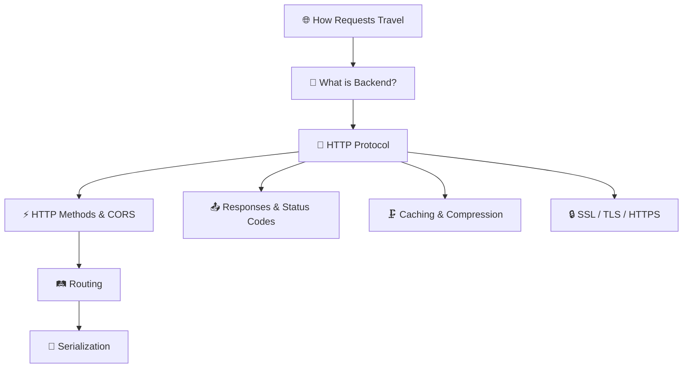

# 🚀 Backend Foundations — Complete Notes

> **"Backend can be compressed into one sentence — the process we use to deal with data."**

Comprehensive notes on backend fundamentals, HTTP, routing, serialization, and more.

---

## 📚 Table of Contents

| # | Chapter | Topics Covered |
|---|---|---|
| 1 | [📡 How Requests Travel on the Internet](./01_How_Requests_Travel.md) | DNS resolution, TCP handshake, TLS, load balancing, the Instagram like button journey |
| 2 | [🧠 What is Backend & Why Do We Need It?](./02_What_Is_Backend.md) | Security, external APIs, database communication, computing power |
| 3 | [🌐 HTTP — The Language of the Web](./03_HTTP_Deep_Dive.md) | Client-server vs serverless, TCP, HTTP message structure, headers, extensibility |
| 4 | [⚡ HTTP Methods & CORS](./04_HTTP_Methods.md) | GET/POST/PUT/PATCH/DELETE, idempotency, OPTIONS, CORS preflight flow |
| 5 | [📤 HTTP Responses, Status Codes & More](./05_HTTP_Responses.md) | Status codes (1xx-5xx), caching, content negotiation, compression, keep-alive, TLS/SSL |
| 6 | [🛤️ Routing](./06_Routing.md) | Static/dynamic routes, query vs route params, nested routes, versioning, catch-all |
| 7 | [🔄 Serialization & Deserialization](./07_Serialization.md) | The language barrier problem, JSON, XML, Protobuf, MessagePack, security |

---

## 🗺️ Concept Map

---

## ⚡ Quick Reference

### HTTP Methods Cheat Sheet
| Method | Action | Idempotent? | Has Body? |
|---|---|---|---|
| `GET` | Read | ✅ | ❌ |
| `POST` | Create | ❌ | ✅ |
| `PUT` | Replace | ✅ | ✅ |
| `PATCH` | Partial Update | ❌ | ✅ |
| `DELETE` | Remove | ✅ | ❌ |

### Status Codes Cheat Sheet
| Range | Category | Common Codes |
|---|---|---|
| `2xx` | ✅ Success | 200 OK, 201 Created, 204 No Content |
| `3xx` | 🔀 Redirect | 301 Moved, 304 Not Modified |
| `4xx` | ❌ Client Error | 400 Bad Request, 401 Unauthorized, 403 Forbidden, 404 Not Found, 429 Too Many |
| `5xx` | 💥 Server Error | 500 Internal Error, 502 Bad Gateway, 503 Unavailable |

---

